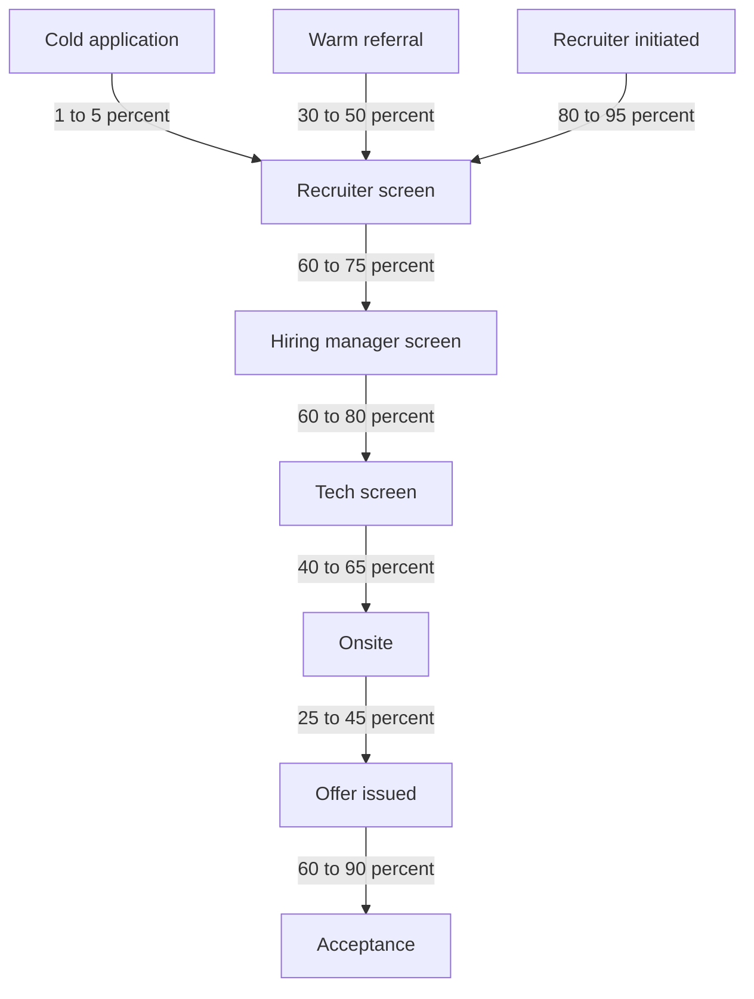

# Lecture 1 — The Hiring Pipeline

> **Duration:** ~2 hours. **Outcome:** You can draw the full hiring pipeline from outreach to offer, name the actors at each stage, and identify the 3 places where most candidates leak out.

## 1. The pipeline as a system

Most candidates think of interviewing as **a sequence of events**: you apply, you get a screen, you do an onsite, you get an offer or rejection. Each event is "do well or don't."

That model is wrong, and the wrongness is the reason most candidates don't get the offer they want. The correct model is **a leaky pipeline of conversations** running in parallel, where:

- Each stage has a probability of progression.
- You manage 3-6 conversations at once.
- The first conversation at a target company is often the most important — and it's not the tech screen.

Draw the full pipeline:

```
                Outreach
                   ↓
       Recruiter conversation (cold or warm)
                   ↓
            Recruiter screen
                   ↓
       Hiring manager screen
                   ↓
              Tech screen
                   ↓
                Onsite
                   ↓
            Hiring decision
                   ↓
             Offer issued
                   ↓
         Offer negotiation
                   ↓
              Acceptance
                   ↓
           Start date locked
```

Every arrow has a conversion rate. Multiplied together, they give you the probability that *one application* turns into *one accepted offer*.

## 2. The actors

Different people show up at different stages. Understanding their roles changes how you talk to them.

### Recruiter

- Job: source candidates, screen for basic fit, move pipeline forward, close offers.
- Compensated: typically a percentage of base salary (external) or a flat per-hire bonus + comp band (internal). Both have an interest in: (a) closing more candidates and (b) closing at lower comp.
- What they evaluate: are you real, are you available, are you within the comp band, can they pitch you to the hiring manager.
- What they CAN'T usually do: judge your technical skill in depth.
- What helps them help you: clarity on what you want, comp expectations within reason, fast email replies.

### Hiring manager

- Job: build a team. Hire the people who'll work directly under or with them.
- Compensated: rarely on hiring; usually on team output. Wants strong hires, accepts that hiring is slow.
- What they evaluate: technical depth in their domain, working-with-you-ness, growth potential.
- What they CAN do: champion you to the hiring committee, set scope, write the offer.

### Hiring committee

- Job: at large companies, review feedback from all interviewers and decide hire / no-hire / hire-at-different-level.
- Often: 4-6 people who haven't met you. They read packets.
- What they evaluate: signal across interviewers. Disagreement = discussion.
- The packet matters: a thoughtful interviewer's "lean hire, but I'd want to see X" is more useful than another's "strong yes" with no reasoning.

### Interviewers (engineers)

- Job: 1-hour interview each. Then write up what happened.
- They don't usually know each other's feedback (deliberate — for independence).
- What you do in the room is 95% of what they remember.

### Hiring lead / "hiring chair"

- A senior engineer or manager who runs the loop end-to-end for a given role.
- Often interviews you themselves. Sometimes the one who calls with the offer.

### Recruiting coordinator

- Logistics person — calendars, NDAs, takehomes, calendaring the onsite.
- *Be kind*: they have the most thankless job in the building, and they will see whether you're easy to work with.

## 3. The 5 stages, in detail

### Stage 1 — Outreach

You contact the company OR a recruiter contacts you. Three submodes:

**A) Cold application** through their website. Goes into their ATS. **Conversion rate to recruiter call: 1-5%** at large companies, 5-15% at startups. The lowest-yield mode; do not rely on it as the primary funnel.

**B) Warm referral** — someone already employed there refers you. Skips the ATS queue, lands in front of a real human. **Conversion: 30-50% to recruiter call.** This is the highest-yield mode by far.

**C) Recruiter-initiated** — they message you on LinkedIn or via email. Implies you've passed their first filter already. **Conversion: 80-95% to recruiter call** (because they wouldn't have reached out otherwise).

**Implication:** spend disproportionate time on building referrals before relying on cold applications. Week 1's mini-project gets you the spreadsheet for tracking.

### Stage 2 — Recruiter screen

30 minutes. Phone or video. They will ask:

- Tell me about yourself (have a 90-second answer prepared)
- Why this company?
- Why are you looking?
- What are you looking for (role, comp, timeline)?
- Authorization status (visa / citizenship; legal screen)
- A few softball technical: "how would you describe your role at $previous_company"

**They WILL try to pin down your comp expectations.** Don't give a number you haven't researched. Acceptable answers: "I'd like to learn more about the role first." "I'm happy to share once I understand the scope and level." If pushed, give a wide band based on levels.fyi data for that company.

**Conversion to hiring-manager screen: 60-75%** if you don't fumble basics.

### Stage 3 — Hiring manager screen

30-60 minutes. Often the first technical-adjacent conversation. The hiring manager:

- Walks you through what their team does.
- Asks about your most recent project — what you actually did, what you'd change.
- Asks 2-3 high-level technical questions in their domain (e.g., for a backend role: "tell me about a time you debugged a production incident").
- Pitches the role to you.

This is **the most predictive conversation in the pipeline**. The hiring manager will either become your champion or quietly drop you. Their gut reaction here is hard to overturn later.

**Conversion to tech screen: 60-80%.**

### Stage 4 — Tech screen

45-60 minutes. A coding problem on a shared editor (HackerRank, CodePair, CoderPad, Google Doc). This is what C2 prepares you for. C13 does not retrain you here.

**Conversion to onsite: 40-65%** depending on company.

### Stage 5 — Onsite

4-6 hours, today usually remote. 4-6 interviewers. Most companies do something like:

- 2 coding interviews (45-60 min each)
- 1 system design (for senior+)
- 1 behavioral / "values" interview
- 1 hiring-manager closer

After: hiring committee reviews. Decision typically in 5-10 business days.

**Conversion to offer: 25-45%.** This is the steepest drop in the funnel.

### Stage 6 — Offer

You get a number. **Do not accept on the call.** Standard practice: thank them, ask for the offer in writing, ask for time to review (1-2 weeks is normal). Then negotiate. (Week 8 covers negotiation.)

**Conversion to acceptance: 60-90%** depending on competing offers, your patience, and the company's flexibility.

## 4. Where candidates leak out (the 3 most common holes)

1. **Application stage, when relying on cold ATS submissions.** Fix: build referral pathways (Week 3).
2. **Hiring-manager screen, when the candidate doesn't "click" with them.** Fix: prepare specifically for this conversation (Week 5).
3. **Onsite-to-offer, when one interviewer raises a strong "no."** Fix: any single weak interview can sink you; prepare uniformly, not just on coding.

## 5. The pipeline math you'll do this week

If you have:

- 30 cold applications → ~1 recruiter call (3% conversion)
- 10 warm referrals → ~4 recruiter calls (40% conversion)
- 10 recruiter-initiated outreach (you didn't ask, they came to you) → ~9 recruiter calls

Total: ~14 recruiter calls.

From those:

- 14 recruiter calls × 70% → ~10 hiring-manager screens
- 10 HM screens × 70% → ~7 tech screens
- 7 tech screens × 50% → ~3.5 onsites
- 3.5 onsites × 35% → ~1.2 offers

**~1 offer per ~50 funnel-entry events**, at the typical numbers. To get *multiple offers* — which you want for negotiation leverage — you need 80-100 funnel-entry events, run in parallel over ~10 weeks.

That's the calculation Week 1's exercises walk through with your actual target list.


*Each arrow is a conversion rate — multiply them across the pipeline to see why volume and warm entry points matter.*

## 6. Self-check

- Name the actors and what each one is graded on.
- What's the typical conversion from cold-application to recruiter call?
- What's the steepest drop in the pipeline?
- A recruiter asks you point-blank for your comp expectations on the first 30-minute call. What's a defensible answer?
- You have 8 weeks before you want to start a new job. How many funnel-entry events do you need?

## Further reading

- **Tech Interview Handbook — "Resume and Application":** <https://www.techinterviewhandbook.org/resume/>
- **AskAManager — "What hiring managers actually look for":** <https://www.askamanager.org/2018/03/what-hiring-managers-actually-look-for.html>
- **Haseeb Qureshi — "How not to bomb your offer negotiation":** <https://haseebq.com/how-not-to-bomb-your-offer-negotiation/>
