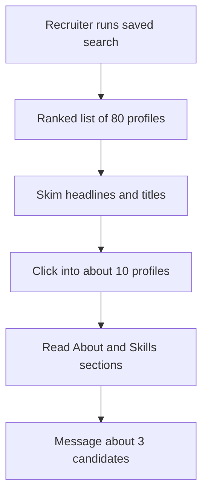
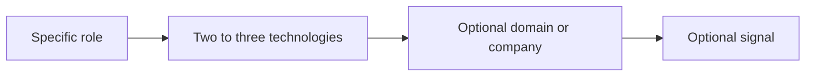

# Lecture 1 — The LinkedIn Profile Recruiters Read

> **Duration:** ~2 hours. **Outcome:** You can describe how a recruiter actually finds you on LinkedIn, rewrite a generic headline into a search-targeted line, draft an About section that reads as resume-grade narrative, and audit your Experience block for parity with your resume.

## 1. LinkedIn is a search index, not a social network

Treat LinkedIn the way you treat your resume: it's a structured document that a piece of software parses, ranks, and surfaces to a human. The software is **LinkedIn Recruiter** — the paid product that virtually every in-house and agency recruiter uses to source candidates. Recruiter is a search engine over the LinkedIn profile graph. Your profile is the document that engine indexes.

This reframing matters because it determines what you optimize. If LinkedIn were a social network, you'd optimize for engagement: clever posts, frequent activity, network growth. As a search index, you optimize for *findability*: the right keywords in the right fields, a current title, a verifiable Experience block, and Skills that match the queries recruiters actually run.

Most engineers' LinkedIn profiles are written as if for a peer audience — a friend reading the page who already knows them. The audience that matters is a recruiter who has never heard of you, has 30 seconds, and is scanning a search-results list of 80 profiles to decide which 8 to message. Write for that reader.

## 2. The recruiter's actual workflow

Inside LinkedIn Recruiter, a sourcer typically:

1. Opens a saved search for the role they're filling. The query is some combination of: keywords (Python, Kubernetes), title filters (current title: "backend engineer"), seniority range, location, years of experience, current/past companies, and skills.
2. Gets back a ranked list of profiles. Each profile shows: photo (if present), name, headline (one line), current title and company, location, and a snippet of the most relevant matched text.
3. Skims the list. They click through to maybe 10 of the 80 results. They decide based on: (a) does the headline say something specific that matches the role, (b) is the current title aligned, (c) do the companies signal a level appropriate to the opening.
4. Reads the full profile for the ~10 they clicked. They look at: Experience (titles, companies, durations), About (do they sound serious), Skills (does the keyword stack match), and sometimes Featured / Activity.
5. Of the ~10 they read, they message ~3.

*How a recruiter narrows eighty profiles down to three messages.*

**Implications.**

- The **headline** is the field that decides if you appear in the first place — and whether the recruiter clicks. It is the highest-leverage piece of writing on your profile.
- The **current title and company** are the field that decides whether the click stays open or bounces in 5 seconds. They must be current.
- The **About** is read by the ~10 who clicked. It is a conversion field — it determines whether they message you, save your profile, or close the tab.
- The **Skills** section is queried by Recruiter; missing skills means missing matches.
- **Activity / posts / engagement** matter very little to a recruiter sourcing for a specific role. Stop optimizing for them.

## 3. The headline — 220 characters that determine whether you appear

The headline is the single line under your name. By default LinkedIn populates it with "{Current title} at {Current company}." This is almost always weaker than what you can write yourself.

### What the headline is for

Three jobs, in order of importance:

1. **Match the query.** When a recruiter searches `backend engineer Python fintech`, your headline is one of the strings their search matches against. Headlines without the right nouns don't surface.
2. **Differentiate from the other 79 results.** "Software Engineer at Acme" is one of seventy. "Senior Backend Engineer (Python, Postgres, AWS) — building payments infra at Acme" is one of three the recruiter remembers.
3. **Earn the click.** The reader is deciding in <2 seconds whether to open your profile. The headline is the entire pitch.

### Headlines that fail

- "Software Engineer | Passionate about technology | Lifelong learner"
- "Aspiring developer 🚀 | Coffee enthusiast | He/Him"
- "Looking for opportunities | Available immediately"
- "Senior Software Engineer @ Acme" (LinkedIn's default; wastes the line)
- "Father, husband, engineer, runner" (a fine human; not findable)

These fail for one of three reasons: they contain no searchable nouns (no language, no platform, no domain), they signal desperation or unseriousness (the emoji-and-tagline pattern), or they assume the reader already cares (passion-and-personality content).

### Headlines that work

The structure: `{Specific role} | {2-3 technologies} | {Optional: domain or company} | {Optional: signal}`.

*The four-part formula behind a headline that gets found and gets clicked.*

Examples:

- "Senior Backend Engineer | Python, PostgreSQL, AWS | Payments infra at Acme"
- "Staff Platform Engineer — Kubernetes, Go, observability | Previously at Stripe"
- "Frontend Engineer (React, TypeScript) | Building checkout flows at a Series-B fintech"
- "New-grad SWE — Python, Java, distributed systems | Class of 2025, open to full-time"
- "Data Engineer | Snowflake, dbt, Airflow | ETL for healthcare claims at HealthCo"

Note the patterns:

- **A concrete role.** "Senior Backend Engineer," not "Engineer."
- **Two or three technology nouns.** These are the search-keyword hooks.
- **An optional domain or company signal.** "Payments infra," "fintech," "healthcare claims" — these are the filters recruiters actually use.
- **No tagline.** No "passionate about," no "driven," no "lifelong learner." The technologies and the role say it for you.

### Character budget

220 characters on mobile, longer (260) on desktop. Write for the 220 cap; the shorter version is what most recruiters see in the search results list. A 220-char line is roughly 30-35 words. You can fit 2 role descriptors, 3-4 technologies, and one signal. That's all that's needed.

### The "Open to Work" question

LinkedIn lets you mark yourself "Open to Work" in two ways:

- **Recruiter-only mode** (the discreet one): a small flag visible to LinkedIn Recruiter subscribers, invisible to anyone else.
- **Public mode**: the green ring around your photo, "#OpenToWork."

The discreet mode is essentially free upside. Turn it on; it makes you surface in recruiter-side searches that filter for active candidates. It costs you nothing.

The public mode is contested. Two real effects:

- **It increases inbound from recruiters** — your profile shows up in "active candidate" filters more prominently. Real signal, real effect.
- **It can signal to peers and current colleagues that you're searching**, which matters if you're employed and not yet announcing. The ring is visible to everyone on LinkedIn.

The decision: use public mode if you're unemployed or in a job you're publicly leaving; use the discreet recruiter-only mode otherwise. Don't agonize about it — it's reversible in two clicks.

## 4. The About section — 200-300 words of narrative

LinkedIn's About is a free-text field, up to 2,600 characters. Most engineers either leave it blank, paste their resume summary, or write a paragraph that opens "I am a passionate software engineer..." and trails off.

The strongest About sections share a structure:

1. **Lead with the current shape of your work** — one sentence naming the role, the domain, and one or two concrete things you've built or are building.
2. **One short paragraph (3-4 sentences) on what you've shipped** — the 2-3 outcomes you'd want a recruiter to know in 90 seconds. These often map to the strongest bullets on your resume, rewritten for prose.
3. **One short paragraph on what you're optimizing for next** — the kind of role / problem you're looking for, the technologies you're deepening into, the size of company that fits.
4. **A close** — a line on how to reach you or what you're open to. (One line. Not a paragraph.)

### A worked example — before

> I am a passionate software engineer with experience in many technologies. I love solving challenging problems and am always eager to learn new things. I am a team player and a self-starter who thrives in fast-paced environments. Currently looking for new opportunities to grow my career and make a meaningful impact. Let's connect!

What's wrong: contains no nouns a recruiter can search on, no specific outcomes, and a tone ("passionate," "team player," "thrives") that recruiters have read 10,000 times and now register as background noise.

### After

> I'm a backend engineer at Acme, where I own the payments service that processes ~$2M/day across 12 countries. Most of my work is in Python and Go on AWS, with a Postgres+Redis data layer and Kafka for async flows.
>
> In the last 18 months I shipped the rewrite of our settlement reconciliation pipeline (cut end-to-end from 4 hours to 35 minutes), led the migration of the payments service from monolith to a 3-service split, and built our internal idempotency-key library that's now used across 14 services.
>
> Next, I want to go deeper into distributed-systems work at a Series B–D fintech or infrastructure company — somewhere I can own a service end-to-end and contribute to the data-store choices, not just the app layer.
>
> Reachable at jane@example.com or via LinkedIn DM. Open to senior backend roles.

What's load-bearing in this version: concrete dollar figures, named technologies (Python, Go, AWS, Postgres, Redis, Kafka), specific outcomes with magnitudes, a forward-looking paragraph that targets a *kind of role* rather than a *kind of company*, and a contact close that is exactly one line.

### What to leave out of the About

- "Passionate about technology" and any near-synonym.
- Lists of every framework you've ever touched. Skills section handles that.
- Quotes from books or mentors.
- Personal-life details unless they're load-bearing for the role (e.g., bilingual where the role is bilingual).
- Photos, banners, or formatting tricks. LinkedIn renders About as plain text; markdown does not work.

### Length

Aim for 180-280 words. Shorter than 150 and the field looks unfinished. Longer than 350 and the average reader stops in the second paragraph. The recruiter is not reading for completeness; they're reading for signal.

## 5. The Experience section — parity with the resume

The Experience block on LinkedIn is the most-scrutinized field after the headline. The rule is simple: **every job on your resume must appear on LinkedIn with the same title, the same company, and the same dates**.

### Why parity matters

When a recruiter pulls your resume and your LinkedIn side by side — and they will — discrepancies read as one of three things:

1. **Carelessness.** You haven't updated one of the two surfaces. Minor flag.
2. **Inflation.** Your resume says "Senior Backend Engineer" and your LinkedIn says "Backend Engineer II" at the same company. The recruiter assumes the resume is inflated. Major flag.
3. **Misrepresentation.** A job appears on the resume but not LinkedIn, or vice versa. Triggers a background-check escalation, often before a screen.

The fix is mechanical: when you update one, update the other. Build a habit.

### What to actually write per job

For each role, the LinkedIn Experience entry should contain:

- **Title** (matching the resume exactly).
- **Company** (with LinkedIn's company-page link, so the company logo renders).
- **Dates** (Month + Year, matching the resume exactly).
- **Location** (city/region, or "Remote").
- **Description** — 3-5 bullets, the same bullets as your resume, lightly adjusted for prose flow. Most of your resume's STAR+R bullets transfer almost verbatim.

LinkedIn's description field renders bullets when you use line breaks and the `•` character (some clients), or plain newlines (others). Test it: paste your bullets, view your profile in a private browser window, confirm the formatting holds.

### Bullets on LinkedIn vs. on the resume

Two small adjustments from the resume version:

- **You can be slightly longer.** LinkedIn doesn't fit on one page, so a 2-line bullet is fine. Don't expand into a paragraph; do allow 25-30 words where the resume version was 18-20.
- **You can include light context the resume omits.** "Built the public REST API for Acme's billing service" — on LinkedIn you can add "Acme is a B2B payroll platform with ~3,000 customers" if the company isn't widely known and the context helps the reader gauge scale.

What stays the same: number-density (≥40% of bullets quantified), strong verbs (no "Responsible for"), past tense for past roles, active voice.

### Short roles and gaps

LinkedIn lets you show or hide individual roles. Don't hide short roles ("the 4-month contract") — recruiters notice gaps, and an unexplained gap reads worse than a short stint. If you took time off (caregiving, study, recovery, travel), list it: "Career break — caregiving, Mar 2023 – Aug 2023." Honesty beats absence.

## 6. The Skills section — the queryable surface

Skills is the field that drives the most LinkedIn Recruiter filter matches. The mechanics:

- You can list up to 50 skills.
- For each skill, your network can "endorse" you (low signal — endorsements are clicks, not assessments).
- Recruiter searches filter on the skills list, ranking profiles where the searched skill is a "top skill" higher.

### How to choose your 50 skills

Order matters. The first three are your "top skills" and surface most prominently. After that, order matters less, but presence matters a lot.

Pick from four categories:

- **Languages** (Python, Go, TypeScript, Java, Rust...).
- **Frameworks and platforms** (Django, React, FastAPI, Kubernetes, Spark...).
- **Domains and methods** (distributed systems, PCI compliance, microservices, ETL, observability...).
- **Tools and clouds** (AWS, GCP, PostgreSQL, Redis, Kafka, Terraform...).

For each, include only what you would discuss in a screening interview without hedging. The recruiter assumes a listed skill means "I can pass a 30-minute conversation on this." If you can't, take it off.

### Skills hygiene

- **Top 3 = the three skills you most want recruiters to match on.** For a backend role: Python, PostgreSQL, AWS. Not "Microsoft Word."
- **Remove dead skills.** "ActionScript" from 2011, "AngularJS" if you only used it once — gone. They dilute the signal and make the list look stale.
- **Endorsements are noise.** Don't farm them. Don't worry about counts. Recruiters know endorsements are mostly social clicks.
- **Skill assessments (LinkedIn's quizzes).** Pass one or two on your strongest languages; the "Verified" badge is a small positive signal. The rest are a time sink.

## 7. The profile photo and banner

The photo and the banner image are the most-visible parts of your profile after the headline. Mistakes here cost more than mistakes in the About.

### The photo

A current photo of you, your face, taken in normal lighting, in clothes you'd wear to an interview at the kind of company you're targeting. That's it. Specifically:

- **You alone** — not you with friends, not you holding a baby, not your group photo from a conference.
- **Recent** — within the last 2-3 years. If you look noticeably different now, retake.
- **Face visible** — sunglasses off, hat off, face fills 50-70% of the frame.
- **A background that doesn't compete** — a wall, an out-of-focus office, outdoors. Not a busy event photo.
- **Square crop.** LinkedIn's photo renders as a circle inside a square; account for the crop.

What to avoid: heavy filters (Instagram presets, beauty mode), low-resolution images, the avatar / cartoon / no-photo state. The no-photo state in particular reduces inbound substantially — recruiters skip blank profiles in scans because they often correspond to abandoned accounts.

### The banner

The banner (the strip behind your photo) is optional but does work for you when used. Three reasonable choices:

- **A solid color or simple gradient** — neutral, non-distracting. Free and safe.
- **A photo relevant to your work** — your office, a conference talk you gave, a screenshot of a system diagram you built. Works if you actually have such an image; don't fake it.
- **A simple text banner** — your professional tagline / contact / portfolio URL, designed cleanly. Works if you have design taste; backfires if you don't.

The default (the gray geometric pattern LinkedIn assigns) is fine. The cardinal sin is a low-resolution stretched image with text overlaid badly.

## 8. Featured, Recommendations, and the lower fields

LinkedIn has a long tail of fields below About / Experience / Skills. Most don't move the needle. A short scan of which matter:

- **Featured.** Pin up to 5 items at the top of your profile (links, posts, documents). Useful if you have something worth pinning: a conference talk, a blog post, a portfolio link, an open-source project page. Skip if you don't — empty Featured is invisible; bad Featured is worse than empty.
- **Recommendations.** Written endorsements from past colleagues. Strong signal if you have 2-3 from senior engineers or managers; meaningless if you have 12 from peers all written in the last week. If you have zero, ask one former manager. One real recommendation beats five generic ones.
- **Licenses & certifications.** List AWS, GCP, Kubernetes, etc. certifications if you've earned them. Don't list expired ones; don't list training-platform completion badges (Udemy, Coursera) — they signal weaker than they're worth.
- **Volunteer experience.** Useful if it's relevant or genuinely substantial. Otherwise omit.
- **Education.** Match the resume. List degree, school, dates. For experienced engineers (>5 years out of school), the school list is the entire content; coursework and GPA come off.
- **Languages.** List if you're conversational or better. Useful for international searches; otherwise low signal.

The fields **not** to fill out: "Interests" (LinkedIn auto-curates this from your follows — leave it), "Causes you care about" (low recruiter signal), the now-deprecated "Accomplishments" sub-sections (publications, patents — those go in Featured or are inferable from Experience).

## 9. The logged-out view test

Your profile looks different to a logged-out viewer than it does to you. LinkedIn shows logged-in viewers your full profile; logged-out viewers see a truncated version. Recruiters using Recruiter see your full profile.

To audit what an out-of-network person sees:

1. Open a private / incognito browser window.
2. Navigate to `linkedin.com/in/{your-handle}`.
3. Note which fields are hidden, which are partial, and which look broken.

In the logged-out view, the headline, the photo, the headline, the location, and the first ~3 lines of About are visible. Most of Experience is cut off after the most-recent role. Skills are partially visible.

**This view is what shows up when someone Googles your name.** Make sure your headline, About lead-in, and current title are all complete and current, because that's the entire pitch a Google-search-driven viewer will see before deciding whether to click.

## 10. Common failure modes (a checklist)

Five patterns that drag profiles down. Each is fixable in under 15 minutes.

1. **Default LinkedIn headline.** "{Title} at {Company}" — wastes the line. Always rewrite.
2. **Empty or generic About.** "Passionate about technology..." — rewrite or delete.
3. **Resume-LinkedIn drift.** A job on one, not the other; mismatched titles; different dates. Fix by re-syncing.
4. **Dead Skills.** Old languages from 10 years ago dominating the top of the Skills list. Reorder.
5. **No photo / cartoon photo.** Reduces recruiter click-through substantially. Replace.

## 11. Activity, posts, and the engagement question

Engineers ask: should I post on LinkedIn?

The honest answer for an active job search: **no, unless you already enjoy doing it**. Posting helps your *long-term inbound* (months/years of compounding visibility). It does not help your *short-term inbound* (next 90 days). For a 12-week job-search cycle, time spent crafting LinkedIn posts is better spent on resume tailoring, C2 problems, and your target-list outreach.

The exception: if you have a portfolio piece worth pinning (a long-form blog post, a conference talk, a major open-source release), share it once with a short note explaining what you did. One concrete share is more valuable than 30 generic "I'm so excited to announce..." posts.

What recruiters actually look at in your Activity tab: nothing, in 90% of cases. They glance at it only if your profile is otherwise borderline. Don't optimize for it.

## 12. The connections graph — quality over count

LinkedIn shows a connection count next to your name. Many candidates obsess over it. The honest weight:

- **Under 50 connections:** the profile reads as new or abandoned. Recruiters discount accounts that look inactive.
- **50-500 connections:** normal, fine, no signal either way.
- **500+ connections:** LinkedIn shows "500+" rather than the actual count above 500. The threshold is the only one that matters; getting above 500 is a one-time effort.
- **5,000+ connections:** starts to read as a networker, not an engineer. Mostly neutral; very high counts can read as LION (LinkedIn Open Networker) behavior, which some recruiters discount.

**The action item.** If you're below 500 connections, spend 20 minutes this week connecting with: every classmate from your degree program, every coworker (current and past) you'd recognize at a coffee shop, every C2 / C13 cohort member, and every recruiter whose outreach you respected. A connection request to a past coworker has a >90% acceptance rate; one to a stranger has <20%. Stay with the warm graph.

Don't pay for "LinkedIn Premium" for this. The free tier handles connection requests, search, and profile viewing well enough for a 12-week cycle. Premium's main feature — InMail credits — is useful only for cold outreach at scale, which is not what most candidates need.

## 13. The five-minute weekly check

Once your profile is in shape, the maintenance cost is small. The discipline that prevents drift:

Every Sunday, spend 5 minutes:

1. Open your LinkedIn in a private browser window.
2. Read the headline. Is it still the current target? (After a screen or two you may pivot focus; update.)
3. Skim the first 3 lines of About. Still current? (A new project, a new role, a new emphasis may warrant a re-edit.)
4. Confirm current title and employer are accurate. (Promotion, departure, anything?)
5. Check the connection-request inbox. Accept warm ones; ignore obvious recruiter spam; respond briefly to recruiters who clearly read your profile before reaching out.

That's it. Five minutes. The compounding effect: when a recruiter Googles you on a random Tuesday, what they see is current rather than the profile you froze in Week 3.

The same Sunday-five-minute habit applies to GitHub: skim the profile README, confirm the "currently working on" list is true, glance at the pinned repos. Same five minutes.

## 14. Self-check

- The recruiter's saved search runs `backend engineer Python AWS`. Your headline says "Software Engineer | Passionate about technology." Why do you not appear in the top results?
- The default LinkedIn headline is "{Title} at {Company}." What's the rewrite pattern that works, and what are the three required elements?
- Your resume says "Senior Backend Engineer" at Acme; your LinkedIn says "Backend Engineer II." A recruiter pulls both. What do they conclude, and what's the fix?
- The About section opens with "Passionate about technology and always learning." Rewrite the first sentence. What does the rewrite need to contain?
- A logged-out viewer sees only the first ~3 lines of your About. What must those 3 lines accomplish?
- Your Skills list opens with "Microsoft Word, Microsoft Excel, ActionScript." What's the failure mode, and what's the reorder rule?

## Further reading

- **LinkedIn Talent Solutions — Recruiter product page:** <https://business.linkedin.com/talent-solutions/recruiter>
- **Pragmatic Engineer — newsletter archive** (search "LinkedIn" and "hiring" for in-the-trenches accounts): <https://newsletter.pragmaticengineer.com/>
- **AskAManager — LinkedIn tag** for recruiter and hiring-manager stories: <https://www.askamanager.org/category/linkedin>
- **Tech Interview Handbook — LinkedIn section:** <https://www.techinterviewhandbook.org/>
