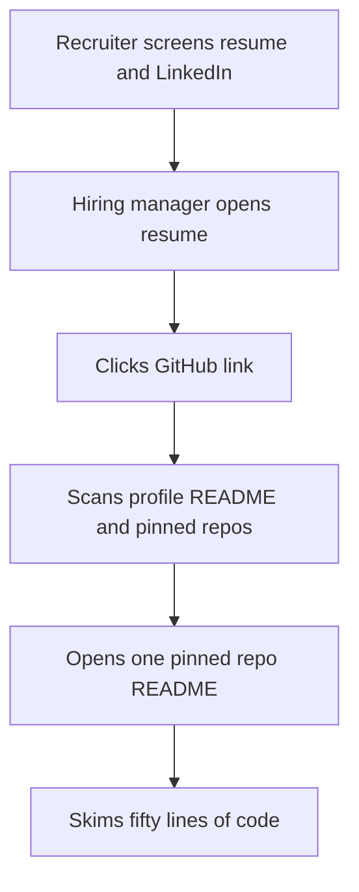
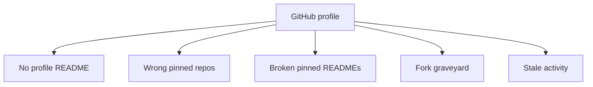

# Lecture 2 — The GitHub Profile That Tells a Story

> **Duration:** ~2 hours. **Outcome:** You can audit your GitHub profile against the five common failure modes, choose three pinned repositories that demonstrate distinct skills, write a profile README that gives a reviewer the right context in 30 seconds, and structure a project README so the reader can run the code in three commands or fewer.

## 1. Who actually reads your GitHub

A LinkedIn profile is read by recruiters. A GitHub profile is read by **hiring managers and engineers on the team you're applying to**. Two different readers, two different rules.

The typical click-through:

1. The recruiter screens you (resume + LinkedIn). They move you to the next stage.
2. The hiring manager pulls your resume to prep for the screen. Most resumes list a GitHub URL in the header. They click it.
3. The hiring manager spends **60-90 seconds** on your GitHub. They look at: the top-of-profile (your profile README, if it exists), the pinned repositories (the six slots above the fold), and maybe the activity grid.
4. If something catches their eye, they click into one pinned repo and read the README. Another 60-90 seconds.
5. If the repo README is good, they may scan a file or two of code. Most won't read more than ~50 lines.


*The narrow path a hiring manager actually walks through your GitHub.*

**The implication is brutal:** your GitHub gets less than three minutes of real attention from a senior engineer. That time is spent on three surfaces — the profile, the pinned repos, the top repo's README. Everything else (your 47 untouched forks, your activity grid from 2019, the abandoned half-projects in the lower repo list) is noise around those three surfaces.

This lecture is about making those three surfaces load-bearing.

## 2. What "good GitHub" actually signals

Hiring managers are not counting your green squares. They are reading for three things:

1. **You can ship.** You have at least one repo where the code is real, the README explains it, and the project does what it claims.
2. **You can write.** Your READMEs are clear, the prose is structured, and the project documentation reflects engineering judgment about what a reader needs first.
3. **You have judgment.** You pinned the right three repos, not the random first three. The profile is curated.

What "good GitHub" is **not**:

- A high commit count. Daily-streak farming reads as obsessive, not productive.
- A long list of repos. 80 forks of other people's projects signal nothing.
- A perfect contribution graph. Green-square farming is widely known and deeply uncool.
- An aesthetic profile README full of badges and animations. Reviewers skim past these.
- Public popularity (stars). A 5-star repo with a great README beats a 500-star repo with a broken `npm install`.

The exception, for engineers with significant open-source contributions: a profile that shows substantial work on real public projects (commits to React, Linux, a major library you maintain) is a strong signal. This describes <5% of working engineers. The rest of us are evaluated on the curation of our own repos.

## 3. The five common failure modes

Most engineering GitHub profiles fail one of these five ways. Each is fixable in under an hour.


*The five ways an engineering GitHub profile most commonly fails.*

### Failure 1 — No profile README

GitHub introduced the `<username>/<username>` "profile README" feature in 2020: create a repo named exactly your username, with a README.md at the root, and that README renders on your profile page above the pinned repos. Most engineers never set this up.

The cost of skipping it: your profile opens with the default GitHub layout (avatar, contribution graph, repo list). A reader has no context for what they're about to look at. They have to infer what kind of engineer you are from the repo names alone — and repo names alone are not enough.

**The fix:** create the repo, write a short profile README (covered in §5).

### Failure 2 — No pinned repos, or wrong pinned repos

GitHub lets you pin up to 6 repos to your profile. These render above the fold and are what every visitor sees first. The default state: no pins. The common bad state: pinning whatever GitHub auto-suggested (often: your most-recent commit activity, which may be a fork, a class project from 4 years ago, or an experiment).

The cost: the reader sees the wrong three projects and forms an impression of your skill level based on the weakest of them.

**The fix:** pick the three best repos, intentionally; pin those. Three is enough. Six is fine if you have six good ones, which you probably don't.

### Failure 3 — Pinned repos with broken or absent READMEs

You pinned the right three repos, but two of them have a README that says "TODO" or auto-generated boilerplate from `create-react-app`. The reader clicks in, finds no explanation, and bounces.

The cost: the same as having no README at all. A repo without a real README is invisible signal.

**The fix:** §6 of this lecture is the README structure. Apply it to each pinned repo.

### Failure 4 — Fork graveyard

Your profile shows 73 repositories. 60 of them are forks of tutorials, course repos, or projects you cloned and never touched. The pinned repos get visually drowned by the long list below.

The cost: the reader assumes the pinned ones are the highlights of a long mediocre catalog. Even if the pins are strong, the volume of empty forks dilutes the impression.

**The fix:** delete or hide the forks. GitHub lets you hide individual repos from your profile without deleting them. For each fork on your profile, ask: "would I pin this if it were one of three?" If no, hide it.

### Failure 5 — Stale activity, dead account look

Your last commit is from 14 months ago. The contribution grid is mostly gray. The reader concludes that GitHub isn't where your actual work happens — fine — but with no signal pointing them elsewhere, they leave with no impression at all.

The cost: a recent senior-engineer-level reader will assume you've stopped coding personally and that everything you've done since is in a private corporate repo they can't see. Without something to read, they have no way to assess your code.

**The fix:** either contribute *something* recent (a small useful repo, a README polish on existing work, a single thoughtful PR to a project you use), *or* update your profile README to point readers at where your work actually lives (a personal blog, a portfolio site, a list of recent projects with descriptions).

## 4. The profile audit — what your visitor sees

Before changing anything, audit. Open your GitHub profile in a private browser window (so it's the logged-out view). Note:

- **Top of page.** Is your profile README there? Does it tell the reader what kind of engineer you are in <30 seconds?
- **Pinned repos.** Six slots. How many are filled? Are they your strongest work or your most recent? Click each — does it have a README a reviewer can read in 90 seconds?
- **Repository list.** Scroll down. How many repos total? What fraction are forks vs. yours? What fraction have been updated in the last 12 months?
- **Activity grid.** Roughly how dense? Is there a long gap? Does it match the story your resume tells about being active?
- **Followers / following / stars.** Not load-bearing — but if you have meaningful followers (>50 from open-source contribution), it does add a signal.

Write the audit down. Exercise 2 walks through this with a structured worksheet.

## 5. The profile README — the homepage you didn't know you had

Create a repository named exactly your GitHub username (case-sensitive). Add a `README.md`. That file renders on your profile page above your pinned repos.

### What goes in the profile README

Keep it short. The reader is here for 30 seconds. Three to five short sections, in this order:

1. **One-line intro.** Who you are, what you do, and the one or two technologies you'd want a reader to associate with you.
2. **Currently working on.** One short paragraph or 2-3 bullets. What you're building, learning, or shipping right now. Updates monthly.
3. **Notable projects.** A short list (3-5 items) with one line each, linking to repos. This is the curated tour. Each line is one sentence: "what it is, what it demonstrates."
4. **Where else to find me.** Personal site, LinkedIn, blog, email. One line each. Make contact easy.
5. **Optional: a "what I'm reading / learning" section.** Books, papers, or tools you're currently digging into. Only if you'll actually update it; stale "currently reading" entries are worse than absence.

### A worked example — the structure

```markdown
# Jane Doe

Backend engineer focused on distributed systems and payments infrastructure.
Currently at Acme; previously Stripe. Most days I'm writing Python and Go.

## Currently working on

- A small Postgres-backed job queue library: `github.com/janedoe/letterbox`
- A series of posts on payments-idempotency patterns: `janedoe.com/blog`

## Notable projects

- **[letterbox](https://github.com/janedoe/letterbox)** — Postgres-backed job queue, 1.4k LOC Go. The architecture writeup is the README.
- **[idempotency-key](https://github.com/janedoe/idempotency-key)** — Library for safe retries against external APIs. Used in production at Acme.
- **[acme-cli](https://github.com/janedoe/acme-cli)** — Command-line tool I built and ship for Acme's internal team (~40 users).

## Elsewhere

- Site / blog: <https://janedoe.com>
- LinkedIn: <https://linkedin.com/in/janedoe>
- Email: jane@example.com
```

### What to leave out

- **Skills lists.** "I work with: Python, JavaScript, Java, C++, Rust, Go, Ruby..." — your pinned repos and the project descriptions tell this story. Lists read as filler.
- **Animated GIFs of someone typing, "Welcome to my profile" banners, large emoji marquees.** These were a 2021 trend; in 2026 they read as cargo-culted decoration. Skip.
- **GitHub stats widgets ("contributions this year: 1,247").** Auto-rendered stats blocks are widely known to be game-able and recruiters discount them. They take up real estate and add little.
- **Personal-life trivia unrelated to engineering.** "I love cats and craft beer." Fine in conversation; out of place on a hiring document.
- **"Open to opportunities" banners on the profile README itself.** The signal belongs on LinkedIn (the Open-to-Work toggle); on GitHub it reads as desperate. If you want to signal availability, the line in §4 ("Where to find me") with "email" is enough.

### Length

100-250 words. If you're over 350, cut. The README is a directory, not a portfolio.

## 6. The project README — the most-read 200 lines you'll write

For each of your three pinned repos, the README is what determines whether a reviewer's 90 seconds of attention turn into a "this person can ship" judgment or a "click back."

### The structure that works

Eight sections, in this order. Most projects need 5-6 of these; some need all 8.

1. **One-sentence description.** First line, after the title. What is this and what problem does it solve. No buzzwords. ("A small Postgres-backed job queue with at-least-once delivery and exponential backoff," not "An enterprise-grade scalable solution.")
2. **A screenshot, demo GIF, or sample output.** First screen of the README. Show what running the code looks like. If it's a library, paste a 5-line code example using it. If it's a CLI, paste an actual terminal session.
3. **Install / run in three commands.** A `Quick start` section with three commands or fewer that take a reader from `git clone` to "the thing is running." If you can't, the project is hard to evaluate.
4. **What problem it solves.** 1-2 short paragraphs. Why this exists, what alternative you tried first, what was wrong with the alternative.
5. **How it works.** A short architecture section. For a library: the API surface and the design decision. For an application: a diagram or 3-bullet description of the components.
6. **Status.** "What works, what doesn't, what's planned." Honest. A project that says "in-progress, the X endpoint works but the Y is rough" reads stronger than one that pretends to be polished.
7. **License.** One line. MIT, Apache-2.0, or whatever you've chosen. Without a license, others can't legally use your code — and the absence reads as carelessness.
8. **Optional: contact, contribution guide, related projects.** Short.

### What an engineer-reviewer is actually looking for

When a hiring manager opens your project README, they are forming three judgments in the first 30 seconds:

- **Can this person explain a problem?** If the README opens with "this is a project I built for class," they have no signal. If it opens with "I needed a job queue that survives Postgres restarts; existing libraries either required Redis or didn't support retries with backoff," they have a complete signal — you can frame a problem.
- **Can this person produce a working artifact?** If the Quick Start section runs end-to-end without surprise, the project is real. If `npm install` errors and the README has nothing about it, the project may be vaporware.
- **Did this person think about the reader?** A README that explains *why* before *what*, that includes a sample output before the install steps, that mentions known limitations — reads as written by someone who imagines the reader. A README that's a wall of `pip install -r requirements.txt` and "TODO: add docs" reads as written by someone who doesn't.

### A worked README — annotated skeleton

```markdown
# letterbox

A small, Postgres-backed job queue for Go. At-least-once delivery, exponential
backoff, no Redis required.


## Quick start

```bash
go get github.com/janedoe/letterbox
psql -f schema.sql
go run examples/worker.go
```

That's it — the worker now polls the `jobs` table every 250ms and processes
jobs in the order they were enqueued.

## Why

I needed a job queue for a side project that ran on a single $5 VPS. Sidekiq
required Redis (extra cost, extra failure surface); plain cron didn't support
retries; rolling my own from scratch each project was wasted time. `letterbox`
is the layer I kept rewriting: Postgres `SELECT ... FOR UPDATE SKIP LOCKED`,
exponential backoff, idempotency key support, one ~1,400-LOC Go module.

## How it works

[short architecture description, 4-5 bullets]

## Status

- **Works:** enqueue, dequeue, retry, idempotency key, graceful shutdown.
- **Rough:** the metrics endpoint is Prometheus-only; no OpenTelemetry yet.
- **Not started:** scheduled jobs (delayed enqueue past 24 hours).

## License

MIT. See [LICENSE](./LICENSE).
```

### Length

A project README for a portfolio project is 200-500 lines of markdown. Less than 100 lines suggests the project doesn't have enough depth to be on the profile; more than 800 suggests the README is doing work that should be in `docs/`.

## 7. Choosing your three pinned repos

You get six pinned slots. Use three. (Three lets the visitor focus; six often dilutes.) The three should demonstrate **distinct skills**, not three versions of the same project.

A defensible mix:

- **One "main project" repo.** The deepest single piece of work you have — a library you wrote, an end-to-end application, a research project. The README is the longest and the architecture is real.
- **One "breadth" repo.** Something that demonstrates a different skill or technology from the main project. If the main is backend Python, the breadth might be a small frontend project, a CLI tool, or an infrastructure repo.
- **One "polish" repo.** A small project that's well-documented and easy to run. Demonstrates that you can ship a complete thing, even if it's modest. ("polish" reads stronger than ambition that didn't finish.)

What to **not** pin:

- **Tutorials and course projects** unless they were unusual in scope (a full operating system project, a serious Raft implementation). The default class project is invisible signal.
- **Forks of well-known projects** unless your fork is doing something distinct (your fork added a documented feature, has 5+ commits beyond `master`, has its own README).
- **Repos with no README or with `create-react-app`'s default README.** No README = no signal.
- **Half-finished experiments.** If "Status" would have to read "abandoned after 3 weeks," skip.

### How many pinned repos do you actually need?

For a new grad: 2-3 strong repos beat 6 mediocre ones. Pin 3.

For a mid-level engineer (3-7 YoE): the pinned repos matter most if your day-job code is in a private corporate repo. Pin 3-4 things from outside work — small libraries, experiments, demos.

For a senior+ engineer: the pinned repos matter least. Your resume and LinkedIn carry the weight. But the README on the strongest pinned repo can still be load-bearing in the recruiter screen.

## 8. The activity grid — what it signals, what it doesn't

The contribution grid (the green squares) is the most-discussed and least-important feature of your GitHub profile.

What it actually signals:

- A long fully-gray period (12+ months of nothing) signals that your GitHub isn't where your work lives. That's fine if your profile README or pinned repos make this clear.
- A consistent low-density pattern (a few green squares per week, across years) signals an engineer who codes in side hours. Mild positive.
- A burst of activity in the last 60 days when there was nothing for the prior 2 years signals job-search-driven theater. Slightly negative — recruiters recognize the pattern.
- A perfect dark-green grid (every single day) signals streak-farming. Slightly negative, for the same reason.

What it does **not** signal:

- Your skill level. A staff engineer at a big company may have a gray grid; a bootcamp grad may have a deep-green one.
- Your work ethic. Most professional code is in private repos that don't count.

**Implication.** Don't optimize for the grid. Do make sure that **if** your grid is mostly gray, your profile README points the reader at where the work actually is (work GitHub Enterprise account, personal blog, portfolio site). Unexplained grayness is the failure; explained grayness is fine.

## 9. The repository list and what to hide

GitHub shows your repositories on the profile, sorted by recent activity by default. The reader scans them after the pinned section.

The hygiene:

- **Hide tutorial forks.** "Settings → Manage repositories pinned to profile" — actually, this is done per-repo: open each repo, hit Settings, and uncheck "Visibility on profile" (where supported) or move it to a separate account. The easier path: delete forks you don't need.
- **Make experimental repos private** until they're presentable. Public junk is worse than private junk.
- **Archive abandoned projects.** If a repo is "done" or "no longer maintained," archive it (Settings → Archive). The archive flag is a positive signal — it says "I knew when to stop" rather than "I abandoned this."
- **Pin your strongest 3.** Pinning floats them above the auto-sorted list.

After cleanup, your public repo count should be ~5-15 for a typical engineer. Less than 5 looks empty; more than 25 dilutes (unless you're an open-source maintainer with real reason to have many).

## 10. The README that gets you a screen

A worked sequence of how a strong GitHub presence converts to interviews:

1. The recruiter screens you (resume + LinkedIn). You move forward.
2. The hiring manager opens your resume to prep for the screen. They click your GitHub URL.
3. They land on your profile. The profile README orients them in 20 seconds: "Jane is a backend engineer who builds payments infrastructure; her main project is letterbox."
4. They click into letterbox. The README opens with one sentence ("Postgres-backed job queue, no Redis required") and a demo GIF. They believe it's real.
5. They scan the architecture section. The design decisions are explained briefly. They believe Jane has judgment.
6. They close the tab.
7. On the screen the next day, they open with: "Walk me through letterbox." You spend 5 minutes giving a coherent technical story about a project you actually built.

That's the whole loop. The READMEs are the second-most-important hiring artifact you produce — after the resume itself. This week's mini-project is bringing one repo to that standard.

## 11. The portfolio site question

Some engineers maintain a personal site (jvns.ca, simonwillison.net, brittanychiang.com). For most candidates, this is **optional and high-effort**.

When a portfolio site is worth building:

- You enjoy writing. The blog is the load-bearing content; the site is just hosting.
- You're targeting a specific niche (developer tools, design-engineering, infrastructure) where a public portfolio is the entry credential.
- You're applying at senior+ levels where a public body of work is expected.

When it's not worth building:

- You're a new grad or early-career engineer focused on getting hired in the next 90 days. Time spent on a portfolio site is time *not* spent on C2 problems or resume tailoring.
- You don't have content to put on it. An empty portfolio site reads worse than no portfolio site.

A reasonable middle path: a single-page personal site with your name, a 200-word About, links to your GitHub, LinkedIn, and email, and a list of 3-5 projects with one line each. This is 4 hours of work; it gives the recruiter a clean "Google this person" landing page; it doesn't require a blog cadence.

## 12. The "Google your name" audit

The cross-surface check: what comes up when someone Googles your full name?

Steps:

1. Open a private browser window.
2. Search: `"Jane Doe"` (with quotes, your exact name).
3. Also try: `"Jane Doe" engineer`, `"Jane Doe" {your-city}`, `"Jane Doe" {your-current-employer}`.
4. Note the first 10 results.

What you want to see:

- Your LinkedIn (top result, in most cases).
- Your GitHub.
- Your personal site, if you have one.
- Possibly: a conference talk page, a published article, a public open-source contribution.

What you don't want to see:

- An old MySpace, Tumblr, or geocities-era page with content that reads adolescent.
- A public profile on a hobby site that contradicts your resume's professional shape.
- A namesake who is more famous than you — your results swamped by someone else's content. (If this is the case, distinguish yourself: middle initial in your LinkedIn name, location specifier, etc.)

The audit takes 10 minutes. The cleanup may take hours if you have old accounts to lock down or delete. Worth it once.

## 13. Self-check

- What are the three surfaces of your GitHub a hiring manager actually reads, and roughly how long do they spend on each?
- A profile has 73 repositories, 60 of them forks of tutorials. What's the failure mode and what's the fix?
- Your pinned repos are good but their READMEs say `TODO`. What does the reviewer conclude?
- Name three things that belong in a profile README and three that don't.
- A project README that opens with "this is a project I built for class" — what's missing, and what's the rewrite?
- Your contribution grid is mostly gray. What's the cost, and what's the lowest-effort fix?
- You have six pinned repo slots. Why does the lecture recommend pinning three?

## Further reading

- **GitHub Docs — Managing your profile README:** <https://docs.github.com/en/account-and-profile/setting-up-and-managing-your-github-profile/customizing-your-profile/managing-your-profile-readme>
- **GitHub Docs — Pinning items to your profile:** <https://docs.github.com/en/account-and-profile/setting-up-and-managing-your-github-profile/customizing-your-profile/pinning-items-to-your-profile>
- **awesome-github-profile-readme — gallery of strong examples:** <https://github.com/abhisheknaiidu/awesome-github-profile-readme>
- **Make a README — minimum content guide:** <https://www.makeareadme.com/>
- **Julia Evans — "Writing good documentation":** <https://jvns.ca/blog/2023/12/29/writing-good-documentation/>

When both lectures are clear, the [exercises](../exercises/README.md) take you from "current LinkedIn + GitHub" to "the polished version that a recruiter and a hiring manager will read with respect."
