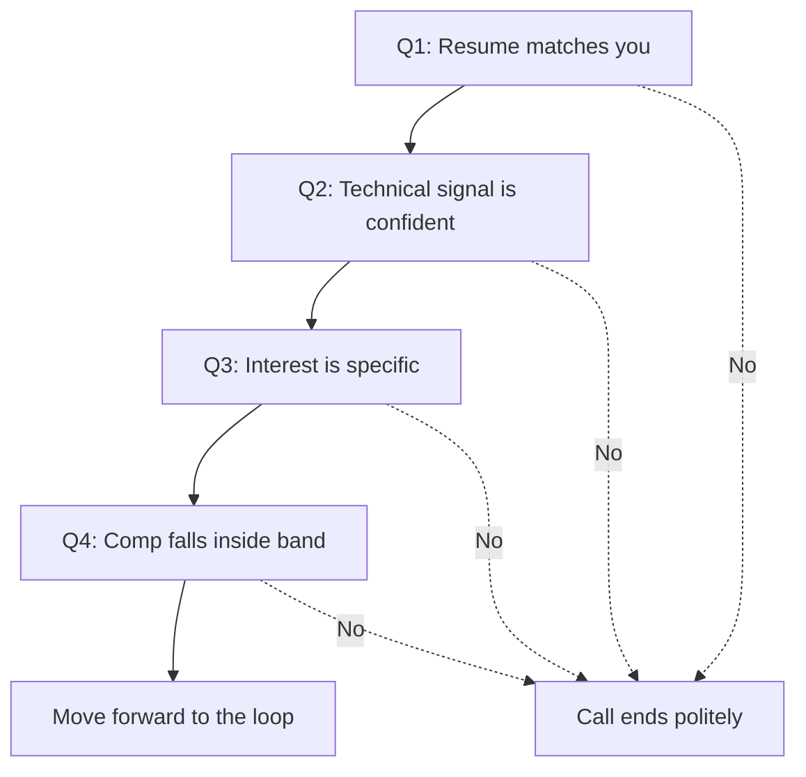
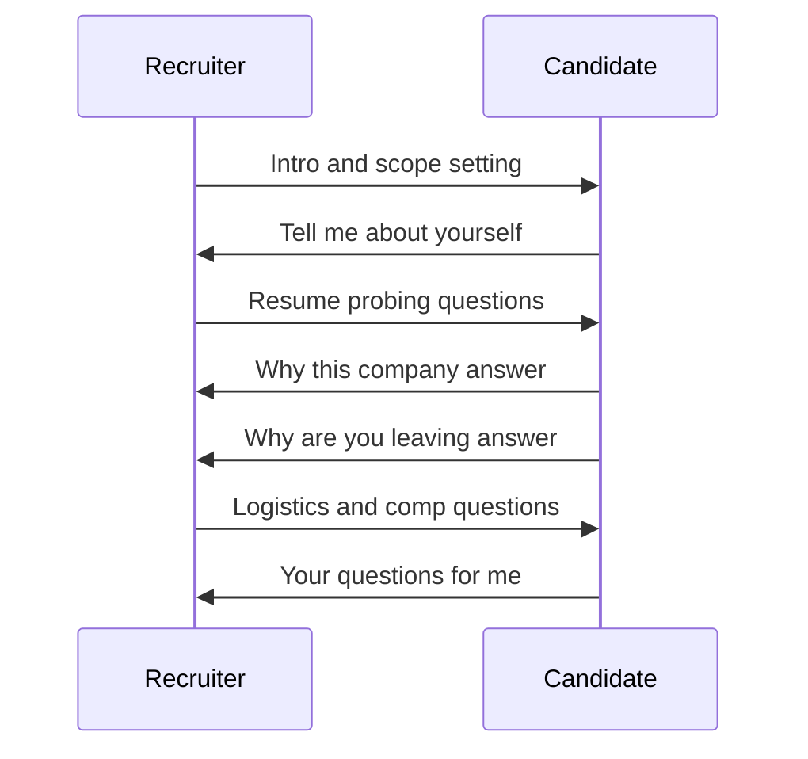

# Lecture 1 — The 30-Minute Call Anatomy

> **Duration:** ~2 hours. **Outcome:** You can name the four questions every recruiter screen is structured to answer, walk through the seven beats of a typical 30-minute call, deliver a 2-3 minute "tell me about yourself" answer that maps to your resume, and write a three-reason "why this company" answer that doesn't bluff.

## 1. The recruiter screen is a structured 30 minutes

The first call in nearly every interview loop in tech is a 30-minute conversation with a recruiter. Not a hiring manager. Not an engineer on the team. A recruiter — an internal employee of the company, sitting in front of an applicant-tracking system, with a screening rubric on the other monitor.

Candidates routinely misread this call. The two most common misreads:

- **"It's just a chat."** It is not. The recruiter is taking notes, filling out a structured form, and scoring you against 6-10 questions that map to their internal pass/fail rubric. The form goes into the ATS as the first scored artifact of your candidacy.
- **"It's a deep technical conversation."** It is not. The recruiter typically cannot evaluate technical depth and is not trying to. They are checking that you sound coherent, that your resume claims hold up to light probing, and that the logistics work.

The honest framing: the recruiter screen is a **fit-and-friction filter**. The recruiter is not deciding whether to hire you; they are deciding whether to spend the company's engineering time on you. That decision is made by answering four questions, in the same order, on nearly every screen call you will take.

## 2. The four questions every recruiter screen is structured to answer

Every recruiter screen, regardless of company or seniority, is trying to answer the same four questions. Internalise them; you will hear them rephrased a hundred different ways across the cycle.

### Question 1 — Are you who your resume says you are?

The recruiter has your resume open in another tab. The first portion of the call cross-checks the resume against you live: does your verbal description of your current role match the resume bullets, can you talk about the projects listed, do the dates make sense, does the seniority you claim correspond to the scope you describe.

This is why "tell me about yourself" is almost always the first real question. It is the recruiter handing you the microphone to confirm — or contradict — what they just read.

### Question 2 — Will you pass the technical loop?

The recruiter cannot evaluate your technical depth themselves. What they can evaluate is **signal density**: do you use specific technology nouns, do you describe systems with appropriate scope, do you avoid hand-waving when asked a follow-up. They are looking for a confident "this person will not embarrass me with the hiring manager."

The recruiter has a kill-list of candidates who passed the screen and then bombed the technical. Their job-stability incentive is to not put another name on that list. If you sound vague about your own work, that's a flag — not because vague means incompetent, but because vague is hard to defend to the engineering team.

### Question 3 — Do you actually want this specific role?

The recruiter has 80 candidates in the pipeline. They will move forward with the ones who clearly want *this* role, not "any senior backend role anywhere." The cost of moving forward with a lukewarm candidate is a 4-stage process that ends in a decline, which is a wasted week of engineer time.

This is why "why this company?" and "why are you looking?" come early. They are filtering for candidates whose interest is specific enough that the chance of a late-stage decline is low.

### Question 4 — Is your compensation expectation inside band?

Every role has an internal compensation band — a pre-approved range the recruiter is authorised to offer. If your expectation is above band, the recruiter will not move you forward (unless your seniority is exceptional and they can pitch an exception, which is rare). If your expectation is below band, they will sometimes still move you forward and pay you below band. Both outcomes are bad for you.

This is why the comp question appears in nearly every screen, often near the end. Lecture 2 is the entire treatment.

**The mental model.** Four questions. Four pass/fail bits. You need 4-for-4 to move forward. The screen is structured to surface a "no" on any of them as early as possible — so the recruiter can end politely and save everyone's time.

*Each of the four questions is a pass or fail gate; one no ends the call early.*

## 3. The seven beats of a typical 30-minute call

Here is the structure that recurs across virtually every internal-recruiter screen at a tech company. Times vary by ±2 minutes; the order is remarkably consistent.

| # | Beat | Time | What's actually happening |
|---|------|------|---------------------------|
| 1 | Recruiter intro + scope-setting | 2-3 min | They name themselves, the role, and the rough loop structure. You confirm you're talking about the right req. |
| 2 | "Tell me about yourself" | 3-4 min | You deliver the 2-3 minute self-intro. They listen and skim your resume. |
| 3 | Resume probing | 4-6 min | They pick 1-2 bullets and ask follow-ups. Often: "Tell me more about $project from $company." |
| 4 | "Why this company / why this role?" | 3-4 min | You deliver the three-reason answer. They look for specificity. |
| 5 | "Why are you looking / why leaving?" | 2-3 min | You give the dignified non-answer. They look for any sign of conflict, instability, or burning bridges. |
| 6 | Logistics + comp | 5-7 min | Notice period, work auth, location, target start date — and the comp conversation. Lecture 2 covers this. |
| 7 | Your questions + close | 4-6 min | "Do you have any questions for me?" Then they walk you through next steps if you're moving forward. |

Two patterns to notice:

- **The first 10 minutes is mostly you talking.** Beats 2 and 3 are 7-10 minutes of monologue with light interjection. If you have not rehearsed those two beats, you will burn most of your screen flailing in them.
- **The last 10 minutes is mostly logistics.** Beats 6 and 7 are short, transactional, and frequently fumbled by candidates who didn't think about them in advance. The candidates who lose screens often lose them in the last 10 minutes, not the first 10.

The middle 10 minutes — beats 4 and 5 — is where specificity (about the company, about your reasons) earns you the moveforward.

*The seven beats of a 30-minute screen, as a back-and-forth between recruiter and candidate.*

## 4. "Tell me about yourself" — the 2-3 minute script

This is the single most-asked question in the entire interview pipeline. You will deliver some version of this answer 10-30 times across a cycle. It is worth spending an hour drafting and another hour rehearsing.

### What the question is actually asking

The recruiter is not asking for your autobiography. They are asking for a **professional shape** that they can hold next to your resume. They want to hear:

1. Your **current state** — role, employer, what you build (60-90 seconds).
2. The **path** — one or two prior roles in compressed form, framed for relevance to the role they're hiring for (30-60 seconds).
3. **What you're looking for next** — the forward-looking sentence that connects your background to their role (20-30 seconds).

Total budget: **120-180 seconds**. Under 90 seconds reads as not-engaged. Over 240 seconds reads as undisciplined.

### The structure

The reliable script structure, in three paragraphs:

> **(Current state — 60-90 sec.)** I'm a {role} at {company}, where I {one-sentence on what you build}. Most of my work is in {2-3 technologies} on {platform/cloud}. Over the last {N months/years} I've shipped {one or two named outcomes, ideally with numbers}.
>
> **(Path — 30-60 sec.)** Before {current company} I was at {prior company} doing {one-line on prior role}. {Optional: how the transition happened in one sentence.} The thread across both is {the through-line — a domain, a kind of system, a kind of problem}.
>
> **(Next — 20-30 sec.)** What I'm looking for next is {kind of role}, ideally at {kind of company} where I can {specific thing you'd own or learn}. That's why I was interested in this role specifically.

Three rules:

- **Lead with current.** Most candidates open with college, which wastes the first 30 seconds on the least-relevant content.
- **Quantify at least once.** One number — dollars, users, latency reduction, team size — anchors the whole answer in something verifiable.
- **Land on a forward-looking sentence.** The recruiter is now primed for beat 4 ("why this company?"). The last sentence should set them up.

### A worked example — before

> "Yeah so, I went to school at $university, graduated in $year, computer science major. Then I joined $company1 as an intern, then I converted full-time, I did backend stuff there for a couple years, mostly Python. Then I moved to $company2 — that's where I am now, I'm a backend engineer on the platform team. I work on a few different things, sort of microservices, sort of data pipelines. Yeah. I've been doing that for a while now and I'm looking for something new."

What's wrong: it opens with school (irrelevant to a screen for a senior role), uses "sort of" twice (signals uncertainty), names no technologies a recruiter can match against a JD, contains zero quantified outcomes, and ends on "something new" (no forward direction).

### After

> "I'm a senior backend engineer at Acme, where I own the payments service — it processes about $2M a day across 12 countries. Most of my work is in Python and Go on AWS, with Postgres and Kafka under it. Over the last 18 months I shipped the rewrite of our settlement reconciliation pipeline (cut end-to-end from 4 hours to 35 minutes) and led the split of our payments monolith into three services.
>
> Before Acme I was at Stripe for two years on the dispute team, also in Python — building automation around chargeback workflows. The thread across both is payments infrastructure: I've spent five years near money-movement systems, mostly on the reliability and reconciliation side.
>
> Next, I want to go deeper into distributed-systems work at a company where payments is the core product, not a feature. That's why I was interested in {Company X} specifically — your engineering blog post on the new ledger architecture is exactly the kind of work I want to be doing."

What's load-bearing: concrete dollars, named technologies, specific outcomes with magnitudes, a through-line that names the domain ("payments infrastructure"), and a closing sentence that names a specific company artifact (their engineering blog).

### The pacing rule

Time yourself. 120-180 seconds is **300-450 spoken words**. If you read your draft aloud and it comes out under 90 seconds, you're skipping the path paragraph or rushing. Over 240 seconds, you are listing rather than narrating — cut.

The recording exercise (Exercise 1) is where you find your actual pacing. Most candidates discover, on the first recording, that what felt like 90 seconds was 200, and what felt like 180 was 75. Calibrate empirically.

### Banned phrases (carried over from Week 3)

- "I'm passionate about technology."
- "I'm a lifelong learner."
- "I'm a team player who thrives in fast-paced environments."
- "I wear many hats."
- "I'm a results-driven self-starter."

These signal *generic*, not strong. Every recruiter has heard each of these phrases roughly 10,000 times. They evaluate to background noise. Cut on sight.

## 5. "Why this company?" — the three-reason structure

The recruiter is filtering for candidates whose interest is specific. Specific means "I know one thing about this company that isn't on the front page of their website." Three of those things is the target.

### What the question is actually asking

Two things, simultaneously:

1. **Have you done any homework?** A candidate who walks in cold is a flight risk later in the process.
2. **Is the homework you did specific to *this* company, or generic boilerplate that swaps in any company name?**

A weak answer is one that you could give about 30 other companies by changing one word. A strong answer names something only true of this company.

### The structure

Three reasons. Ordered roughly from most-specific-to-this-company to most-generic. Each is 20-40 seconds. Total: 90-120 seconds.

> **Reason 1 — Product or technical specifics.** One specific thing about *what this company builds* that you find interesting. "Your engineering blog post on the dual-region failover for the ledger" or "the fact that you're one of the few payments companies that runs your own card-issuing rails" or "the recent open-source release of {library}."
>
> **Reason 2 — Stage / scope / business-shape fit.** One specific thing about the *kind of company* this is that fits where you want to be. "Series B, post-PMF, ~80 engineers — that's the stage where I think I can have the most impact" or "I want to work somewhere where payments is the core product, not a feature."
>
> **Reason 3 — A specific person or team signal (optional but strong).** One specific person or team artifact that drew you in. "I saw {Engineer X}'s talk on {topic} at {conference}" or "I follow {team}'s open-source work on {project}." Use this if you have a real signal; do not fabricate.

### Examples — before

> "I think your company is doing really exciting work and the culture seems great. I've heard good things from people, and I think it would be a great fit for me to grow my career."

What's wrong: every phrase here ("exciting work," "great culture," "good things from people," "grow my career") could be said about any company. Zero signal.

### After

> "Three things, in order. One — I read your engineering blog post on the new ledger architecture about a month ago. The decision to split read and write paths the way you did is exactly the kind of distributed-systems work I want to spend the next few years on. Two — you're at the stage I'm targeting: post-PMF, ~120 engineers, payments as the core product. That's the stage where a senior IC can still own a major piece end-to-end. Three — I saw {Engineer X} give a talk on idempotency at PyCon last year, and the open-source library that came out of that talk is one I've actually used in production at my current job."

What's load-bearing: a named artifact (the blog post), a stage descriptor (post-PMF, ~120 engineers, payments-as-product), and a specific person + named work. None of these can be cargo-culted from a different company.

### The 20-minute prep rule per company

For each Tier-A target, the three-reason answer should take you **about 20 minutes** to prep. The structure of the prep:

1. **5 minutes — Engineering blog / public technical content.** Read or skim the most recent 2-3 posts. Pick one that you can speak to without bluffing.
2. **5 minutes — Stage and shape research.** Crunchbase, LinkedIn employee count, the company's About page. Land on a one-sentence description of stage / size / business model.
3. **5 minutes — People / team signal.** Who's on the engineering team's LinkedIn page? Has anyone given a recent talk? Any open-source from the team that you've seen?
4. **5 minutes — Draft the three-reason answer**, in writing, in your prep doc.

20 minutes × 5 Tier-A targets = 100 minutes total. That's Exercise 2.

## 6. "Why are you looking / why are you leaving?" — the dignified non-answer

This question is a trap if you don't have a clean answer rehearsed. Two failure modes:

- **You badmouth your current employer.** "My manager is awful, the codebase is a disaster, leadership is delusional." Even when true, the recruiter writes it down. They cannot evaluate whether you're correct; they can evaluate that you will probably badmouth them too, some day.
- **You give a confused, meandering answer.** "I'm not really sure, I just kind of feel ready for something new..." Reads as a flight risk: someone whose own reasoning is unclear is likely to flake on next steps.

### The dignified structure

One sentence on the **push** (the thing about your current role that's not what you want long-term). One sentence on the **pull** (the kind of thing you're looking for next, framed positively). One optional sentence on **timing** (why now).

> "At my current role I've built and shipped {X}; what I want next is to go deeper into {Y}, and {current company} doesn't have the {Y} surface. I'm at the natural end of my current scope — the next 12 months would be more of the same — so this is the right time to look."

Three things this answer does:

- Names a concrete reason ("doesn't have the Y surface") without insulting anyone.
- Frames the move as forward-looking ("go deeper into Y"), not escape.
- Acknowledges timing in a way that signals intentionality, not impulse.

### Variants by situation

- **Laid off.** "My role was eliminated in {month}'s reduction. The team did good work; the company decided to {restructure / focus / etc.}. I'm looking for {kind of role}." Brief, factual, no defensiveness.
- **Already left, gap on resume.** "I left {company} in {month} to {reason: caregiving / study / travel / health / project}. I'm now ready to come back to full-time engineering and want {kind of role}." Owning the gap beats hiding it.
- **First job out of school.** "I'm graduating in {month}; I'm looking for my first full-time role, ideally in {area}." Short, no need to overexplain.
- **Currently happy at current job.** "Honestly, I'm not actively unhappy at {company}. {Specific catalyst — talk, blog post, friend at company} drew me in to look at this specific role, and the more I learned, the more it fit." This works only if true; recruiters can tell when it isn't.

The rule: **two sentences max for the push, two for the pull**. Anything longer reads as overexplaining, which itself signals a problem.

## 7. Logistics — the boring questions that disqualify people

In beat 6, the recruiter runs a logistics check. Each question has a correct format for the answer; candidates who fumble them lose points disproportionate to the question's difficulty.

### Notice period

"What's your notice period at {current employer}?" Standard answers: "Two weeks," "Four weeks (UK / EU contract)," "Immediately available." Whatever the answer, have it ready. Hesitating reads as someone who hasn't thought about leaving seriously.

### Work authorisation

"Do you have authorisation to work in {country}, and will you require sponsorship now or in the future?" Honest one-sentence answers only:

- "Yes, US citizen / permanent resident, no sponsorship needed."
- "I'm on an H-1B at my current employer, I'd need transfer + extension."
- "I'm on OPT through {month/year}, I'll need H-1B sponsorship after that."
- "I'm a UK citizen, work auth is fine for {UK / EU role}; I would need sponsorship for a US role."

Do not bluff or finesse this. Companies that don't sponsor are not going to be talked into it; companies that do will not penalise you for needing it. Honesty is the only winning move.

### Location and remote / on-site

"Where are you based, and are you open to {fully remote / hybrid / on-site}?" One-sentence answer; if the role's location is incompatible with yours, name it before you waste any more of the call.

### Interview availability

"When are you available for the next steps?" Have your weekly availability roughly memorised. "Mornings work best for me Tuesday-Thursday; I can do most afternoons with a day's notice." That kind of answer reads as serious; "Uh, I'd have to check my calendar" reads as not.

### Target start date

"If we made an offer in {N} weeks, when could you start?" Calculate: today + 4 weeks (typical loop) + your notice period. State the number. "Probably late {month}, depending on how the loop runs."

## 8. "Do you have any questions for me?" — the closing question, scored

Almost every recruiter screen ends with this. **It is scored.** A candidate who has no questions is, on the recruiter's rubric, less engaged than one who has three.

### What to ask the recruiter (not the hiring manager — different role, different questions)

The recruiter cannot answer deep technical questions. They can answer:

- **Process and timing.** "What's the typical loop look like for this role? How many stages, what kinds of interviews, what's the rough end-to-end timeline?"
- **The team's shape.** "How big is the team this role would sit on? Who would I report to, and how long have they been at the company?"
- **The hiring bar / what they're optimising for.** "What's the profile of the person who tends to do well in this role? Anything specifically you've seen separate the candidates who pass the loop from the ones who don't?"
- **Compensation structure (if not already covered).** "Can you share the rough band for this role at the level we discussed?"
- **Their own read.** "Based on this conversation, anything you think I should emphasise or be prepared for in the next stages?"

Three questions is the sweet spot. One reads as not engaged. Five reads as not respecting the recruiter's time.

### What not to ask

- Technical depth questions ("how is your CI/CD set up?"). Save those for the engineer interviews.
- Anything you could answer from the company's website ("what does the company do?"). Reads as no prep.
- Compensation questions if comp was already covered in beat 6. Reads as not listening.
- Negotiation moves ("if I had a competing offer, how would that affect..."). Way too early; save for offer stage.

## 9. The post-screen email — the 4-sentence follow-up

Within 4-24 hours of the screen, send a short follow-up email to the recruiter. Most candidates don't; doing so is free conversion.

> Subject: Thanks for today — {your name}, {role}
>
> Hi {recruiter first name},
>
> Thanks for the conversation about the {role} role today. The {one specific thing they mentioned about the role or team that you found compelling} was particularly useful for me to hear about.
>
> A quick clarification on {one logistics item you want to confirm in writing, if any — e.g., the rough loop timeline}: {one sentence}.
>
> Happy to provide any references, prior projects, or context that would help the team prep. Looking forward to next steps.
>
> Best,
> {Your name}

Four sentences. Acknowledges the call, names one specific thing (proof you listened), optionally clarifies one logistic, offers a concrete next-step asset. Closes professionally. Total: under 100 words.

Why this works: it gives the recruiter something to forward to the hiring manager ("here's the candidate's note") without asking anything that demands a response. It also reads as the kind of professionalism that lowers their risk in pitching you internally.

## 10. The five common failure modes

The recruiter screens that go badly almost always fail one of these five ways:

1. **Meandering self-introduction.** No structure, opens with school, no quantified outcomes, no forward sentence. Burns 5 minutes of a 30-minute call and leaves the recruiter with no clear shape of who you are.
2. **Generic "why this company" answer.** Could be said about any company. Signals zero homework.
3. **Undefended comp number.** You name a number with no reasoning, or you decline to name one and the recruiter has to drag it out of you. Both read as unserious. (Lecture 2.)
4. **Fumbled logistics.** "Uh, I'd need to think about my notice period." "I'm not sure if I need sponsorship." These are 30-second answers prepared in advance, not on the call.
5. **Zero questions at the end.** "Nope, you covered everything." Reads as low engagement, and recruiters score it.

Each failure mode is fixable with 30 minutes of preparation. None of them require talent. All of them are still common.

## 11. Internal vs. agency recruiter — what changes on the call itself

Week 1, Lecture 3 covered the structural differences. On the screen call itself, the differences manifest:

### Internal recruiter (employee of the hiring company)

- They know the specific role, the team, and often the hiring manager personally.
- They are constrained by an internal comp band; they cannot offer above it without escalation.
- They will be involved in your loop logistics for the rest of the process.
- They typically score you on a structured form that flows into the company's ATS.

**Implication.** Use them as a process ally. Ask process questions. Don't try to negotiate hard at this stage — the internal recruiter can't change the band on a screen call, and aggressive negotiation here will be remembered for the rest of the loop.

### Agency / external recruiter (working on contract for the hiring company)

- They often work multiple roles across multiple companies; they may know the team less well.
- They are paid a percentage of your first-year base by the hiring company, so they have a direct incentive to maximise your comp.
- They will represent you to the internal recruiter; you don't typically get to talk to the company directly until later.
- They may push you toward roles that fit *their* portfolio more than your interest.

**Implication.** Be polite and clear. Treat them as an aligned negotiator (their interest in higher comp matches yours) but a less-reliable narrator about the role itself. Verify the role specifics independently before investing serious prep time.

## 12. Note-taking during the call

You will take notes during a recruiter screen. Two principles:

- **Don't pretend you're not taking notes.** Recruiters can hear typing on a video call. It's professional to take notes; just say so once at the start.
- **Capture facts, not your impressions.** Facts: stated comp band, loop structure, names of the people you'll meet, key dates, anything they emphasise about the role. Impressions: save for your post-call write-up.

The minimum capture from every screen, into your tracking spreadsheet (Week 1):

- Recruiter name and email.
- Date of screen.
- Comp band, if shared.
- Loop structure: how many stages, what types of interviews.
- Stated timeline to offer.
- One sentence on the recruiter's tone / read of you (your impression, captured in the 10 minutes after the call ends).

## 13. The screen-call cheat sheet (one screen)

By the end of this week you will build a one-page "screen-call cheat sheet" that fits on a single laptop screen. You open it on a second monitor (or the second half of your one screen) during real calls. The contents:

- **Top quarter:** Your 2-3 minute self-intro, written out as bullets (not a script — bullets, so you don't sound like you're reading).
- **Middle quarter:** Three-reason "why this company" — left blank, filled in per company before each call.
- **Lower-middle:** Comp numbers — base anchor, total target, walk-away minimum. (Lecture 2.)
- **Bottom:** Three questions you'll ask the recruiter. Two are reusable across companies; one is company-specific.

A real cheat sheet is **fewer than 200 words**. It is not a script. It is a memory aid for the four highest-stakes beats of the call.

## 14. Self-check

- The recruiter screen is structured to answer four questions. Name them.
- The seven-beat structure of a typical 30-minute call: name beats 2, 4, and 6 with their typical time budgets.
- Your "tell me about yourself" answer is 60 seconds. What's likely wrong? Now it's 4 minutes. What's likely wrong?
- A weak "why this company" answer is one that "could be said about any company." Rewrite the following weak answer: "I think you're doing really exciting work and I'd love to be part of it."
- "Why are you leaving?" — what's the dignified structure?
- A recruiter asks for your target comp. You don't have a number ready. What's the failure cost on the recruiter's rubric? (Lecture 2 has the fix.)
- "Do you have any questions for me?" — what's the difference between a good question to a recruiter and a good question to a hiring manager?

## Further reading

- **Patrick McKenzie — "Don't Call Yourself a Programmer"** (broader frame on how the hiring side reads candidates): <https://www.kalzumeus.com/2011/10/28/dont-call-yourself-a-programmer/>
- **AskAManager — "Phone screens" tag** for recruiter and candidate stories: <https://www.askamanager.org/category/phone-interviews>
- **Tech Interview Handbook — behavioural section** (the question bank): <https://www.techinterviewhandbook.org/behavioral-interview/>
- **Pragmatic Engineer — "How tech companies hire"** (multi-part newsletter series, search archive): <https://newsletter.pragmaticengineer.com/>

When the structure is clear, move to [Lecture 2 — The Comp Conversation](./02-the-comp-conversation.md). The screen call has four questions; comp is one of them and deserves its own treatment.
