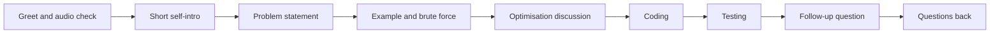

# Lecture 1 — The Shared-Editor Call

> **Duration:** ~2 hours. **Outcome:** You can name what the technical phone screen evaluates and why it differs from every other call in the pipeline, run a CoderPad / HackerRank CodePair / CodeSignal session end-to-end without losing time on the tooling, and identify the four scoring dimensions every rubric uses.

## 1. The technical phone screen is a different call

The technical phone screen is the third major filter in the pipeline. The first two — recruiter screen and hiring manager screen — were conversation-shaped. The third is structurally different: 45 minutes with a shared editor open, an engineer at the other end, and one or two easy-to-mid LeetCode-shape problems. You spend roughly 5 minutes on intro, 5 minutes on problem clarification, 25-30 minutes on the actual coding-and-narrating, and 5-10 minutes on follow-up questions and your own questions back.

The recruiter was filtering for *credibility*. The hiring manager was filtering for *fit*. The technical phone screen is filtering for one thing the first two could not test: do you actually write code? Most candidates self-rate themselves as "good at coding" — the technical screen is the first time in the loop where someone watches and scores it.

### Who's on the call

The interviewer is almost never your future hiring manager. They are usually:

- A working engineer on the team — 2-6 years in, sometimes more senior — who has been asked to run a 45-minute slot.
- A working engineer from a *related* team if the hiring team is small or busy. Same rubric.
- An interviewer from a third-party service like **Karat**. Karat employs engineers specifically to run technical screens on behalf of hiring companies. The structure and rubric are nearly identical to in-house screens, but the recording is mandatory and the interviewer has no skin in your specific hiring decision — they are the most consistent and the most rubric-strict interviewer you will encounter.
- Sometimes: a senior engineer or tech lead, especially for senior+ roles. They will be slightly more flexible on the problem and more probing on the follow-up.

What matters is that this person is **not** the hiring manager. They will not run your 1:1s. They will write 3-5 sentences in the debrief and never think about you again unless the loop converges on a hire. This shapes everything about how the call works.

### What they're evaluating

Four things, in roughly equal weight, often written as a 4-axis rubric:

1. **Problem-solving.** Can you take a vague problem statement, ask the right clarifying questions, walk through an example, sketch an approach, and improve it? This dimension is scored over the *whole* call, not just the moments when you write code.
2. **Coding.** Once you start writing, is the code clean, idiomatic in the language you chose, correct, and readable? Does it compile and run? Bug count matters but is not the only thing.
3. **Communication.** Are you narrating your thinking in a way the interviewer can follow? Can they score what you were doing during the long silent stretches, or were they guessing? Communication is the most-underrated of the four.
4. **Testing.** Did you test the code at the end — actually run it on examples, catch the edge cases — or did you say "I think this works" and stop? Most candidates lose half a point here without realising it.

Note what's *not* scored: deep algorithm knowledge beyond the standard patterns, system design, language esoterica, your resume, your story. The HM screen tested those things; this call doesn't.

### The mental model

The hiring manager screen was a colleague's instinctive read after a 40-minute conversation. The technical screen is a rubric-filled-out by a working engineer who has done this 20-50 times. The scoring is more mechanical and the debrief is shorter. The interviewer writes something like:

> "Took the problem cleanly, asked one clarifying question (about duplicates), walked through an example before coding, proposed brute force then optimised to hash map in one step with no hint. Code was clean Python, ran on the first try, candidate caught the empty-input case in testing. Strong hire on this screen; advance to onsite."

That paragraph is what you are producing. Every minute of the call is either feeding sentences into that paragraph or not. The "not" sentences are the failure modes; the rest of this lecture is how to write the paragraph yourself.

## 2. Technical phone screen vs. HM screen vs. onsite — the comparison

| Axis | HM screen (Week 5) | Technical phone screen (this week) | Onsite (Week 7+) |
|------|---------------------|-------------------------------------|-------------------|
| **Who's on the call** | The future direct manager. | A working engineer (or Karat-employed); not your manager. | 4-5 engineers across coding, system design, behavioural. |
| **What they evaluate** | Recent-project depth, ownership, team-fit, questions back. | Problem-solving, coding, communication, testing — on a live shared editor. | All of the above, across multiple rounds, plus system design and at least one harder coding round. |
| **Anchor question** | "Tell me about a recent project." | "Here's a problem. Walk me through how you'd approach it." | Multiple anchor questions across rounds. |
| **Failure mode** | Vague project, no ownership, no questions. | Silent coding, premature optimisation, no examples-by-hand, no testing. | Compounded; usually the weakest single round determines the loop outcome. |
| **Time budget** | 30-45 min, conversational. | 45 min, hard-bounded by problem time. | 4-6 hours, broken into 45-60 min rounds. |
| **Recording** | Almost never. | Sometimes (Karat always). Check before the call. | Sometimes; system-design rounds often recorded. |

Two implications worth stating explicitly.

**The technical screen is the first call where you cannot bluff.** Every prior call had wiggle room — you could meander on a self-intro, reframe a project description, deflect a sharp question. The shared editor does not let you meander. The code either runs or it does not. The interviewer either watches you find the optimisation or they do not.

**The technical screen is the first call where the tooling itself can cost you points.** If you spend 4 minutes figuring out how to run tests in CoderPad while the interviewer waits, you have lost 4 of your 25-30 coding minutes. The tooling fluency *is* part of the score, even if it is not on the rubric explicitly — interviewers know what a candidate who has practised looks like, and what one who has not looks like, and they score accordingly.

## 3. The shared-editor landscape

Five tools dominate, and you will encounter at least two of them across a real interview cycle.

### CoderPad

The most-common commercial shared editor. Free tier sufficient for practice (no recording on free tier; the pads are timed). Used by a large set of companies — Airbnb, Stripe, Lyft, many mid-stage startups.

**What you need to know going in:**

- **Language selection** is in the top-left dropdown. Switching languages clears the pad — do not do this mid-call.
- **The run button** is bottom-right; it runs the code against the input shown in the input pane. You can paste your own test inputs into the input pane.
- **Tabbed pads** exist (CoderPad calls them "files") — the interviewer may set up multiple tabs for multi-part problems. Click between them at the top.
- **Drawing mode** (the whiteboard tab) is useful for sketching the brute force; the interviewer can see your sketches in real time.
- **Test cases** are a paid feature on the interviewer's side; on your side, you write `print` statements and check output in the run pane.
- **Common shortcuts** — Cmd/Ctrl+S does nothing (auto-saves); Cmd/Ctrl+/ comments; Tab indents; the language-specific shortcuts you'd expect work.

**The 90-second pre-call check:** Open CoderPad on a personal pad, switch to your chosen language, write a one-liner that runs (`print("hello")`), confirm the run pane shows output. Do this before every CoderPad screen, ideally on the same browser you'll use in the call.

### HackerRank CodePair

Second-most-common. Used at HackerRank-customer companies — Bloomberg, some banks, a few large enterprises.

**Differences from CoderPad worth knowing:**

- **The test runner** is more aggressive — CodePair often comes with a pre-written test harness and expects your code to pass the included tests. The interviewer may not tell you the tests until you ask.
- **The language selector** is in the top-right.
- **The chat panel** is on the right side; the interviewer may paste links or hints there. Watch it.
- **The run output** is in a tab next to the editor, not below it. The visual layout misleads candidates used to CoderPad.

CodePair fluency does not transfer cleanly from CoderPad fluency. If you practise only one, you will lose 2-3 minutes the first time you encounter the other. Stretch goal of the week: spend 30 minutes in the other tool before the real call.

### CodeSignal

Used at some companies (Robinhood, Quora, Meta for a stretch in 2022-2023). The "general coding framework" is similar to CoderPad in shape. CodeSignal also has an *asynchronous* certification mode — candidates do problems alone in a recorded session, and the recording is graded later. The async mode is structurally different and not the focus of this week, but if a recruiter mentions "CodeSignal certification," that is the async version.

### Karat

A third-party interview service. Karat-employed engineers run screens on behalf of hiring companies. Karat sessions:

- **Are recorded by default.** The recording is reviewed by hiring engineers from the company; the live interviewer may not be the final scorer.
- **Use Karat's own editor**, structurally similar to CoderPad.
- **Are more rubric-strict** than in-house screens. The Karat interviewer follows a script and is calibrated against other Karat interviewers; "vibe" carries less weight, structure carries more.
- **Often run two problems in 60 minutes**, instead of one in 45. Shorter problems, faster pace.

A Karat screen is the highest-leverage practice surface in the industry, because the recording means the rubric is enforced. If you ever get a Karat screen, treat it as the most-formal version of the call.

### Google Doc / Zoom screen-share / Replit

Fallbacks. Smaller companies and some specific teams use these. The friction is lower than the dedicated tools but there is no test runner — you execute mentally or out of a local terminal you've shared.

The trade-off: in a Google Doc, you can write less code with less precision, because there is no execution to check correctness. The interviewer is scoring the same four dimensions but with a higher tolerance for one-off syntax issues.

## 4. Editor hygiene — the first 90 seconds

The first 90 seconds of the call should be invisible to the interviewer. Anything visible — fumbling for the language selector, asking how to run, getting locked out of your own session — costs measurable points.

The pre-call routine, repeatable in 5 minutes the morning of:

1. **Open the shared editor in the browser you'll use in the call.** Not the one you usually use; the one the call will be in. Some browsers (Safari, older Edge) have quirks with the editor; test in advance.
2. **Pick your language and confirm you can run a one-liner.** `print("hello")` or `console.log("hello")`. If it does not run, you know now, not on the call.
3. **Test your audio with the headset you'll use on the call.** Wired beats Bluetooth. Test in the same browser tab the call will be in if possible.
4. **Have a second tab open with a markdown scratchpad** — your cheat sheet, the JD, your notes from the recruiter / HM. Do not switch tabs visibly during the call.
5. **Have scratch paper and a pen ready.** The trace tables and the example-by-hand work go on paper, not in the editor.

During the call itself, the first 90 seconds:

- **Greet, confirm audio.** "Hi, I'm {name}, can you hear me okay?"
- **Confirm the editor.** "I'm seeing CoderPad with Python selected. Is that right for you?" — this also tests your language choice without committing if the interviewer has a preference.
- **Wait for the problem.** Do not start coding before the interviewer has explained the problem fully. Some candidates rush into the editor on the assumption the problem is going to be the one they expected; this is a tell of underprep.

The whole sequence: under 90 seconds. After that, the problem statement begins, and your time is now the call's time.

## 5. The four scoring dimensions, in detail

The rubric is four axes. Every published company rubric (Google, Meta, Amazon, Microsoft) breaks down to roughly these four with minor renamings. Tech Interview Handbook's synthesised public rubric is the closest single reference.

### Dimension 1 — Problem-solving

What the interviewer is looking for:

- **Did you ask the right clarifying questions before coding?** Empty input, duplicates, expected output format, integer overflow, the size of `n`, whether the input is sorted. Asking 2-3 of these in the first 2-3 minutes lands a full point on this dimension.
- **Did you walk through an example by hand before sketching the approach?** "Let me try this on `[3, 1, 4, 1, 5]` — what should the output be?" Five minutes of example walking is worth twenty minutes of debugging later.
- **Did you propose a brute force first, even if you immediately saw the optimisation?** Skipping the brute force is a recognisable failure mode. Even strong candidates lose half a point here.
- **Did you improve it once you had the brute force?** Most easy problems have one or two optimisation steps from O(n²) to O(n) — usually a hash map or a two-pointer pass. The interviewer is watching for that step.
- **Did you handle the interviewer's hints gracefully?** A hint is a gift; treating it as criticism or ignoring it both lose points.

### Dimension 2 — Coding

What the interviewer is looking for:

- **Clean, idiomatic code in your chosen language.** Python that looks like Java is a tell; so is Java that looks like 2008-era Java. Use the standard library; do not reimplement `Counter` from scratch.
- **Correct names.** `result`, `count`, `i`, `j` — short, lowercase, conventional. Not `myResult` or `theAnswerVariable`.
- **Compiles and runs on the first or second try.** Bugs are normal; compilation failures look like underprep.
- **Handles obvious edge cases in the code itself.** Empty input check, single-element check, sometimes a duplicates check. Adding these proactively while writing the main logic is worth points; bolting them on after the interviewer asks is worth half points.

### Dimension 3 — Communication

The most-underrated dimension. Lecture 2 is the entire treatment. The summary:

- **Talk while you think.** Not constantly, but in beats — every 30-60 seconds, say one sentence about what you are doing or about to do.
- **Talk while you write code,** even if just to say "I'm setting up the loop now, then I'll handle the hash map insert."
- **Recover narration after a silent burst.** When you go silent for 60-90 seconds of focused coding, come back with "Okay, I think that handles the main case. Let me walk through it."
- **Receive hints visibly.** "Oh, good point — I was assuming the input was sorted; let me reconsider." Versus the silent-nod approach, which reads as either not having heard the hint or not having understood it.

### Dimension 4 — Testing

The most-skipped dimension. Most candidates write the code, say "I think this works," and stop. The strong move:

- **Run the code on the original example.** The one the interviewer gave or the one you walked through by hand. Confirm the output matches.
- **Run on one edge case.** Empty input, single element, or whatever the obvious edge is for this problem. Out loud: "Let me try empty input — yes, returns empty as expected."
- **Run on one stress case.** Larger input, or a case that exercises the optimisation. Out loud: "And on a longer one — that's `[5, 2, 8, 1, 9, 3]` — output is what I'd expect."
- **Catch one bug if there is one.** If your code has a bug, finding it yourself is worth more than the interviewer pointing it out. Be willing to slow down at the end and step through; do not rush the testing phase to "finish."

A clean testing phase is 3-5 minutes. Skipping it saves 3-5 minutes you do not have anywhere else to spend; it costs a half-point at minimum.

## 6. The shape of the call — minute by minute

A 45-minute technical phone screen has a typical structure. Memorise this; deviation from it should be deliberate.

| Minutes | Phase | What happens |
|--------:|-------|--------------|
| 0-2 | Greet + audio check | "Hi, I'm X, can you hear me?" Interviewer introduces themselves and the team. |
| 2-5 | Short self-intro and pivot | 60-90 sec self-intro (shorter than the recruiter or HM version), then the interviewer transitions: "Okay, let me share the problem." |
| 5-8 | Problem statement | The interviewer reads or pastes the problem. You listen, take notes, ask 2-3 clarifying questions. |
| 8-12 | Example-by-hand + brute force sketch | You walk through one example out loud on scratch paper. You name the brute force and its complexity. |
| 12-15 | Optimisation discussion | You propose an improvement, name the new complexity, get a green light from the interviewer to code. |
| 15-35 | Coding | Code the optimised solution, narrating in beats. Run it once or twice as you go. |
| 35-40 | Testing | Run on the original example, one edge case, one stress case. Catch any bugs. |
| 40-43 | Follow-up question | Interviewer asks: complexity? extension? production framing? edge case? You answer in 60-90 seconds. |
| 43-45 | Your questions back | One or two short questions; close professionally. |

The phases are not rigid — a particularly fast problem may finish the coding by minute 25 and leave room for a second problem; a particularly tricky one may push testing to minute 42. The interviewer manages the clock, not you. But you should know the shape and notice when you are off the typical timing — if you are still in the brute-force discussion at minute 20, that is a signal to push toward code, not a signal to keep optimising.

*The typical 45-minute technical phone screen moves through eight phases in order, with the interviewer managing the clock.*

## 7. The seven failure modes

The technical screens that go badly almost always fail one or more of these seven ways:

1. **Silent coding.** You stop talking for 8-10 minutes, type fast, then go "okay I think it's done." The interviewer has 8-10 minutes of unscored time and now has to reconstruct what you did. Half-point loss at best.
2. **Premature optimisation.** You skip the brute force and go straight to the optimised approach. Reads as memorised. The interviewer is watching for the *process* of optimisation, not just the optimised answer.
3. **No examples-by-hand.** You read the problem, say "okay, I'll use a hash map," and start coding. You miss the duplicates case because you never walked through an input that had duplicates. Found during testing if at all.
4. **Ignoring the interviewer's hints.** The interviewer says "what if the input were sorted?" and you keep going on your unsorted-input approach. The hint was offered for a reason; not taking it costs the call.
5. **Fighting the editor.** Three minutes spent figuring out how to switch tabs in CoderPad, or how to clear the input pane in HackerRank. Lost time that does not come back.
6. **No testing at the end.** Code looks done; you say "I think this works"; you stop. Half-point loss minimum, more if there was a bug.
7. **Badmouthing the problem.** "This is a really standard easy LeetCode, isn't it?" or "I've seen this one before." Even if true, you've signalled that you think the call is below you. The interviewer is human; they will score accordingly.

Each failure mode is fixable with practice. None require talent. All are still common — the technical screen is the most-skipped prep area among candidates who are otherwise strong, because they think "I can already code" is sufficient.

## 8. Language choice

You pick the language. Pick the one you would write a real production system in *and* that has high readability for the interviewer. The two are not always the same.

### Python — the modal choice

Python is the most-common phone-screen language for good reasons:

- **High readability.** A two-line list comprehension narrates itself; the interviewer follows along easily.
- **Strong standard library.** `Counter`, `defaultdict`, `deque`, `heapq`, `itertools` cover most easy and mid problems without reimplementation.
- **Forgiving syntax.** No semicolons, no curly braces, no type declarations to fight.

Pick Python unless you have a reason not to.

### JavaScript — the secondary choice

Reasonable second pick if you write JS for a living. The array methods (`map`, `filter`, `reduce`, `slice`, `findIndex`, `includes`) cover most live-coding surface. Watch out for:

- **`==` vs. `===`** — use `===` unless you have a specific reason; the interviewer will notice if you use `==`.
- **Hoisting and `var`** — use `const` and `let`.
- **Async/await** — almost never relevant on a phone screen, do not bring it up.

### Java / C++ / Go — the considered choices

Pick one of these only if you are deeply confident. Java has the most boilerplate (the `HashMap<Integer, Integer>` ceremony eats time on the screen). C++ is fine for systems-leaning roles but the iterators take care. Go is fine and increasingly common; the standard library is thinner than Python's but adequate.

### Anti-patterns

- **Picking a language you do not use day-to-day to "look impressive."** Reads as the opposite. The interviewer would rather see clean Python from a Python user than rusty C++ from a Python user.
- **Switching language mid-call.** Almost never the right move. Commit to your choice in the first 90 seconds.
- **Asking the interviewer "what language do you want?"** They want whatever language you are best in. The question signals indecision.

## 9. Audio, video, and the room

The technical screen is more sensitive to audio and connectivity than any other call in the pipeline, because:

- **The interviewer needs to hear your narration.** Dropped audio for 3 minutes during a coding burst is 3 minutes of unscored time. The interviewer cannot reconstruct what you said.
- **You need to hear the interviewer's hints.** A hint missed is points lost.
- **The editor needs a stable connection.** Sync lag in CoderPad or HackerRank looks like you are typing nothing; the interviewer sees a blank pad and assumes you have stopped working.

The minimums:

- **Wired internet or strong wifi.** Mobile hotspot is the worst common option; coffee-shop wifi is the second-worst.
- **Wired headset.** Bluetooth fails at the worst moment. A twenty-dollar wired headset is the highest-leverage purchase for this week.
- **A quiet room.** Background noise — open windows, roommates, cafe — wears the interviewer down across 45 minutes. They will not say so; the rubric will absorb it as "communication: weak."
- **Camera on if requested.** Most technical screens request video. The interviewer reads more from your face than they realise; a black square reads as low-effort even when the call is functionally identical.

If something goes wrong mid-call — audio drops, editor freezes, your laptop dies — the right move is to surface it immediately in a chat message or text, then reconnect from the backup device. Most interviewers will reset the clock for genuine tech failures. Pretending nothing happened, or trying to work around a broken editor for 5 minutes, is the wrong move.

## 10. Note-taking during the call

Two layers of notes.

### Layer 1 — Notes during the problem statement

In the first 5-8 minutes, while the interviewer is reading the problem, write down:

- **The input shape.** Array, string, tree, graph, linked list. Dimensions if known.
- **The output shape.** Boolean, integer, list, string, structured object.
- **The constraints.** Size of `n`, bounds on the values, sortedness, uniqueness, time/space if specified.
- **The examples.** Copy them verbatim; the interviewer's chosen examples are usually the cleanest.

Three minutes of careful note-taking at the start saves twenty minutes of "wait, what was the constraint again?" later.

### Layer 2 — Notes after the call

Within an hour of the call, while it is fresh, write down:

- **The problem.** The exact statement, not paraphrased — for your prep notebook. Phone-screen problems repeat across companies; the same problem may appear in three loops.
- **What you did well.** One specific thing.
- **What you did poorly.** Two or three specific things. Length of silent stretches, missed hints, the bug you did not catch.
- **What you would do differently next time.** One specific habit to bring forward.

This post-call note is the single highest-leverage artefact of the week. It is also the most-skipped step in real cycles. Do not skip it.

## 11. The interviewer's debrief — what they're writing

After the call, the interviewer writes 3-5 sentences for the recruiter and the rest of the loop:

- One sentence: who you are, language, level. ("Senior backend candidate, Python, 5 YoE.")
- Two-three sentences: what happened on the problem. ("Got to brute force quickly, asked good clarifying question about duplicates. Found hash-map optimisation with no hint. Code was clean and ran on first try. Caught empty-input case in testing.")
- One sentence: recommendation. ("Strong hire on this screen; advance to onsite.")

If your call produces a write-up like that, you are moving forward. If the two-three middle sentences are "candidate took 15 minutes to start coding, did not catch the optimisation, code did not run on first try and required a hint to fix the off-by-one," you are getting a "no" or a "leans no."

The single most actionable framing for the technical screen: imagine the interviewer writing those 3-5 sentences after your call. Are the sentences specific enough to recommend you, or are they bland enough that you will get filtered out by someone else's stronger write-up?

## 12. The post-call follow-up

Different from the recruiter and HM follow-ups. Short, sent to the recruiter (not the interviewer — most interviewers do not want direct candidate email), within 24 hours.

> Subject: Thanks for today — {your name}
>
> Hi {recruiter first name},
>
> Quick note to thank {interviewer first name} for the technical screen this morning. The problem was a clean challenge and I appreciated the discussion around {one specific thing from the call — the optimisation, the extension, a question the interviewer asked}.
>
> Happy to share any prior code samples or take a follow-up if useful for the loop.
>
> Best,
> {Your name}

Three sentences. Under 80 words. The differences from the HM follow-up:

- **No substantive technical follow-up.** The HM follow-up included a paragraph of continued conversation; this one does not. The interviewer is not the decision-maker, and a long technical follow-up reads as overinvested.
- **Routed through the recruiter.** You do not have the interviewer's email and should not request it.
- **Names one specific thing from the call.** Proof you listened.

Some candidates skip the technical-screen follow-up entirely. That is fine — it is a smaller lever than the HM follow-up. But the 5 minutes it takes to send adds a small positive signal to the recruiter, who is coordinating the loop.

## 13. Self-check

- What's the difference between the technical screen and the HM screen on the "anchor question" axis?
- Name the four scoring dimensions and one specific behaviour that earns a point on each.
- The first 90 seconds of the call should produce what observable outcome? What kinds of things would extend it to 3 minutes?
- A candidate skips the brute force and goes straight to a hash-map optimisation. What does the interviewer write in the debrief?
- The interviewer says "what if the input were sorted?" mid-coding. What is the right response, and what is the wrong response?
- Name the seven failure modes and which two of them are most common in candidates with strong CS backgrounds.
- The testing phase is 3-5 minutes. What three things should happen during it?
- A Karat screen differs from an in-house technical screen on which two specific axes?
- You finish coding at minute 30 and the interviewer has 10 minutes left. What's the most-likely next move from them, and how should you prepare for it?

## Further reading

- **Tech Interview Handbook — the technical-screen section:** <https://www.techinterviewhandbook.org/>
- **Cracking the Coding Interview** (chapters 6, 7, 11; library access fine).
- **CoderPad documentation for candidates:** <https://coderpad.io/resources/docs/coderpad/>
- **interviewing.io recorded mocks:** <https://interviewing.io/recordings>
- **NeetCode 150 (easy and lower-medium):** <https://neetcode.io/>

When the editor, the four dimensions, and the failure modes are clear, move to [Lecture 2 — Thinking Out Loud on a Call](./02-thinking-out-loud-on-a-call.md). The narration loop is the load-bearing skill of this week, and it deserves its own treatment.
