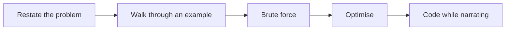

# Lecture 2 — Thinking Out Loud on a Call

> **Duration:** ~1.5 hours. **Outcome:** You can name the five phases of the narration loop, identify when to speak and when to fall silent for short coding bursts, recover narration cleanly after a silent burst, and handle interviewer interruptions and hints without breaking your problem-solving flow.

## 1. Thinking out loud is the load-bearing skill

Of the four scoring dimensions from Lecture 1 — problem-solving, coding, communication, testing — the one most-underrated by candidates is **communication**. Most candidates rehearse the problem-solving by grinding LeetCode and rehearse the coding by writing the solutions out. They almost never rehearse the talking-out-loud part, because it feels like the part you should be naturally good at.

You are not naturally good at it. Almost no one is. Thinking out loud while writing code is a skill that takes deliberate practice; the gap between "I can solve this in silence" and "I can solve this while talking in a way someone can score" is the largest skill gap of Week 6.

The candidates who pass technical phone screens are not the ones with the best algorithms. They are the ones who let the interviewer follow their thinking in a way that produces strong rubric-paragraph sentences. The interviewer is trying to write "candidate articulated the brute-force approach, then identified the time bound and proposed a hash-map optimisation, walking through how the new approach would handle the example." That sentence requires you to have *said* the words "brute force," "this is O(n²)," and "let me try a hash map" out loud at the right moments. If you only thought them, the interviewer cannot write that sentence and writes a weaker one instead.

## 2. The five-phase narration loop

The reliable structure for the 35-minute coding block of a 45-minute screen, in five named phases. Use the names out loud where natural; the interviewer hears the structure and scores you on it.

> **Phase 1 — Restate the problem (60-90 sec).** "Let me make sure I understand. We have {input shape}, and we want {output shape} such that {constraint}. Specifically — {paraphrase the constraint in your own words}. Is that right?"
>
> **Phase 2 — Walk through an example (90-150 sec).** "Let me try {one of the given inputs} by hand. For input {X}, the output should be {Y}. Let me trace through what that looks like — first I'd {step 1}, then {step 2}. That gives me {Y}. Good, that matches."
>
> **Phase 3 — Brute force (60-90 sec).** "The brute force here is — I'd {describe the obvious O(n²) or O(n!) approach}. That's {complexity}. It works but it's not great because {specific reason — the size of n, the time bound}."
>
> **Phase 4 — Optimise (60-180 sec).** "I can do better. If I {observation about the structure of the problem}, then I can {pattern — hash map, two pointer, sort, sliding window}. That brings it to {new complexity}. Let me sketch that quickly. {Sketch in plain English or pseudocode.}"
>
> **Phase 5 — Code while continuing to narrate (15-25 min).** "Okay, I'll write this out. I'm going to start with the {data structure} setup, then the main loop, then return. {Code; periodically: "I'm at the part where..."} ... Let me run it. {Run.} That returns {result}, which matches what we expected. Let me try an edge case — empty input. {Run.} Returns empty as expected."

The five phases total 35-40 minutes of the call's 45. The interviewer is producing rubric sentences across each phase. The phases are named for a reason — when you find yourself stuck, you can ask "where am I?" and the answer is one of the five.

*The five-phase narration loop that structures the coding portion of the call — when stuck, name which phase you are in.*

## 3. When to speak, when to fall silent

The most-common narration mistake is binary: either talking constantly (which is exhausting for both of you and dilutes the signal) or silent for 5-10 minute stretches (which produces unscored time).

The rule: **speak in beats, not in a stream**. Every 30-60 seconds, say one sentence about what you are doing or about to do. Between beats, focus.

### The speak beats

Some moments demand narration; do not skip them:

- **Before starting any new phase.** "Okay, let me move from the brute force to an optimisation."
- **When you have an insight.** "Oh — I just noticed that because the array is sorted, I can use two pointers."
- **When you change direction.** "Actually, scratch that. The hash map approach won't work because we need to preserve the original indices. Let me reconsider."
- **When you receive a hint.** "Good point. I was assuming {X}; let me adjust."
- **When you start writing code.** "I'll write the main loop first, then handle the edge cases at the end."
- **Before running the code.** "Let me run this on the given example first."
- **After running.** "Returned {X} — that's what we expected" or "Hm, it returned {Y} not {X}, let me look at the loop bounds."
- **When you find a bug.** "Wait, I see it — the index is off by one. Let me fix."
- **When you finish.** "Okay, I think that's the main solution. Let me test a couple of edge cases."

### The silent beats

Some moments are improved by silence. Specifically:

- **The actual typing burst.** When you have the approach clear and are translating it into code, narrate at the start ("setting up the hash map now") and at the end ("okay, that's the loop done"). Between, you can be quiet for 30-60 seconds. This is the *focused* silence; the interviewer hears typing and trusts the work.
- **Reading the interviewer's hint.** When the interviewer offers a hint, listen fully. Do not narrate while they are talking; do not interrupt. Wait, then respond.
- **The 5-10 seconds after a question.** Pausing for 5-10 seconds before answering a follow-up question is fine — it reads as thoughtful. Pausing for 30 seconds reads as stuck.

### The recovery beat

The hardest part of narration is **after a silent coding burst** — you have been quiet for 60-90 seconds while typing, and now you need to come back without sounding rehearsed. The recovery template:

> "Okay. I think that handles the main case. Let me walk through what I wrote — I set up {data structure}, looped through {input}, on each iteration I {action}, and then returned {result}. Let me run it and see."

The recovery beat is 15-20 seconds. It re-orients the interviewer (who has been watching code appear without commentary), it re-orients you, and it sets up the next phase (testing or further reasoning). Practise the recovery beat specifically; it does not come naturally.

## 4. Narration vocabulary — the high-leverage phrases

Some phrases do disproportionate scoring work. Most of them signal that you are thinking about the right things; the interviewer's rubric has a row for each.

### Phrases that earn problem-solving points

- "What if {edge case}?" — empty input, single element, duplicates, all-equal values.
- "Let me trace through this on {example}."
- "The brute force is {description}. That's O({complexity})."
- "I think we can do better if we {observation}."
- "The trade-off is {space vs. time / readability vs. speed}."
- "Under what conditions would this approach fail?"

### Phrases that earn coding points

- "I'll use {standard-library structure} here — {Counter, defaultdict, set, deque}."
- "Let me name this {variable} for clarity."
- "I'll factor this out — it's used twice."
- "I'll add a guard for empty input at the top."

### Phrases that earn communication points

- "Before I code, let me walk through one more example."
- "Let me check my understanding."
- "Does this approach make sense before I commit?"
- "I'm going to take 30 seconds to think — I want to make sure the boundary is right."

### Phrases that earn testing points

- "Let me run this on the given example."
- "Now an edge case — empty input."
- "Now a slightly bigger one — what about {n=10}?"
- "I expected {X}; the code returned {Y}. That's a bug; let me find it."

### Phrases that lose points

- "Best practices, I think." (Lecture 1's banned-phrase list applies here.)
- "I've done this before / I've seen this problem." (Even if true. Signals memorisation.)
- "Is this an easy?" / "This looks like a standard one." (Reads as condescending.)
- "I don't really know, but I'll try." (Reads as low confidence; the interviewer is making a hire decision.)
- "Hmm, hmm, hmm" / extensive filler / heavy throat-clearing.
- Switching from "I" to a passive "we" specifically when the answer is uncertain.

## 5. Receiving hints — the underappreciated skill

The interviewer will offer at least one hint during a typical screen. Sometimes more. How you receive the hint is scored at least as heavily as whether you can solve the problem on your own.

### What a hint looks like

Hints are usually phrased as questions:

- "What if the input were sorted?"
- "Is there a way to do this without scanning twice?"
- "What's the time complexity right now?"
- "Could you use a data structure for that?"
- "What happens at the boundary of the array?"

These are not idle questions. They are the interviewer telling you, in the most polite way possible, that you have missed something and they want you to find it.

### The right response pattern

Four steps:

1. **Acknowledge the hint** out loud. "Good point — let me think about that."
2. **Process it visibly.** Restate the hint to yourself: "If the input were sorted, then I'd know that..."
3. **Update your approach.** "...so two pointers would work here, because I can move from both ends and only need one pass."
4. **Confirm with the interviewer** before going back to code. "Does that sound right? Okay, I'll re-code with two pointers."

The whole sequence is 15-30 seconds. Visible engagement with the hint earns the points back; ignoring it loses them.

### The wrong response patterns

- **Ignoring.** Continuing on your original approach as if the hint was not offered. Reads as either having not heard the hint (audio issue worth surfacing) or having not understood it (worse).
- **Over-deference.** "Oh you're right I was completely wrong let me start over." Reads as no confidence in your own work. The interviewer was not asking you to start over; they were nudging you toward an improvement.
- **Defending.** "No, my original approach works because..." If the interviewer asked, your original approach has a problem, even if you cannot see it yet. The right move is to engage with the hint, not to defend.
- **Speeding up.** "Oh okay yeah definitely two pointers good idea here it is" and then a flurry of code with no narration. The whole point of the hint is to test how you handle direction-change *gracefully*.

### When you genuinely disagree

Sometimes the interviewer's hint is wrong or based on an assumption that does not hold. This is rare but real. The right move:

> "Hmm, let me think about that. I had been assuming {assumption}. If that's true, then {your original approach} still works because {reason}. Did you mean the case where {alternative} — in which case yes, I'd switch to {hint approach}?"

You are not refusing the hint; you are clarifying what case the hint applies to. The interviewer will either say "yes, the case I was thinking about" (and you switch) or "good catch, you're right, your original was fine for the case as stated" (and they score you a full point on problem-solving for that exchange).

## 6. Handling the silent coding burst

Once you start writing code, there will be 60-90 second stretches where you are typing and not narrating. This is correct — narrating every keystroke is exhausting and dilutes the signal. But long silent stretches are a failure mode, so the structure of the coding burst matters.

### The structure

- **Open the burst with a narration sentence.** "I'm going to set up the hash map first, then iterate through the array, then return the result." 5-10 seconds.
- **Code in focused silence.** 30-90 seconds. Type. Do not narrate keystrokes.
- **Close the burst with a recovery sentence.** "Okay, that's the main loop done. Let me run it." 5-10 seconds.

A 45-minute screen will have 4-7 coding bursts of this shape. Anything longer than 90 seconds of pure silence is too long; break it with a beat ("setting up the inner loop now").

### When silence is wrong

- **At the start of the problem.** Silent for 60 seconds while you read the problem statement is fine. Silent for 4 minutes is too long. Start narrating by the 60-second mark, even if it is just "let me re-read the constraints."
- **After receiving a hint.** Silent processing for more than 15 seconds reads as confused. Verbalise the processing.
- **When you have hit a bug and are debugging.** Silent debugging for 90+ seconds reads as stuck. Narrate the debug process: "Returned 4, expected 3 — let me check the loop bound — okay the upper bound should be `n-1` not `n`."
- **In the last 5 minutes.** Silence reads as out-of-time panic. Even a brief beat ("running the edge case now") earns a point and reads as composed.

## 7. Pacing — the 25-30 minute coding window

The biggest pacing mistake is not speed; it is mis-budgeting. Candidates who fail technical screens on pacing usually:

- **Spend 12-15 minutes on clarification and brute force.** No problem with the analysis; the problem is that 12-15 minutes leaves only 20 for coding and 5 for testing, on a problem where 25 + 5 + 5 + 5 was the right split.
- **Spend 25 minutes on the optimised solution because the brute force took too long.** Same root cause.
- **Code fast for the first 10 minutes, then get stuck and recover for the next 25.** Coding too fast off a half-thought approach is more dangerous than coding more slowly with the approach clear.

The right pacing:

- 5 minutes for clarification + example.
- 5 minutes for brute force discussion.
- 3-5 minutes for optimisation discussion.
- 20 minutes for coding.
- 3-5 minutes for testing.
- 5-7 minutes for follow-up and questions back.

Total: 41-47 minutes. The interviewer adjusts.

When you find yourself 15 minutes in and still not coding, that is the signal to *push* — not to keep optimising. "Okay, I think I have an approach. Let me code it and we'll see how it performs." Better to start coding the suboptimal-but-clear approach at minute 15 than to find the perfect approach at minute 25 and only have 15 to code.

## 8. The interviewer interruption — handling it

Interviewers interrupt for three reasons:

1. **To offer a hint** (Section 5).
2. **To clarify what you said** ("Wait, can you walk me through what you just did?"). This is a request for narration, often because you went silent for too long. Respond by narrating the last 60 seconds of code in 15 seconds: "Sure — I set up a hash map, looped through the input, and on each iteration I checked whether the complement was already in the map. If yes, return the indices."
3. **To suggest moving on** ("Why don't we start coding?"). This is the interviewer telling you the analysis phase has gone long. Take the cue. Move to code.

The wrong moves on interruption:

- **Talking over the interviewer.** They are scoring you on communication; interrupting is a tell.
- **Defensive responses.** "Well I was just about to code." Just code.
- **Long apologies.** "Oh I'm so sorry I'll move faster." 5 seconds is enough; more is unprofessional.

Interruptions are gifts. The interviewer is investing energy in steering you toward a higher score; treat it that way.

## 9. The narration of testing — the underdone phase

The testing phase is 3-5 minutes and most candidates compress it to 30 seconds or skip it. The narration template:

> "Okay, I think the main solution is done. Let me test it.
>
> First, the given example — input {X}, expected output {Y}. {Run.} Got {Y}. Good.
>
> Now an edge case — empty input. {Edit input, run.} Got empty. Expected.
>
> Single-element input — {edit, run}. Got {result}. Right.
>
> Let me try a larger one — {edit, run}. Got {result}. Looks right.
>
> Any other edge cases I should think about? {Pause.} The duplicates case — let me try {input with dupes}. {Run.} Got {result}. Good, matches what I'd expect.
>
> I think it's solid."

That whole sequence is 3-5 minutes spoken. It produces three or four rubric sentences ("candidate tested on the given example, then empty input, then duplicates"). It also catches the bug you might not have caught in silent re-reading.

The two specific moves worth practising:

- **Narrating the expected output before running.** "I expect {X}." This proves you know what the code should do, separately from whether it does it.
- **Pausing to think of more edge cases.** 5-10 seconds of "what else should I check?" is worth a point. The interviewer hears thoroughness.

## 10. The follow-up phase — handling the last 5-10 minutes

After testing, the interviewer almost always has a follow-up. Exercise 3 is the full drill on the four patterns. Quick summary:

- **Complexity analysis.** "What's the time and space?" Answer: name both, justify briefly. "Time is O(n) because we iterate once; space is O(n) because the hash map can grow to size n."
- **Problem extension.** "What if the input were a stream instead of an array?" Answer: name what changes ("we'd need an online algorithm; the hash map approach still works because we process one element at a time"), name what stays ("the per-element complexity is the same"), and acknowledge any new edge cases ("we'd need to think about memory if the stream is unbounded").
- **Production framing.** "How would you change this for production traffic?" Answer: name three concrete things — logging, error handling, monitoring, input validation, concurrency. Pick the two or three that fit the problem.
- **Edge-case probe.** "What if the input is empty?" Answer: name the behaviour ("returns an empty result"), check that your code handles it ("which my guard at the top covers"), and call out any other related edges.

Each answer is 60-90 seconds. Lecture 1's structure applies: speak in clear sentences, name the trade-offs, do not bluff.

## 11. Your questions back — the closing 2-3 minutes

Different from the HM screen. The technical interviewer is not the decision-maker; they cannot answer questions about the team's roadmap or the manager's style. They can answer:

- **What the interviewer's own role looks like.** "What kind of work are you doing currently on the team?"
- **Concrete technical questions.** "What's the team's stack? What does the codebase look like? How do you handle on-call?"
- **The interview process from here.** "What does the rest of the loop look like? When should I expect to hear back?"

Two short questions is the right amount. One question is fine. Three or more is too many — the interviewer has another call after yours, and the last few minutes are for them to wrap up too.

Skip the questions you would ask the HM (manager style, team strategy, comp). The technical interviewer cannot answer them and the question reads as a category error.

## 12. Self-check

- Name the five phases of the narration loop.
- A candidate codes for 4 minutes in silence, then says "I think it works." What is the rubric likely to say?
- The interviewer asks "what if the input were sorted?" mid-coding. Walk through the four-step right-response pattern.
- What is the "recovery beat" and when do you deploy it?
- Name three phrases that earn problem-solving points and three that lose them.
- A candidate is 15 minutes in and still discussing optimisations. What is the right move and why?
- The testing phase produces what specific rubric outcomes that the coding phase does not?
- Your questions-back to the technical interviewer should differ from your questions-back to the HM. On what specific axis?

## Further reading

- **Cracking the Coding Interview** chapter 7 (the interview process) and chapter 11 (testing).
- **interviewing.io recorded mocks** — watch one start to finish: <https://interviewing.io/recordings>
- **Pramp recorded mocks on YouTube:** <https://www.youtube.com/@Pramp>
- **AlgoExpert — "How to think out loud" essay** (public): <https://www.algoexpert.io/>

When you can narrate the five phases on a fresh easy problem without notes, move to the exercises. [Exercise 2 — Narrate on CoderPad](../exercises/exercise-02-narrate-coderpad.md) is the highest-leverage solo drill of the week; do it before the pair mock in Exercise 1.
