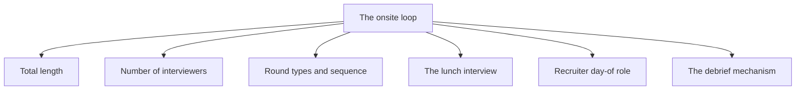
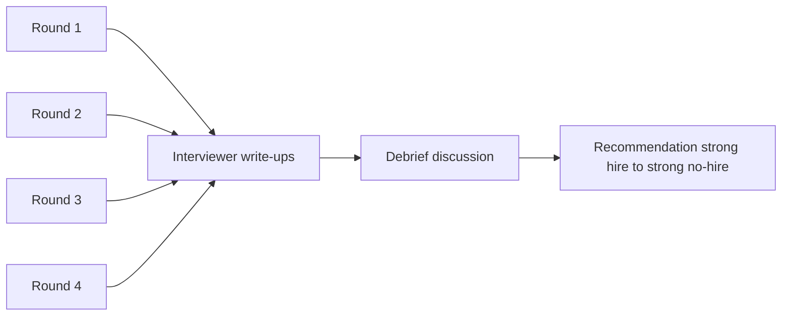

# Lecture 1 — The Shape of an Onsite

> **Duration:** ~2 hours. **Outcome:** You can describe the typical onsite loop on six axes (length, interviewer count, round types and order, the lunch interview, the recruiter's day-of role, the debrief mechanism), name the company variants worth knowing (Google's hiring committee, Amazon's bar raiser, Stripe's one-room model, Meta's lunch-as-networking line), and plan the day-of logistics for both in-person and virtual loops.

## 1. The onsite is an institution, not a process

The onsite loop is the longest-surviving piece of the modern technical hiring pipeline. The recruiter screen, the technical phone screen, the take-home assignment — these are recent inventions or recent renamings. The "spend most of a day at the company, talk to four or five people, eat lunch with one of them, get hired or not by committee within 48 hours" pattern has been roughly stable in tech since at least the early 1990s, with a brief and partial migration to fully-remote loops during the pandemic that has since reverted at most large companies to a hybrid where the loop may be remote but its shape — the four-to-six hours, the four-to-five interviewers, the lunch, the debrief — is unchanged.

The shape persists because the institution serves several functions at once. It collects enough independent observations of the candidate to support a calibrated hiring decision (the debrief averages over four to five interviewers, which reduces the variance of any single one). It tests sustained performance rather than peak performance (most candidates can solve one problem cleanly in 45 minutes; far fewer can sustain that across four hours with a lunch interruption). It allows the team to evaluate "would I want to work with this person" in a sample-size way that no single call achieves. And, less idealistically, it imposes a real cost on the candidate that filters for genuine interest.

The four-to-six-hour shape is not arbitrary. It is the longest the company can demand without paying you (legally complicated past about six hours of unpaid time in many US states; the typical loop is structured to stay under that line), and it is the longest a calibrated panel of working engineers can pay attention to a single candidate without quality collapse. Loops shorter than four hours fail to produce enough signal; loops longer than six hours produce signal that is dominated by fatigue rather than fit.

The work in this lecture is to name the parts of the institution clearly enough that you can plan against them. Not just the technical content — that is Weeks 6 and 8 — but the *shape*: how the day is organised, who you will see, what the recruiter does, where lunch fits, what happens after.

## 2. The six axes

Every onsite loop varies on the same six axes. Knowing the loop is knowing the value on each.

*The six axes every onsite loop varies on.*

### Axis 1 — Total length

Typical: four to six hours of structured time on-site, plus 30-60 minutes of arrival and departure buffer. Virtual loops compress this slightly — no commute, sometimes shorter lunch — but the four-to-six-hour structured-time window is similar.

Variants worth knowing:

- **The single-day loop** — the default. Everything happens in one calendar day. Most common at large companies and at smaller companies for senior roles.
- **The two-day loop** — increasingly common. Day one is two or three rounds (often coding and behavioural), day two is two more (often system design and a final coding round) plus lunch. Used when the company wants to give more rounds without exhausting the candidate; used at Meta, Google, and many mid-size companies for senior+ roles.
- **The split loop** — rare and bad news. Some rounds are run synchronously, others are scheduled later or replaced with take-homes. Usually indicates a loop the company is reconfiguring and you are an experimental subject. Ask the recruiter why.
- **The half-day loop** — junior roles or low-confidence-of-fit roles. Three rounds in two-and-a-half hours, no lunch. Treat as a higher-bar 45-minute-per-round event.

### Axis 2 — Number of interviewers

Typical: four to five distinct interviewers, each running one round. A loop with three interviewers is short and signals a junior role or a low-bar process; a loop with six or seven is long and signals a senior role or an unusually thorough company.

Variants:

- **The shared round** — two interviewers in one round. Common for system-design rounds at senior+ levels (one engineer asks the question, one observes). Treat both as scoring.
- **The shadower** — a third party in the room observing the interviewer (calibration of the interviewer, not of you). Usually quiet, sometimes asks a clarifying question at the end. Ignorable for your purposes, but acknowledge them.
- **The bar raiser** (Amazon) — a senior employee from outside the hiring team. Runs one round, usually a behavioural round but sometimes coding. The bar raiser has an effective veto on the hire. Lecture 2 covers reading the room for the bar-raiser round specifically.

### Axis 3 — Round types and sequence

The typical mix for a software engineering loop:

| Round type | Count | Length | What it tests |
|------------|------:|-------:|---------------|
| Coding | 2-3 | 45-60 min | Live problem-solving on a shared editor or whiteboard; medium LeetCode-shape problems or applied variants. Different from the phone screen in difficulty (medium not easy) and depth (the follow-up is harder). |
| System design | 1 (mid), 2 (senior+) | 45-60 min | Design a system from a prompt; mid-level rounds focus on a single service, senior rounds on a multi-service system or a deeper specialisation. |
| Behavioural | 1-2 | 30-60 min | Recent-project depth, leadership signals, conflict and ambiguity questions. The HM screen format expanded into a full round. |
| Lunch | 1 | 30-60 min | Informal conversation with a peer engineer; informally scored at most companies, fully scored at a few. |
| Domain-specific | 0-1 | 45-60 min | Data, ML, security, mobile, distributed systems — for specialised roles. Sometimes replaces a coding round, sometimes additive. |

The sequence matters less than the count. A common pattern is: coding → coding → lunch → system design → behavioural. Some companies put the hardest round (often the system design) first, when you are freshest; others put it last, when you are most tired. The bar-raiser round at Amazon is usually mid-day.

### Axis 4 — The lunch interview

The lunch interview is treated separately because most candidates underrate it.

**What it is.** A 30-60 minute meal — sometimes catered in a meeting room, sometimes in the company cafeteria, sometimes at a nearby restaurant — with one peer engineer (rarely two). The conversation is informal: how do you like the company so far, what are you working on now, what brought you here, do you have questions about life at the company.

**What it is for.** Officially, the lunch is "a chance for the candidate to ask questions in a low-pressure setting" — and that is partly true. In practice, the lunch is also informally scored at most large companies and fully scored at a few. The peer engineer who hosts you will be asked, in the debrief or in a short Slack message after, "would you want to work with this person?" Their answer is a non-trivial input to the loop's outcome.

**The strong-candidate signature.** Treat the lunch as a real round. Eat enough but not too much. Ask one or two thoughtful questions about the team and the company; do not pump for inside information. Do not complain about the morning's rounds; do not coast on "small talk." Carry one specific thing you noticed about the company's public work — a recent blog post, an open-source repo, an engineering talk — and use it as a conversation-opener.

**The variant worth knowing.** Some companies use the lunch as deliberate calibration: the peer engineer is briefed to probe for a specific signal, usually around teamwork or ambiguity. Meta has historically framed the lunch this way ("build your network at lunch" is recruiter language; the engineer's brief is different). When you are not sure if a lunch is scored, assume it is.

**The no-lunch loop.** Half-day loops have no lunch. Virtual loops often compress lunch to a 20-30 minute break, or eliminate it entirely. Do not request a lunch round; if the loop has one, use it.

### Axis 5 — The recruiter's day-of role

The recruiter is your guide for the day. They will:

- **Greet you at the building entrance or in the lobby.** Walk you through security, to the waiting area, to the first interview room.
- **Walk you between rounds.** The 5-minute gap between each round is the recruiter's walk-time plus a buffer. Use the walk to clear the previous round; do not relitigate it with the recruiter.
- **Do the midpoint check.** Around the lunch hour, the recruiter will ask "how's it going?" This is not idle conversation; it is calibration. The strong answer is some version of "really good — Sam and Priya were great, I'm enjoying the day" plus one specific concrete observation. The weak answer is "fine, I think" or "I'm not sure how the second round went." Either of those tells the recruiter you are off-balance; they will note it.
- **Run the closing.** At the end of the day, the recruiter will walk you to the exit, ask if you have last questions, and outline the timeline for next steps. This conversation is not scored on the technical rubric, but the recruiter is writing a closing note that goes to the loop debrief.

The recruiter is on your side in a specific, limited way: their job is filled when you accept an offer. Their job is not filled when the loop drops you. This means they will give you genuine help on logistics (where the bathroom is, how long the next interviewer typically runs) and limited help on signal (they will not tell you how the previous round went).

### Axis 6 — The debrief mechanism

The debrief is the actual scoring event. The rounds are the data collection.

**The typical debrief.** Within 24-48 hours of the loop, the interviewers convene — synchronously in a meeting room or asynchronously in a shared doc or Slack channel — and discuss the candidate. Each interviewer brings their written write-up (1-3 paragraphs per round, scored on each rubric dimension). The discussion converges on a recommendation: strong hire / hire / lean hire / lean no-hire / no-hire / strong no-hire.

*Rounds feed write-ups, write-ups feed the debrief, the debrief produces the recommendation.*

**The variants.**

- **Google's hiring committee.** The interviewers from the loop write their write-ups and *do not attend* the debrief. The hiring committee — a separate group, calibrated across many candidates — reads the write-ups and makes the decision. This pushes more weight onto the *quality of the write-ups* and less onto the individual interviewer's advocacy. The implication for you: be visible enough that each interviewer can write a confident, specific paragraph. Vague, ambiguous performance produces vague write-ups and the hiring committee defaults to no-hire on ambiguous write-ups.
- **Amazon's bar raiser.** The bar raiser participates in the debrief and has effective veto power. The bar raiser is calibrated across many candidates company-wide and represents the long-term hiring bar against the hiring team's short-term staffing pressure. The implication: the bar-raiser round (one of your loop rounds) is disproportionately important.
- **Stripe's one-room model** (and similar at some smaller companies). The interviewers stay in one room, the candidate rotates between rooms — same outcome, different physical layout. The debrief is still calibrated; the dynamics are the same.

The single most useful framing for any onsite: **you are not interviewing with the people in the rounds. You are producing artefacts — write-ups — for the debrief.** The interviewers are the medium, not the audience.

## 3. In-person vs. virtual — the day-of differences

Most of this week's content applies to both modes. The two differ in specific logistics worth naming.

### In-person logistics

The day-of plan for an in-person loop:

**The night before:**

- Hotel near the office if you are flying in. Walking distance ideally; under a 15-minute car ride otherwise. The morning commute is a variable you control by booking the hotel close.
- A 30-45 minute walk or light exercise after arrival. Burns the travel anxiety, helps with sleep.
- A light dinner. Not the heaviest meal of your day. No alcohol. No new food you have not eaten before — food poisoning the morning of a loop has ruined more onsites than any single round.
- Lay out clothing the night before. Whatever you would wear to a normal work day at the company, slightly more put-together. The dress code at most tech companies is "business casual or less"; match it. Do not show up in a suit to a t-shirt company; do not show up in a t-shirt to a business-casual company.
- Phones, chargers, ID for the building, any printed materials — packed the night before. The morning is not for finding things.
- Asleep by 22:30 local. The loop starts around 09:00-10:00; you need 7-8 hours.

**The morning of:**

- Up 2-2.5 hours before the loop. Time enough for breakfast, the morning routine, the 30-minute warm-up, and a buffer.
- Breakfast: protein-heavy, low in simple sugar. Eggs, toast, a piece of fruit. Avoid pure-carb breakfasts (a bagel and orange juice spike and crash); avoid heavy breakfasts (a stack of pancakes will make you sleepy by hour two).
- Caffeine: your usual amount, not more. The day is not the day to introduce extra coffee; the jitters will cost you more than the alertness gains.
- 30-minute warm-up: one easy LeetCode you have done before, narrated aloud through the first phase only (the restate). The point is to warm up the voice, not to learn anything. Then read your cheat sheet's onsite-section twice.
- Arrive at the building 15-20 minutes before the loop's start time. Not earlier (you will sit in the lobby getting nervous) and not later (the buffer is for security delays).

**At the building:**

- Find the lobby, identify yourself to security or the front desk, give the recruiter's name and the start time. They will direct you to the waiting area.
- Use the bathroom. You will not have a good chance again for two hours.
- Water bottle: ask the recruiter for one when they greet you. They will usually offer; if not, ask. Carry it between rooms.
- The waiting area is not a quiet study room. Do not pull out your laptop; do not start cramming. Sit, breathe, read something low-stakes (a magazine, the company's recent blog posts on your phone).

**Between rounds:**

- The recruiter walks you to the next room. The walk is 2-5 minutes; do not relitigate the previous round.
- If you need the bathroom, ask the recruiter. They will route you. Most candidates do not ask and lose the back half of the day.
- Drink water in the gap, not during the round itself. Sip during the round only if you need to pause to think.

**Lunch:**

- The peer engineer who hosts you will walk you to the cafeteria or the room with the catered food. Eat enough but not too much; a heavy lunch will cost you the 2pm round.
- Conversation: as outlined in Axis 4 above. Treat as a scored round.
- Bathroom before the next round.

**The closing:**

- The recruiter walks you to the exit. Ask the timeline question — "When can I expect to hear next?" — and confirm it back to them. The strong move is to confirm in writing in your follow-up email that night.
- Leave the building. Do not linger in the lobby.

### Virtual logistics

The virtual loop is logistically simpler in some ways (no commute) and harder in others (multiple Zoom links to manage, no recruiter walking you between rounds, the camera-and-audio setup that the technical screen taught you must hold for six hours).

**The night before:**

- Test your full setup the night before: laptop on, camera on, audio on, the Zoom or Google Meet link you will be on, the screen-share you will be using, the editor you will be using. The night before, not the morning of. If your audio dies the morning of, you have time to fix it; if it dies five minutes before the loop, you do not.
- The links: every round has a separate Zoom link, usually. Confirm with the recruiter that you have all of them. Keep them in a single document on your second monitor or printed out; do not search your email for "Zoom link" between rounds.
- Same dinner, sleep, and clothing rules as in-person. Yes, dress for the loop. The camera reads sloppy dressing as low-effort; you do not want that signal.
- Confirm the timezone the loop is in. If you are interviewing at a West Coast company from the East Coast, every time on the schedule is in the company's timezone unless the recruiter explicitly converted; double-check.

**The morning of:**

- Same warm-up and breakfast routine as in-person. The 30-minute warm-up is *more* important on a virtual loop because you do not have the commute-and-arrival ritual to bring you into the mood.
- 30 minutes before the loop, do the setup check again: camera, audio, all the Zoom links, the editor, your cheat sheet on a second monitor or printed.
- Use the bathroom 5 minutes before the loop starts.
- Water bottle on the desk. Phone face-down, on Do Not Disturb. The morning is not the morning for unrelated notifications.

**Between rounds (virtual):**

- The recruiter does not walk you between rooms. There is usually a 5-10 minute gap built into the schedule. *Use it.* Stand up. Walk to the bathroom. Drink water. Look out a window. Do not check your phone; do not relitigate the previous round.
- If a round runs over, the recruiter usually messages you in Slack or email about the schedule adjustment. Check the channel they told you to watch.

**Lunch (virtual):**

- Lunch on a virtual loop is sometimes preserved (the peer engineer has a 30-45 minute video call with you) and sometimes converted to a real break. Confirm with the recruiter.
- If you have a virtual lunch round, treat it as a scored round. Have your meal ready before the call so you are not assembling food on camera. Light meal, same rules as in-person.
- If you have a real break, eat away from the desk if possible. Stretch. Go outside if you can. Return to the desk 5-10 minutes before the next round.

**The closing (virtual):**

- The recruiter usually hops on a closing call after the last round. Same timeline question, same confirmation in writing.
- Close the laptop. Do not check email for an hour.

## 4. The night before — sleep, food, alcohol, screens

The single highest-leverage thing you can do the day before a loop is sleep well that night. Most candidates know this; most candidates also do not act on it.

The sleep rules:

- **8 hours minimum, 7 hours acceptable, under 6 hours is a real cost on your performance.** Track your sleep the night before a loop for the rest of your career; correlate with how well the loop went. The pattern is consistent.
- **The night before the night before matters too.** A single bad night two days out is recoverable; two bad nights is not. If you are travelling for the loop, that means good sleep on the travel day.
- **No alcohol the night before.** Alcohol degrades REM sleep even at one or two drinks. The "I'll have a glass of wine to calm down" instinct is real and is wrong; the calming effect at the time costs you sleep architecture overnight.
- **Caffeine cutoff at 14:00 the day before** for most people. Caffeine has a 5-6 hour half-life; an afternoon coffee at 16:00 is still measurably in your system at midnight.
- **Screens off by 21:30.** The standard sleep-hygiene rule. The hour before bed is for low-stimulus activity — a book, a walk, conversation. Not for cramming on LeetCode. Cramming the night before a loop has never produced a measurable improvement; it has produced a measurable cost in sleep.

The food rules:

- **A normal dinner.** Not a celebration meal, not a calorie-restricted "trying to feel sharp" meal. Whatever you eat on a normal working night.
- **No new foods, no spicy foods, no foods that have caused you GI trouble before.** This is not the night to try the new Thai place. Conservative dinner.
- **Light dessert is fine.** Sugar at dinner does not noticeably hurt sleep; the screens-off rule matters more.
- **Hydrate, but stop heavy fluid intake by 21:00.** A 03:00 bathroom trip costs you 30-60 minutes of sleep continuity.

The screens rules:

- **Phone in the kitchen or the living room, not the bedroom.** The morning alarm can be a clock or a separate device.
- **No social media after 20:00.** The dopamine cycle disrupts sleep onset for many people.
- **No work email after 19:00.** The "one more thing" instinct is the strongest the night before a loop; resist it.

## 5. The morning of — breakfast, caffeine, warm-up

The morning is for setting the floor of your performance, not the ceiling. The ceiling is set by weeks of preparation; the floor is set by the morning routine.

The breakfast rules:

- **Protein and complex carbs.** Eggs with toast. Greek yoghurt with granola. Oatmeal with nuts. Not a pastry-and-coffee combination; that produces an 11am crash that costs you the second coding round.
- **A piece of fruit.** Banana, apple, orange. Fibre and natural sugar; no crash.
- **Water before coffee.** The first thing in your stomach should be 250-500ml of water. Caffeine on a dehydrated stomach is worse than caffeine on a hydrated one.

The caffeine rules:

- **Your usual amount, not more.** If you drink one coffee, drink one. If you drink two, drink two. Today is not the day for an experimental third.
- **No energy drinks unless they are part of your daily routine.** The crash is real and arrives at hour three.
- **A second small dose at the midpoint is fine** if you would normally do that. Save it for after lunch, before the afternoon rounds.

The warm-up rules:

- **30 minutes, finishing 60-90 minutes before the loop starts.**
- **One easy problem narrated aloud through Phase 1 only** — the restate. The voice needs to wake up; the brain needs to remember that out-loud problem-solving is a thing.
- **Read your cheat sheet twice.** Not new material; the things you already know. The cheat sheet is a calming object as much as an informational one.
- **Do not look at unfamiliar problems.** Cramming a new pattern in the warm-up window is the same mistake as cramming the night before. It does not work and it costs you energy you need for the loop.

## 6. The lunch interview — a deeper look

The lunch interview deserves more than the paragraph it got under Axis 4 because most candidates underrate it and the unique skill it tests.

### What is actually scored

Two things, mostly:

1. **"Would I want to work with this person on a normal Tuesday?"** The lunch is a low-bandwidth proxy for working alongside the candidate. The peer is asking themselves, half-consciously: would I want this person on my standup, in my code review, at my next team offsite?
2. **The "we can survive an awkward silence" test.** A real lunch has natural pauses — eating, the food arriving, the waiter returning. A candidate who fills every pause anxiously, or who collapses every pause into uncomfortable silence, signals a stress response that translates to the workplace.

The technical content of the conversation matters less than these two signals. A candidate who answers a casual technical question well at lunch but cannot navigate the food-arrival pause comfortably scores lower than a candidate who has nothing brilliant to say but is genuinely pleasant company.

### The strong-candidate signature at lunch

- **Order something normal and not messy.** No sushi (chopstick anxiety), no spaghetti (cuff-staining risk), no salad-as-a-whole-meal (extended chewing time). A sandwich, a bowl, a wrap. Something you can eat in normal-sized bites and put down when conversation requires attention.
- **Eat enough to not be visibly hungry; do not eat to satiation.** A heavy lunch costs you the 2pm round. A light lunch with a real meal afterward is fine.
- **Ask one good question early.** Something specific to the company or the team — a recent blog post, a recent product release, a project the team is on. The peer will engage with a specific question more readily than with "what's it like to work here."
- **Let the peer steer.** They have done many of these lunches and know the rhythm. Follow their energy; do not impose your own.
- **No complaints about the morning.** Even if a round went badly. The peer will mention it in their write-up or to the recruiter.
- **No grilling for inside information.** "What does the team really think about [the controversial product decision]?" puts the peer in an awkward spot. Ask about the team's work, not the team's drama.

### The weak-candidate signature at lunch

- **Treating it as a break from the loop.** The peer notices when the candidate visibly relaxes ("oh good, this part doesn't count") and reads it as not taking the company seriously. The lunch counts.
- **Treating it as a continuation of the technical rounds.** Volunteering deep technical opinions, debating the peer on architecture, performing intellectualism. Costs the peer's "would I want to work with them" score.
- **Excessive self-promotion.** The peer is not the hiring manager; they are not the recruiter; the lunch is not the place to reiterate your accomplishments. Talk about the company's work, ask about the team, share genuine context about yourself if asked.
- **Silence.** Long silences read as discomfort or as disinterest. Either reads as "not a good fit."
- **Complaining about anything.** The food, the building, the previous round, your last job, the industry. Each one costs you points.

## 7. The recruiter's day-of role — a deeper look

The recruiter is your single point of contact across the day. Their work shapes your experience and your write-up in ways most candidates do not appreciate.

### What the recruiter is doing while you are not in a round

- **Briefing the next interviewer.** "Sam's running 5 minutes late, I'll have Priya next; can you start at 11:35 instead of 11:30?" The interviewers are usually working engineers fitting the loop into their day, and the recruiter is the logistics function holding it together.
- **Logging the loop in the ATS.** Every round's start and end time, the interviewer's confirmation, sometimes a one-line "how did it look from the outside" note from the recruiter's own observation.
- **Watching for problems.** A round that runs long, an interviewer who cancelled, a candidate who looks distressed. The recruiter is the first responder for any of these.

### The midpoint "how's it going?"

The midpoint check usually happens around the lunch hour or just before. The recruiter will find a moment — the walk to lunch, a brief stop in a quiet corridor — and ask how it is going.

**The strong answer:** specific, positive, named. "Really good — Sam asked a really clean medium problem and we got through it cleanly, and Priya's behavioural round let me talk about [project]. I'm enjoying the day." This gives the recruiter material they can carry to the rest of the day's interviewers ("Sam's round went well, the candidate's in a good place").

**The weak answer:** vague, neutral or negative. "It's been okay. I'm not sure how the second one went." This tells the recruiter you are off-balance; they will note it. It also gives them nothing to carry forward.

**The trap.** Some candidates use the midpoint to surface a real problem — the second round had a hostile interviewer, the system-design round went badly, they are visibly tired. There are situations where surfacing a problem is correct (a genuine illegal question, a sick stomach, a logistics failure on the company's side). There are more situations where surfacing a problem is wrong — every loop has a round that goes worse than others; the recruiter cannot help you recover, and naming it lowers their assessment of your composure. The default is to surface only what the recruiter can act on.

### The closing conversation

At the end of the loop, the recruiter will walk you to the exit (in-person) or hop on a closing call (virtual). The conversation:

1. **"How was your day?"** — same answer as the midpoint, refined. Specific, positive, named.
2. **"Do you have any last questions for me?"** — yes, one or two. Compensation range (if you have not asked yet and the recruiter is the right person for it; usually they are). Timeline. Process from here.
3. **"What's the next step?"** — the recruiter will outline the debrief and the response timeline. Confirm it back to them: "So debrief tomorrow, response by end of week, is that right?"
4. **Your closing line.** Brief, genuine, forward-looking. "Thanks — really enjoyed the day. Looking forward to hearing." Not effusive; not perfunctory.

The follow-up email that night is shorter than after any prior call. One line: "Thanks for organising today; I enjoyed meeting the team. Looking forward to the next step."

## 8. The 24 hours after — what you do, what you do not do

After the loop, your work is almost done. There are a few things to do and many things to not do.

### Do

- **Within 2 hours: fill out the after-action template** (Challenge 2). The rounds, the interviewers, the questions, the read of the room, the three things you would do differently. The template is fresh now; in 24 hours it is half-fresh; in 48 hours it is useless.
- **Within 4 hours: eat a real meal and sleep.** The cognitive recovery from a four-hour loop is real; protein-heavy meal, hydration, sleep.
- **Within 24 hours: a short thank-you email to the recruiter.** As above. Not to the interviewers (most do not want candidate email; the recruiter will pass on any specific thanks if relevant).
- **The next morning: a 30-minute review of the after-action.** Adjust the run-of-show for the next loop based on what you learned.

### Do not

- **Do not email the interviewers.** Even if you got someone's contact info; the recruiter is the channel.
- **Do not post the experience on social media.** Even an anodyne "I had an onsite today" post. Companies sometimes watch.
- **Do not relitigate specific questions on Reddit or Discord.** Even anonymously; the patterns are recognisable, and the recruiter sometimes reads cscareerquestions.
- **Do not call the recruiter to ask how it went.** They will tell you on the timeline they outlined. Calling before that timeline reads as anxious and lowers their assessment.
- **Do not take a different interview's call within 24 hours if you can avoid it.** The brain needs to clear; another loop the next day produces worse signal on both.

## 9. The variants worth knowing

Most loops fit the typical shape. A few company-specific variants are worth knowing in advance.

### Google's hiring committee

Google's structure separates the interviewers from the deciders. You do four to five rounds. Each interviewer writes a detailed write-up. The hiring committee — a separate group, not part of the loop — reads the write-ups and decides. The interviewers do not advocate for you in the debrief; the write-ups do.

The implication: visibility matters more at Google than elsewhere. A round where you solved the problem but the interviewer is not sure what you did becomes a "weak hire" write-up; the committee defaults to no-hire on weak write-ups. Be visible. Narrate clearly. Make the interviewer's job (write a strong write-up) easy.

### Amazon's bar raiser

Amazon's loop includes a designated bar raiser — a senior employee from outside the hiring team, calibrated company-wide, who runs one round and participates in the debrief with effective veto power. The bar-raiser round is usually behavioural and is usually mid-day.

The implication: the bar-raiser round is the highest-leverage round of your day. The bar raiser is checking whether your bar is at or above Amazon's overall bar, regardless of the hiring team's staffing pressure. The Amazon Leadership Principles are the rubric; have stories ready for each. Lecture 2 covers reading the room for the bar-raiser round specifically.

### Meta's "build your network at lunch" line

Meta's recruiter language around lunch emphasises networking over evaluation. The peer engineer hosting the lunch is briefed similarly. *And the lunch is still scored.* The dissonance between "build your network" and "we are still evaluating you" trips candidates who take the recruiter language literally.

The implication: at Meta, treat the lunch as a scored round even if the recruiter framed it as a break.

### Stripe's one-room model (and similar)

Stripe historically used a one-room model where you stay in a single conference room and interviewers rotate in. Smaller companies sometimes do the same. The dynamics are identical to the typical loop; the physical layout differs.

The implication: the bathroom and water are even more important to ask for proactively, because there is no walk between rounds to use for these.

### The remote-only company

A few companies are fully remote and the loop is virtual by default. GitLab and Zapier are the most-cited. The virtual loop logistics in Section 3 apply; the cultural variant is that the lunch interview, if it exists, is virtual and is the company's main early test of "can you work synchronously with someone you have never met."

## 10. The mental model

The technical phone screen was a 45-minute artefact for one person. The onsite loop is a four-to-six-hour artefact for a debrief. Every round produces a write-up; every write-up produces a vote; the votes produce the recommendation; the recommendation produces the offer or the no.

The single most useful framing: imagine, after every round, the interviewer sitting at their desk for 5-10 minutes writing the paragraph they will bring to the debrief. Are the sentences specific enough to recommend you? Did you give them concrete moments to point at? Or are the sentences hedged and bland, because nothing concrete happened in the room?

That paragraph is the actual output of the round. Every minute of the round is either feeding sentences into that paragraph or not. The "not" minutes are the failure modes — the silent coding from Week 6 generalised across an hour, the vague answer to "tell me about a hard project," the missed hint, the dropped follow-up. Lecture 2 turns this framing into a reading-the-room skill across the full day. Lecture 3 turns it into a survival skill when one of those interviewers is hostile or asks a question the EEOC says they cannot ask.

The loop is winnable. It is winnable by candidates with strong technical skill, on days when their sleep was decent, with a run-of-show they have rehearsed, with the legal frame internalised before they walk in, with the recruiter relationship handled well, with the lunch treated as a real round, and with the after-action template ready to fill out two hours later. Almost none of these have anything to do with algorithms. Almost all of them are decidable this week.
