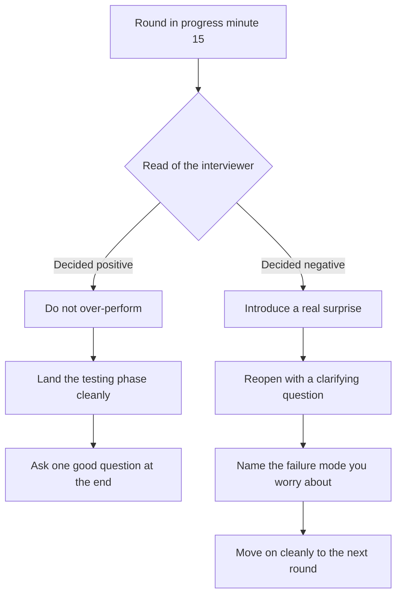
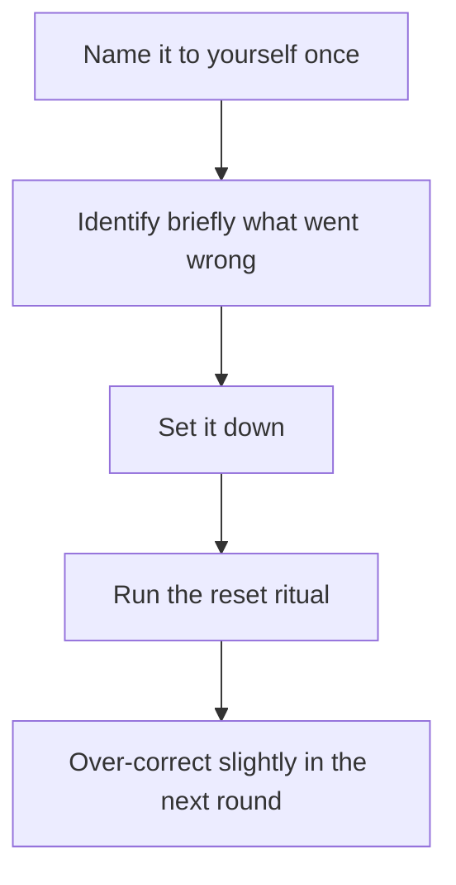

# Lecture 2 — Reading the Room and Pacing

> **Duration:** ~1.5 hours. **Outcome:** You can name the engagement signals interviewers emit within the first 10-15 minutes of a round, distinguish a round that has decided early (positively or negatively) from one that is still open, recalibrate your own performance for the next round when the previous one went badly, pace your energy across four to six hours so you do not collapse at hour four, and take a bathroom or water break mid-round without losing the round.

## 1. Reading the room is a learnable skill

"Reading the room" sounds like a personality trait. It is not; it is a skill that decomposes into observable signals, learnable responses, and rehearsable patterns. Most engineering candidates have never been asked to develop it explicitly, because their previous evaluative experiences — exams, code reviews, take-home assignments — did not require it. The onsite loop requires it.

What it is, concretely: the practice of inferring an interviewer's evaluation state — engaged, decided positively, decided negatively, hostile by design versus by accident, tired, distracted — from observable behaviour, and adjusting your own behaviour to either reinforce a positive read or recover a drifting one. The signals are not subtle; they are not invisible; they are not the secret language of people who "get it." They are predictable patterns that you can learn to notice, and you do not have to be born intuitive about people to learn them.

The reason most candidates are bad at reading the room is not that they lack the underlying perceptual capacity. It is that they have not been told what to look for. This lecture tells you.

## 2. The engagement signals

An engaged interviewer — one whose attention is on you and who is genuinely curious about your thinking — emits a recognisable set of signals. A disengaged interviewer emits the opposite. The signals are reliable within the first 10-15 minutes of a round; the round is usually already going somewhere by minute fifteen, and the signal in the first quarter usually predicts the closing read.

### Positive engagement signals

- **Eye contact during your explanation.** Not staring; just steady attention to your face when you are speaking, breaking only when the interviewer looks at their notes or the editor.
- **Follow-up questions that go deeper into your answer, not orthogonal to it.** "How would that handle X?" is engagement. "Anyway, let me ask you about Y" is disengagement.
- **The interviewer leans in or angles their body toward you** (in-person) or sits closer to the camera (virtual). The body-orientation signal is half-conscious and reliable.
- **Note-taking that follows your reasoning.** You can sometimes see the interviewer's pen move when you say something specific; if their note-taking is keyed to your statements, they are tracking.
- **The interviewer offers a hint that is gentle and adjacent rather than corrective and large.** A small "what if the input was very large?" hint is engagement; a large "I think you should reconsider the whole approach" is a recovery move from disengagement or a calibration probe.
- **The interviewer smiles or nods at a specific moment.** Half-conscious; reliable.
- **The interviewer asks you a personal-context question during the round** ("what would you do at your current job for this?"). Engagement creates the impulse to connect across contexts.

### Negative engagement signals

- **The interviewer's eyes drift to the clock, their phone, or out the window during your explanation.** Not always negative; if it is a 3-second glance and they return immediately, it is nothing. If it is sustained, it is a signal.
- **Short, flat acknowledgements.** "Mhm. Okay. Sure. And?" Replacing what would have been a follow-up.
- **The interviewer skips ahead in their notes.** They have a list of questions and they are running through it rather than going deep on any one.
- **The interviewer cuts you off, not to redirect to a hint, but to move to the next thing.** "Okay, let's pivot. Tell me about [unrelated thing]." The first cut-off is procedural; the second and third are a signal.
- **No follow-up questions at all.** A clean answer that produces no follow-up is unusual; either you were extraordinarily clear, or the interviewer is not engaged.
- **The interviewer is reading something on their screen while you speak.** In a virtual round, this is sometimes visible — their eyes track horizontally across their monitor, not at the camera.
- **The interviewer reaches the round's end early.** "Looks like we have a few minutes left, want to ask me anything?" at minute 30 of a 45-minute round.

### The signals you should ignore

A few things look like signals and are not:

- **An interviewer with a flat affect.** Some engineers are just like that. Read against their baseline — if they are flat-affect for the first 5 minutes of greeting and stay that way, that is their normal. Adjust expectations downward and look at the other signals.
- **An interviewer asking a clarifying question that sounds dismissive.** "Wait, what?" can read as hostile and is sometimes just the interviewer's communication style. Wait for the second clarifying question to confirm or rule out a pattern.
- **Awkward silence in the first 90 seconds.** Many interviewers are awkward with the opening greeting and warm up over the first 5-10 minutes. Do not read the first 60 seconds as the round.
- **The interviewer's mood at the start.** Some interviewers come in tired or coming off a hard meeting; their first 5 minutes is not about you. By minute 10 they have either re-engaged or not; the read happens after that.

## 3. The decided-early round

Sometimes — perhaps 20-30% of rounds, in the experience of working interviewers — the interviewer decides early. By minute 15 of a 45-minute round, they have an internal recommendation and the rest of the round is data collection to confirm or moderately revise that recommendation. The decision can be positive ("this is a hire, I am now looking for confirming evidence") or negative ("this is a no, I am now looking for either confirming evidence or a surprise that flips me back").

You cannot reliably distinguish positive-decided-early from negative-decided-early from the outside, because the signals are similar (less follow-up depth, faster pacing, the interviewer engaging with their own framing more than yours). What you can do is recognise that the round has tilted somewhere and adjust accordingly.

*Two branches once a round has tilted: reinforce a positive read or introduce a surprise to recover a negative one.*

### If you suspect decided-positive

The round is going well; the interviewer is pacing through their checklist, satisfied. Your job is to not undo it.

- **Do not over-perform.** Do not introduce harder-than-asked extensions, do not show off, do not bring up topics they did not ask about.
- **Land the testing phase cleanly.** Most candidates lose half a point on testing even in their best round; this is a free opportunity to keep the score.
- **Ask one good question at the end** — about the team's work, not about logistics. Reinforces the "I would want to work with them" signal.

### If you suspect decided-negative

This is the harder case. The round is tilting and the rest of the round will not naturally recover. Your only move is to introduce a surprise — something that genuinely changes the interviewer's read.

- **Ask a clarifying question that re-opens the problem.** "Wait — I want to check one thing. When you said {X}, did you mean {X1} or {X2}? Because that changes the approach." A clarifying question late in the round, if it is real, sometimes resets the interviewer's read.
- **Volunteer the failure mode you are most worried about.** "I want to flag that I'm not sure my approach handles the case where {edge}. Let me check." Self-criticism that is concrete and addresses the actual edge case the interviewer was about to ask reads as strong meta-awareness.
- **Surface the misunderstanding directly, once.** If you genuinely believe there was a misunderstanding about what the problem was asking, name it. "I think I misread the prompt; can I restart the approach with what I now understand?" Use this once per round; using it twice is a recovery spiral.
- **Do not panic.** Visible panic produces the negative read in interviewers who had not decided yet. The composure-under-stress signal is itself part of the evaluation; collapse confirms the no.
- **Move on cleanly to the next round.** A round that is lost is lost. The loop is the unit, not the round. A four-round loop with three good rounds and one weak round usually moves forward; a four-round loop with three good rounds and one collapsed round (panic, surrender) sometimes does not.

### The "everyone has decided by minute 25" axis

A useful working assumption: by minute 25 of a 45-minute round, every interviewer has a strong tentative read. The last 20 minutes are confirmation; the surprises come from the candidate, not from the interviewer's continued open-mindedness. This means your time-budget in the round is not "45 minutes to build a case"; it is "25 minutes to establish the case, 20 minutes to not undo it."

## 4. The cross-round drift

The signals above are within a single round. The harder version of reading the room is across rounds: noticing that your *own* performance has drifted between round one and round three, before round four lands and you discover it in the debrief weeks later.

### What drifts across rounds

- **Voice fatigue.** Your voice gets quieter, your articulation gets sloppier, you swallow consonants. Most candidates do not notice this until they re-watch a recording. The remedy is water, and the discipline of speaking up by 10-15% on every round after the first two.
- **Cognitive depth.** Your second-pass thinking — the "wait, let me reconsider that" beat after the first answer — disappears by round three. You answer the first thing that comes to mind and move on. The remedy is the deliberate pause: after the initial answer to a hard question in round three or four, take a breath and ask yourself "is there a second thing here?" before letting the interviewer respond.
- **Narration coverage.** The percentage of your thinking that you spoke aloud was 60% in round one, 40% in round two, 25% in round three. The remedy is to over-narrate from the start; the natural decline still leaves you above the floor.
- **Question quality at the end of the round.** "Do you have questions for me?" — your round-one questions were specific and curious; your round-three questions are generic ("what's a typical day like?"). The remedy is a pre-written list of three good questions you can reach for, even tired, even at hour four.
- **Composure under hostile probing.** A hostile question in round one lands smoothly; the same question in round four cracks you. The remedy is the deflection drill from Lecture 3, rehearsed enough that the response is muscle memory and does not require fresh cognitive load.

### Recovery beats between rounds

The 5-10 minutes between rounds is your only chance to reset. The recruiter is walking you; you have water; you have 3-5 quiet minutes. Use them deliberately.

The recovery beats, in order:

1. **The deliberate forgetting.** The previous round is done. The interviewer's decision is set or close to it. Replaying the round in your head between rooms costs you the next round. Name this to yourself: "Round 2 is done. I am now in round 3."
2. **Water.** Half a bottle. Hydration matters; thirst masks as fatigue.
3. **A snack** (if it is between rounds 3 and 4, or 4 and 5). A small piece of fruit or a few nuts. Not a meal. The blood sugar from breakfast is gone by hour three.
4. **A bathroom check** (if available). You do not need to use it; you need to know whether you should. If yes, ask the recruiter on the next walk.
5. **The cheat-sheet glance.** Not new material. The single line you wrote to yourself for round three. The energy-budget reminder. The deflection one-liner.
6. **The slow breath.** Two cycles of 4-second-in, 4-second-out. The interviewer will be there in 3 minutes; the breath is the reset.

The whole beat takes 5-8 minutes. It is the highest-leverage 5-8 minutes of the loop. Most candidates spend it relitigating the previous round and arrive at the next one carrying the previous round's mistakes; the relitigating gives the round no signal and the carrying gives the next round bad signal. Do neither.

## 5. Conversation pacing across hours

The 45-minute round in a six-hour loop is structurally different from the 45-minute call that is the whole event of a technical phone screen. The differences:

- **Your audience changes every 45 minutes.** Each interviewer has not seen the previous rounds. You are starting from scratch on rapport every round.
- **Your energy is monotonically depleting.** The voice, the attention, the narrative quality. Plan for it.
- **The interviewers know each other and will compare notes.** A self-presentation that drifts across the day reads in the debrief as inconsistent; a self-presentation that holds reads as steady.
- **The recruiter is watching the seams.** The walks between rooms, the lunch behaviour, the closing. Your behaviour outside the rounds is part of the loop.

### Pacing within a round

A single round in a loop has the same shape as a 45-minute technical screen but with slightly different beats:

| Minutes | Phase | What happens |
|--------:|-------|--------------|
| 0-2 | Greet, name exchange | Confirm pronunciation; exchange titles; a sentence on the team. |
| 2-5 | Short self-intro (60-90 sec) | Shorter than at the start of the day; this interviewer does not need the full version. |
| 5-8 | Problem statement / prompt | The interviewer reads or pastes the problem; you take notes; you ask 2-3 clarifying questions. |
| 8-12 | Example by hand + brute force sketch (coding) or restate of the prompt (behavioural / system design) | You walk through one example out loud; you name the brute force and its complexity. For non-coding rounds, you restate the prompt in your own framing. |
| 12-15 | Optimisation / structure | You propose an improvement (coding) or sketch your structure (system design) or pick the project you'll discuss (behavioural). Confirm with the interviewer before going deep. |
| 15-35 | Execution | Coding: write code while narrating. System design: deepen the design with diagrams and trade-offs. Behavioural: tell the story with structure (STAR or equivalent), drilling on the parts the interviewer probes. |
| 35-40 | Testing / hardening | Coding: run on examples, edge cases, stress. System design: walk through failure modes. Behavioural: name the lessons learned and what you'd do differently. |
| 40-43 | Follow-up question | The interviewer asks one of the four patterns from Week 6 (complexity / extension / production / edge) for coding; an analogous pattern for non-coding. |
| 43-45 | Your questions back | One or two short questions; close professionally. |

The phases generalise; the times are approximate. The interviewer manages the clock.

### Pacing across rounds

The hour-by-hour energy curve, for a typical 09:30 start:

| Time | Round | Energy level (1-10) | Risk |
|-----:|-------|---------------------:|------|
| 09:30-10:30 | Round 1 | 8-9 | Slight nervousness; speak too fast |
| 10:30-11:30 | Round 2 | 8 | Falling into "I've got this" overconfidence; sloppy testing |
| 11:30-12:30 | Round 3 / lunch interview | 6-7 | Hunger; voice drying out; lunch is scored, do not coast |
| 12:30-13:30 | Lunch (real, if no lunch interview) | n/a | Eat too much; lose the 1pm round |
| 13:30-14:30 | Round 4 | 5-6 | Post-lunch dip; narration collapse |
| 14:30-15:30 | Round 5 | 5 | Cognitive depth shrinks; second-pass thinking gone |
| 15:30-16:30 | Round 6 (if applicable) | 4-5 | Composure crack on hostile question |
| 16:30-17:00 | Recruiter closing | 4-5 | Tired vague answer to "how did it go?" |

The pattern is predictable. The remedy is to plan against it.

The pacing levers:

- **Front-load your strongest rounds.** You do not get to choose the order, but you can rest the weakest skill into the slot the company gives you and lean into the strongest one. If your system design is your weakest round and it lands at 15:00, accept that and conserve energy for it; do not over-perform the coding rounds in the morning.
- **The five-minute walk between rounds.** As Section 4. Treat it as a real recovery.
- **Water on a schedule, not on thirst.** Sip in the gaps; sip during the round only if you genuinely need a pause to think. Empty cup at lunch refilled.
- **A small snack at the 15:00 dip.** A handful of nuts or a piece of fruit you brought; the recruiter can usually point you to where to put it.
- **The slow breath before round 5 or 6.** Two full cycles. The breath is the most-underused recovery tool of the day; it works because the parasympathetic response damps the late-day stress baseline.

## 6. The bathroom break

Most candidates do not use the bathroom during a four-to-six-hour loop. They drink water at breakfast, they drink coffee at the warm-up, they ask the recruiter for a water bottle, they sip through the morning, and by hour three they need the bathroom and decline to ask.

The consequence: hour three onward is degraded. The discomfort is a constant background load on attention. The second-pass thinking disappears. The narration shortens. The composure-under-hostile-question cracks.

The fix is to ask. The bathroom break is normal, it is short (90 seconds to 3 minutes), the recruiter expects it, the interviewer will not penalise it, the round will hold.

### When to ask

- **Between rounds.** The simplest case. The recruiter is walking you; ask. They route you. You go. The next round starts 2-3 minutes later than scheduled and nobody notices.
- **At the start of a round.** "Can I just step out for two minutes before we start?" Equally acceptable. The interviewer will say yes; you go.
- **Mid-round, if you must.** Less ideal but completely acceptable. "Can I pause for two minutes?" The interviewer will say yes; the clock pauses (or it does not, depending on the interviewer, but you take it anyway because the alternative is worse).

The deciding question to ask yourself, every gap between rounds: "If a 90-second bathroom break would make me 10% sharper for the next round, do I take it?" The answer is always yes; the cost is microscopic; the benefit is the round.

### Why most candidates do not ask

Three reasons, none of them good:

1. **They think it looks weak.** It does not. Working engineers ask for the bathroom every day; recruiters and interviewers know how four hours of structured conversation works on a human body.
2. **They are afraid of "wasting time" in the round.** A 90-second break is a 3% time cost on a 45-minute round; the comfort it buys you is a 10%-20% performance gain. The math is obvious.
3. **They do not want to draw attention to a bodily need.** The recruiter is briefed for this; the interviewer expects it; the bathroom is twenty feet down the hall. The attention is in your head, not theirs.

The simplest rule: ask once per loop, minimum. If you have not asked by minute 90, ask on the next walk. Treat it as part of the day-of routine, not as an exception.

### Water during the round

Water in the round is acceptable; it is the smaller version of the bathroom question. Sip when you need a pause to think; the sip is a legitimate "I am thinking" beat that does not read as evasion. Do not sip constantly; the camera on a virtual round will pick up the visual rhythm and it reads as fidget.

### Snacks

For long loops (six hours or two-day), bring a small snack. A few nuts or a piece of fruit. The recruiter will let you eat it between rounds. Do not eat in the round itself.

## 7. The room-reading drill

Reading the room is rehearsable. The drill, run weekly through the cycle:

### Drill 1 — Watch a recorded mock and score the room

Pick a public mock interview from the interviewing.io archive or Pramp's YouTube channel. Watch it twice.

- First pass: score the candidate's content (coding, communication, testing, follow-up).
- Second pass: score the interviewer's engagement state at the 10-minute, 20-minute, 30-minute marks. Use the positive/negative signals from Section 2.

After the second pass, write three sentences: was the interviewer decided by minute 25? If yes, positively or negatively? What signals tell you?

This drill is the cheapest way to develop the perceptual skill. Twenty minutes a week through the cycle is enough.

### Drill 2 — Self-score a recorded round

Re-watch one of your own recorded rounds — a pair mock from Week 6, or a round from this week's mini-project. Run the same two-pass scoring. The second pass — your own performance through the interviewer's eyes — is the more valuable.

The discomfort of watching yourself is real. Push through it; the diagnostic value is high.

### Drill 3 — The post-round one-minute write

Within 60 seconds of every round in the mini-project, write down: was the interviewer engaged? Decided early? Hostile? Tired? Three sentences. Compare with the peer's actual read in the debrief.

The mismatch between your read and the peer's read is the diagnostic. If you systematically over-read negativity, you will collapse rounds that were going fine. If you systematically over-read positivity, you will under-recover from rounds that were going badly. Calibrate over the mini-project and the first one or two real loops.

## 8. The hostile-by-design vs. hostile-by-accident distinction

Some interviewers are hostile because the company has briefed them to be: a stress-interview round, designed to test composure. Others are hostile because they are tired or rude or having a bad day. The two are different situations and require different responses.

The hostile-by-design pattern:

- **The interviewer is consistently hostile, but not personally.** Their questions are sharp; their follow-ups are challenging; their tone is dry. But they ask all of it with a kind of structural calm — they are running a script.
- **The hostility maps to a specific dimension.** It is "challenge every assumption" or "push every decision" or "find the flaw" — it has a shape.
- **The interviewer recovers warmth at the end.** When the round closes, the dry tone lifts. They thank you for your time, ask if you have questions, and the closing is professional and human.

The hostile-by-accident pattern:

- **The hostility is inconsistent.** Some questions are sharp, some are warm, some are checked-out.
- **The hostility is personal.** The dryness is targeted; the tone is impatient in a way that reads as "I do not respect you specifically" rather than "I am calibrating you."
- **The closing is short and curt.** No softening; the interviewer wants out of the room.

The response template, for both:

1. **Treat the round as fully scored.** Do not assume hostile-by-accident means "this round does not count." It counts. The interviewer will still write a write-up.
2. **Do not match the energy.** Sharp questions land better when answered calmly; dry tone is best met with the same composed tone you would use in a warm round. Matching hostility reads as defensiveness.
3. **Acknowledge sharp questions visibly.** "That's a fair pushback. Let me reconsider." Versus the silent-and-defensive approach, which reads as either not having heard the challenge or not having understood it.
4. **Surface the dynamic only if it crosses into something unacceptable.** Hostile-by-design is acceptable; hostile-by-accident-but-still-professional is acceptable; hostile-that-crosses-into-personal-attack-or-illegal-question is not. Lecture 3 covers the escalation language for the third case.

The bar-raiser round at Amazon is hostile-by-design by default. The interviewer is briefed to challenge every claim, to push every decision, to find the gap. The hostility is calibration. Expect it; meet it with composure; the round is winnable.

## 9. The recalibration after a bad round

Sometimes a round goes badly. You missed the optimisation; you blanked on the behavioural prompt; the hostile-by-accident interviewer ate the energy you needed. The next round is in 5-10 minutes.

The recalibration sequence:

*The five-step recalibration sequence between a bad round and the next one.*

### Step 1 — Name it to yourself, once

"That round did not go well." Say it to yourself; do not say it to the recruiter. Naming it ends the rumination cycle; the brain can let go of an event it has labelled.

### Step 2 — Identify, briefly, what went wrong

One sentence. "I was unprepared for the system-design depth on caching." Or: "I let the hostile interviewer rattle me and I over-explained." Not a deep diagnostic; just one sentence to file the event.

### Step 3 — Set it down

The next round is not informed by the previous one. The next interviewer has not seen the previous round; the debrief averages across rounds; one bad round is not a loop. Set the round down — literally, mentally place it on a shelf — and walk to the next.

### Step 4 — The reset ritual

Water. Slow breath. Cheat-sheet glance. "Round 4 starts now." The recruiter is walking you; engage with the recruiter normally. You are fine.

### Step 5 — Over-correct, slightly, in the next round

Not by panicking, but by leaning into the disciplines you know. Over-narrate the first few minutes. Ask one extra clarifying question. Cite one extra example. The over-correction calibrates back to baseline.

### The trap to avoid

Trying to "make up for" the previous round in the next one. You cannot. The next round is its own data point; the interviewer in the next round does not know the previous round happened; producing a stronger round 4 to compensate for a weak round 3 produces a normal round 4 plus a stronger round 4 in the debrief, not a stronger round 3.

The loop is the unit. Each round produces its own write-up. The debrief averages. You cannot pull a round average up by playing harder in a different round. You can only avoid pulling rounds down through the carry-over of the previous round's mood.

## 10. The closing of the day — the final 30 minutes

The last 30 minutes of the loop are the recruiter's closing. They are not scored on the technical rubric. They affect the recruiter's write-up and your relationship with the recruiter going forward.

The strong closing:

- **A composed, specific answer to "how was your day?"** Not effusive; not perfunctory. "Really good — Sam's coding round was a great problem and Priya's behavioural round let me talk about [project]. I enjoyed the team."
- **One or two genuine questions back.** Compensation range (if not already covered). Timeline. The next step in the process. Maybe a personal one about the recruiter's experience at the company.
- **A clear "thanks, looking forward to hearing" that closes the conversation cleanly.** Not over-stayed; not abruptly ended.

The weak closing:

- **Visible exhaustion.** You are tired; the recruiter knows. Do not perform exhaustion; do not collapse against the wall. Stand up straight; speak clearly; the energy you do not have is not the energy you display.
- **Relitigating rounds.** "I think the second one went well, but the third one — I'm not sure, the interviewer didn't seem engaged, do you have any sense — " The recruiter cannot help you with this; the question makes you look anxious.
- **A flat "okay, thanks."** The bare minimum. The recruiter will note the lack of specificity in their closing line on the loop.
- **No questions at all.** Same; reads as disengaged.

The follow-up email that night is one to two lines, sent to the recruiter only:

> Subject: Thanks for today
>
> Hi {recruiter},
>
> Thanks for organising today. Enjoyed meeting the team — Sam's coding round and Priya's behavioural were both interesting conversations. Looking forward to hearing the next step.
>
> Best,
> {name}

That is the entire follow-up. Shorter than the recruiter-screen follow-up, shorter than the HM-screen follow-up. The loop's signal is already collected; the email is a maintenance step, not a strategic move.

## 11. The mental model

Reading the room is a learnable perceptual skill that runs in parallel with the technical content of the round. Pacing is a learnable energy-management skill that runs across the whole day. Both are non-substitutable for technical preparation, and both are decidable in the next few weeks if you are honest about your current state.

The simplest framing: the loop is a six-hour artefact for a debrief. Each round produces a write-up. Your job is to make every write-up confident, specific, and positive — and to do that under conditions of progressive fatigue, hostile probing on at least one round, illegal questions on perhaps one round, and the lunch interview that you must not coast on.

Reading the room is how you know which write-up you are producing. Pacing is how you have the energy to produce a good one in round five after a tiring round three.

Lecture 3 covers the case where one of the questions in the loop crosses the legal line — what the EEOC says interviewers cannot ask, why they sometimes still ask, the deflection language that preserves the interview, and the escalation language when escalation is the right move.
