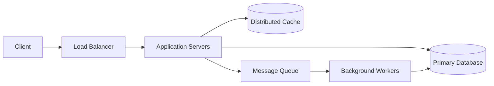
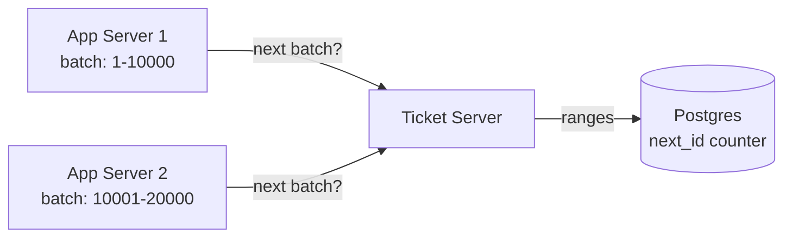

# Lecture 1 — The 45-Minute Design Round

> **Duration:** ~2 hours. **Outcome:** You can run a 45-minute system-design round on a structured six-phase timing, name the four building blocks of every distributed system, identify the default choice within each building block at the 101 level, and articulate the transition phrase you speak out loud at each phase boundary.

## 1. The design round is a timed performance, not a research session

The single most common failure mode in a new-grad design round is not insufficient knowledge. It is unstructured time. The candidate hears the prompt, picks the most-interesting subproblem, dives into it, spends 30 of the 45 minutes there, surfaces with five minutes left, and never produces a high-level architecture. The interviewer's debrief writeup reads "candidate showed strong depth on caching but never described the overall system; could not be evaluated on requirements clarification, API design, or scale reasoning." Lean no-hire.

The structure exists to prevent that failure. It is artificial; no working engineer designs a real system on a six-phase 45-minute clock. The artificiality is the point. The round is graded on the dimensions the structure enumerates, and the candidate who hits each dimension audibly — even shallowly — outperforms the candidate who goes deep on one and silent on the rest.

Treat the structure the way you treated the five-phase narration loop in Week 6's coding round. It is a default sequence you run unless the interviewer redirects you. It is not a script you recite. You will deviate from it whenever the interviewer steers you; the structure exists so that, when you deviate, you can return to it deliberately rather than getting lost in the deviation.

The six phases:

1. **Requirements clarification** — 5 minutes. What are we building? What are we optimising for? What is in scope and out of scope?
2. **High-level architecture** — 5 minutes. The boxes-and-arrows diagram. Five to seven boxes. Name each.
3. **API and data model** — 10 minutes. The handful of endpoints. The handful of tables or collections. The fields.
4. **Deep dive** — 15 minutes. The one component the interviewer wants depth on. Sometimes the interviewer picks; sometimes you propose.
5. **Trade-offs and scale** — 5 minutes. What changes at 10x scale? What did we trade away? What would a future revision do differently?
6. **Questions** — 5 minutes. Their questions to you. Your questions to them.

The timing is approximate. The transitions between phases are not. Each transition is a spoken sentence the interviewer hears as a signal that you are aware of the structure. The candidate who speaks the transitions out loud is the candidate who runs the round on the schedule; the candidate who does not is the candidate the interviewer has to interrupt.

## 2. Phase 1 — Requirements clarification (5 minutes)

The prompt you receive is deliberately under-specified. "Design a URL shortener." "Design a rate limiter." "Design a chat system." The prompts are short because the candidate is being scored on how they unfold them.

The work in 5 minutes:

- **Confirm the core feature.** "When you say URL shortener, do you mean a service that takes a long URL and returns a short URL that redirects to it — like bit.ly or tinyurl?" The interviewer will say yes, or they will narrow it. Either way you have anchored the conversation.
- **Probe scale.** "Roughly how many URLs are we shortening per day? A million? A hundred million?" The number determines the architecture. The interviewer will give you a number — or will say "you tell me" and you commit to a number you can defend. A common 101 anchor is **100M new URLs/day** for a URL shortener; **10M DAU** for a chat system; **1M requests/second** for a rate limiter at large scale.
- **Probe the read-write ratio.** "Is this read-heavy? I would expect roughly 100 reads per write for a URL shortener — the redirect happens many times after the URL is created once." The ratio drives caching strategy. Saying it out loud commits you; the interviewer will correct you if you are wrong.
- **List the non-functional requirements you will optimise for** — pick two or three from: low latency, high availability, strong consistency, durability, cost. "I'll prioritise low-latency reads and high availability; I'll trade some write latency to get there." Three is enough. Listing all six tells the interviewer you have not committed.
- **Bound the scope.** "I won't cover the user-facing web app, the billing, or the analytics dashboard — I'll focus on the core shorten-and-redirect service. Is that the right scope?" The interviewer will confirm or redirect. Either way you have made the scope decision audibly.

The five-minute budget is real. You will feel like you are rushing. You are not; the next 40 minutes need the runway. The new-grad candidate who spends 12 minutes on requirements clarification because they want to be thorough has 33 minutes for the rest of the round and will not finish.

**The transition out loud:** "Okay, that's the requirements space. Let me sketch the high-level architecture."

## 3. Phase 2 — High-level architecture (5 minutes)

Five to seven boxes. Arrows between them. Each box labelled. Each arrow labelled. The diagram is the conversational anchor for the rest of the round.

The default 101-level skeleton for almost any web-facing system:



Six boxes. The diagram fits any of the six canonical 101 problems with minor adjustment — the URL shortener replaces the queue with a key generator; the chat system adds a WebSocket gateway in front of the app servers; the news feed adds a fan-out worker between the queue and the database.

Draw the diagram and narrate it as you draw. "Client hits a load balancer. The load balancer distributes to a pool of stateless application servers. The app servers check the cache first; on miss, they go to the primary database. Writes that don't need immediate consistency go onto a queue and are processed by background workers." Forty seconds of narration. The interviewer now has a mental model they can probe.

What not to do in this phase:

- **Do not draw 15 boxes.** The diagram should be the smallest set of components that can do the job. You can add boxes later in the deep dive. The 15-box diagram is a tell that you have memorised an architecture and are reciting it rather than designing one.
- **Do not commit to specific technologies yet.** "Distributed cache" is the right label; "Redis cluster with sentinel" is premature. The technology choice comes in the deep dive when the interviewer asks.
- **Do not draw the network layer.** No TCP boxes, no DNS boxes, no TLS termination boxes. They are real; they are not the level of abstraction this phase wants.

**The transition out loud:** "That's the skeleton. Let me lay out the API and the data model next."

## 4. Phase 3 — API and data model (10 minutes)

This is the phase where most new-grad candidates lose the most easy points. The API is small — five to ten endpoints at most. The data model is small — two to four tables. The depth is shallow. The candidate who writes them down crisply scores; the candidate who hand-waves loses.

**The API.** Write each endpoint as a single line:

```text
POST /api/v1/urls
  body: { "long_url": "https://...", "custom_alias": optional }
  returns: 201 Created, { "short_url": "https://x.co/abc123" }

GET /:short_code
  returns: 302 Redirect to long_url
           404 if not found

DELETE /api/v1/urls/:short_code
  returns: 204 No Content
           403 if not owner
```

Three endpoints; the URL shortener barely needs a fourth. The candidate who writes ten endpoints has invented features the prompt did not ask for. The candidate who writes one ("shortenUrl(url)") has not engaged with the API as a real artefact.

Use HTTP conventions. POST creates, GET reads, PUT/PATCH update, DELETE deletes. Plural resource names (`/urls`, not `/url`). Status codes that match meaning (201 for create, 302 for redirect, 404 for not found, 403 for unauthorised). The Google API Design Guide in resources.md is the canonical source if any of this is shaky.

**The data model.** Write each entity as a single block:

```text
Url
  id          BIGINT PK
  short_code  VARCHAR(8)   UNIQUE INDEX
  long_url    TEXT
  user_id     BIGINT FK -> User.id
  created_at  TIMESTAMP
  expires_at  TIMESTAMP NULLABLE

User
  id          BIGINT PK
  email       VARCHAR(255) UNIQUE
  created_at  TIMESTAMP
```

Two tables. The fields a junior engineer would actually write down. The primary key is a BIGINT (not a string). The short code is indexed because every read is by short_code. The user_id is a foreign key. The timestamps are typed.

What to commit to and what to defer:

- **Commit** to the schema-on-write database (relational, document, key-value) based on access patterns. For the URL shortener, all queries are point lookups by short_code; a relational DB or a key-value store both work, and you should pick one and defend it. ("I'll go with Postgres because the data model is simple and I want the transaction guarantee on the short-code uniqueness check.")
- **Defer** sharding strategy, indexing details, and replication topology to the deep dive. Phase 3 is about the shape of the data, not the operational details.

**The transition out loud:** "Those are the entities and the endpoints. Let me dive into [the component the interviewer signals interest in] next."

## 5. Phase 4 — Deep dive (15 minutes)

The longest phase. The most variance in candidate performance. The phase where the interviewer is making the actual hire/no-hire decision.

Three patterns for picking what to deep-dive on:

1. **The interviewer picks.** "Walk me through how you'd generate the short code." "How does the cache invalidation work?" "What happens when a URL expires?" The interviewer is signalling the depth they want. Follow them.
2. **You propose, they accept.** "There's an interesting design choice in the short-code generation — do you want me to go through the trade-offs?" The interviewer says yes or steers you elsewhere. Both are fine.
3. **You and they agree silently.** The first deep-dive question they ask sets the topic and you stay on it. This is the most common pattern in a smooth round.

The structure within the deep dive:

- **Name the problem.** "The hard part of the URL shortener is generating a unique short code that's also reasonably short and reasonably random."
- **List the candidate approaches.** Three is the right number. Two feels under-considered; four feels like a survey. For short-code generation: (a) random 6-character base62 string with collision retry; (b) hash of the long URL truncated to 6 characters; (c) auto-incrementing 64-bit ID base62-encoded.
- **Discuss the trade-offs of each.** Each approach has one virtue and one cost. (a) is simple but has collision-retry overhead at high write volume. (b) is deterministic and de-duplicates but exposes that two different users shortened the same URL. (c) is collision-free and fast but is guessable.
- **Commit to one with reasoning.** "I'll go with (c), the auto-incrementing 64-bit ID base62-encoded, because the system needs guaranteed uniqueness and the predictability is acceptable for our threat model — these are public short URLs, not security tokens."
- **Sketch the implementation.** Three to five sentences. "A ticket server allocates ranges of IDs to each app server in batches of 10,000. Each app server hands out IDs from its batch without coordination. When the batch runs low, the app server asks for the next range. Base62 encoding (a-z, A-Z, 0-9) lets a 10-digit number fit in 6 characters."
- **Identify one or two follow-up issues.** "The ticket server is a single point of failure; in production we'd run two with leader election. If both fail, we have batched IDs to last a few hours; long enough to recover."

The deep dive should produce a diagram in addition to the high-level one — a more detailed view of the one component:



Three boxes; one external relationship. The diagram is the artefact the interviewer will remember in the debrief.

What not to do in this phase:

- **Do not go three layers deeper than asked.** If the interviewer asks about short-code generation, do not also dive into the cache layer and the queue and the load balancer. You will run out of time.
- **Do not invent novel algorithms.** The interviewer wants to hear that you know the standard approach (the Twitter Snowflake pattern, the consistent-hashing pattern, the rate-limiting token-bucket pattern) and can apply it. Inventing your own is a signal that you have not encountered the standard.
- **Do not say "we'd use Redis" and stop there.** Every candidate says that. The depth is in the next sentence: "Redis cluster with three primary nodes and two replicas, sharded by short_code modulo the node count, with a 24-hour TTL on each entry."

**The transition out loud:** "I think that covers the deep dive. Let me think about trade-offs and what would change at scale."

## 6. Phase 5 — Trade-offs and scale (5 minutes)

The candidate who skips this phase fails the round. The candidate who runs it shallowly passes. The candidate who runs it well stands out.

The work in 5 minutes:

- **Name the explicit trade-offs you made.** Two or three. "I chose Postgres over a key-value store; the simplicity is worth the slightly higher latency on point lookups, which the cache absorbs anyway." "I chose strong consistency on the short-code generation; the alternative was a probabilistic ID with no collision check, which I rejected because the user-facing failure mode of a duplicate is bad."
- **Name what changes at 10x scale.** Pick the dimension the interviewer cares about and walk through it. "At 10x write volume — a billion URLs/day — the single-Postgres setup hits IO limits. I'd shard by short_code prefix; each shard sees ~100M writes/day, which is well within a single-node Postgres budget."
- **Name the failure mode you did not handle.** One. The interviewer wants honesty more than completeness. "I did not design for multi-region durability; if the primary region goes down, the service is down. The fix is async replication to a secondary region with a planned failover, but the consistency story gets harder; happy to talk about that if useful."
- **Name what a senior engineer would add.** One sentence. "A senior design would include capacity planning numbers for the cache, an explicit SLO and error budget, and a plan for graceful degradation when the database is slow."

The framing "what a senior engineer would add" is deliberate. It signals to the interviewer that you know the round was scoped to a new-grad level and that you can recognise the next layer. It does not lower your evaluation; it shows calibration.

**The transition out loud:** "Those are the trade-offs I'd call out. What questions do you have for me, and what should I ask you?"

## 7. Phase 6 — Questions (5 minutes)

The interviewer will ask one or two clarifying questions on the design. Answer them concisely. Then they will turn it over: "Any questions for me?"

The strong candidate has two or three questions ready. Not generic questions; questions that follow from the round.

- "We didn't get into the analytics side — does your team handle the analytics for URL-shortener-style products, or is that a separate team?"
- "I picked Postgres; I'd be curious which databases your team actually uses for similar workloads."
- "The interviewer-side of the round — what's a follow-up question you'd typically ask at the senior level that I could think about for next time?"

The third type is the highest-leverage question for a new-grad candidate. It signals self-improvement, it gives the interviewer a chance to mentor (which they will note positively), and it gives you a real answer to take into the next loop.

## 8. The four building blocks

Every distributed system you will design at the 101 level is composed of four building blocks. Knowing the taxonomy of each at this level is the difference between a confident round and a hand-wavy one.

### Block 1: Compute

The stateless servers that run application code. The default at the 101 level is "a pool of identical application servers behind a load balancer." Variants worth naming:

- **Stateless web/app servers.** The default. Horizontally scalable. Any request can be served by any server. The pool is sized to peak QPS.
- **Background workers.** Stateless servers that consume from a queue rather than answering HTTP. Same operational model; different input source.
- **Stream processors.** A specialised worker that processes a continuous stream (Kafka, Kinesis). Mention only if the design naturally produces a stream.

Compute is the cheapest building block to reason about because it scales linearly with traffic and has no state to coordinate. Most 101 designs allocate compute generously; the harder problems are downstream.

### Block 2: Storage

The persistent state. The 101 taxonomy is five categories; you should know one default per category.

- **Relational (Postgres, MySQL).** Default for structured data with relationships, transactions, and complex queries. The 101 default for most designs.
- **Document (MongoDB).** Default when the data is naturally a JSON tree and the queries are mostly by ID or by indexed field. Slightly out of fashion in 2026; still a valid choice.
- **Key-value (Redis as a store, DynamoDB).** Default for high-throughput point lookups. Redis is also the default cache; DynamoDB is the default managed KV store on AWS.
- **Wide-column (Cassandra, ScyllaDB, Bigtable).** Default for time-series, event logs, and write-heavy workloads at scale. Mention for chat messages, activity feeds, telemetry.
- **Blob (S3, GCS, Azure Blob).** Default for files: images, videos, attachments, backups. Mention for any design that has user-uploaded content.

The 101-level rule of thumb: pick relational unless there is a specific reason not to. The specific reasons — write volume above ~10K/sec, schema-flexibility, point-lookup-only access patterns, blob-shaped data — each push you to a specific alternative.

### Block 3: Caching

In-memory storage in front of slower storage. The 101 taxonomy:

- **In-process cache.** A hash table inside the application server. Fast (nanoseconds) but small (gigabytes), per-server (so cache-miss rate is high), and dies on restart. Mention for hot read-only data.
- **Distributed cache (Redis, Memcached).** A separate cluster of in-memory servers. Slower than in-process (~1ms network round-trip) but shared (cache hits across the whole fleet), larger (terabytes), and survives application-server restarts. The 101 default for "put a cache in front of the database."
- **CDN (Cloudflare, CloudFront, Akamai, Fastly).** A geographically distributed cache for static content. Mention for any design with public images, video, or HTML.

The 101-level rule of thumb: a distributed cache in front of the primary database catches the hot path. A CDN catches the static path. Both are cheap relative to the latency and database load they remove.

### Block 4: Queues

Asynchronous messaging between services. The 101 taxonomy:

- **Message queue (RabbitMQ, SQS).** Producers push messages; consumers pull and process; messages are deleted after acknowledgement. Default for work queues: send-this-email, resize-this-image, charge-this-card.
- **Distributed log (Kafka, Kinesis).** Producers append to a log; consumers read at their own pace; messages are retained for a configured window. Default for event streams: every-click, every-message, every-state-change.

The 101-level rule of thumb: if work is "fire and forget, one consumer," use a message queue. If work is "an event that multiple consumers care about and that you might want to replay," use a distributed log. The choice between RabbitMQ-shaped and Kafka-shaped is one of the cleanest 101 trade-offs to articulate.

## 9. The transitions, restated

The six phases and the six transition phrases, in order:

1. *(start)* "Let me start by clarifying the requirements."
2. *(after ~5 min)* "Okay, that's the requirements space. Let me sketch the high-level architecture."
3. *(after ~10 min)* "That's the skeleton. Let me lay out the API and the data model next."
4. *(after ~20 min)* "Those are the entities and the endpoints. Let me dive into [component] next."
5. *(after ~35 min)* "I think that covers the deep dive. Let me think about trade-offs and what would change at scale."
6. *(after ~40 min)* "Those are the trade-offs I'd call out. What questions do you have for me, and what should I ask you?"

Memorise these six phrases. They are the audible scaffolding the interviewer hears. They are the difference between "candidate ran a structured round" and "candidate produced a disorganised set of observations." Even if you say nothing else memorable, these phrases run the round on the clock.

## 10. The recovery moves

The structure breaks. You will overshoot a phase, get stuck in the deep dive, lose the thread in the API. The recovery moves:

- **Phase 3 (API) ran 15 minutes instead of 10.** Shorten the deep dive to 12 minutes; cover the same ground but skip the optional second sub-topic. Recover.
- **Phase 4 (deep dive) ran 25 minutes instead of 15.** You are now 5 minutes short. Skip the explicit trade-offs phase; weave one or two trade-offs into the closing. Take the questions on time. Do not eat the questions phase; the candidate who runs the questions cleanly recovers a lot.
- **You realise at minute 35 that you misunderstood the requirements.** Surface it. "I want to check — did you mean X or Y? I've been designing for X; if it's Y, I'd change A and B." The interviewer either confirms or redirects. Either is recoverable. Silently designing the wrong system for ten more minutes is not.
- **You realise at minute 30 that the design has a hole.** Surface it. "One thing I missed in the API phase — we don't have an endpoint for X. Let me add that." Adding the missing piece on the fly is normal; pretending the hole isn't there is not.

The interviewer is on your side. They want you to succeed. The structure exists so you can recover audibly; the candidate who recovers visibly is scored higher than the candidate who never had a problem but also never had a high.

## What to take into the exercises

By the end of this lecture, you should be able to do three things from cold:

1. **Recite the six phases and their timing budgets** without looking — the structure should be on muscle memory by the end of the homework.
2. **List the four building blocks** and one default technology per block at the 101 level — compute / app servers, storage / Postgres, caching / Redis, queues / RabbitMQ-or-Kafka.
3. **Name the six transition phrases** and the moment in the round when each one fires — these run the round even if you have nothing to say in between.

Lecture 2 takes the structure and adds the quantitative scaffolding: the back-of-envelope estimation, the latency numbers, the "is that fast or slow" calibration. Lecture 3 then walks through the canonical 101 problems against the structure. Together they form the round-running toolkit; the exercises and mini-project then drill it.
