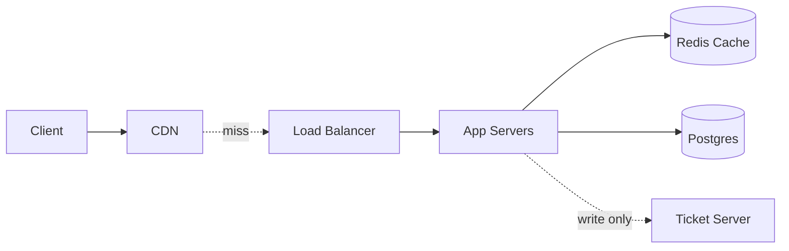
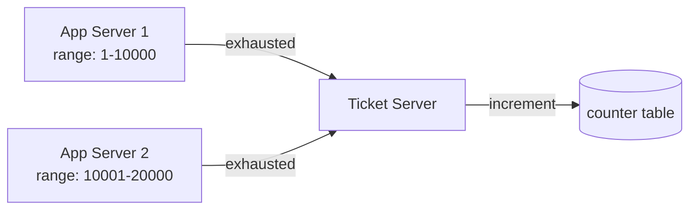
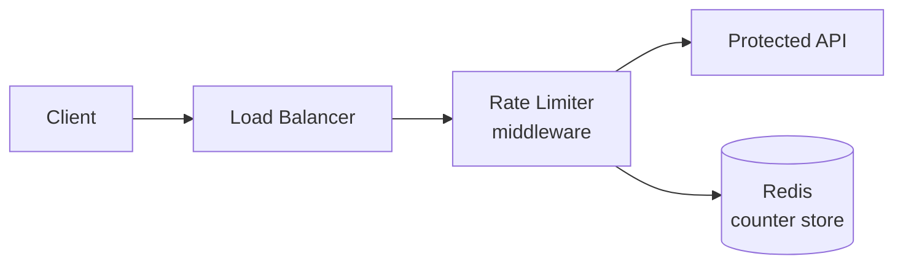
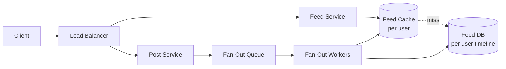
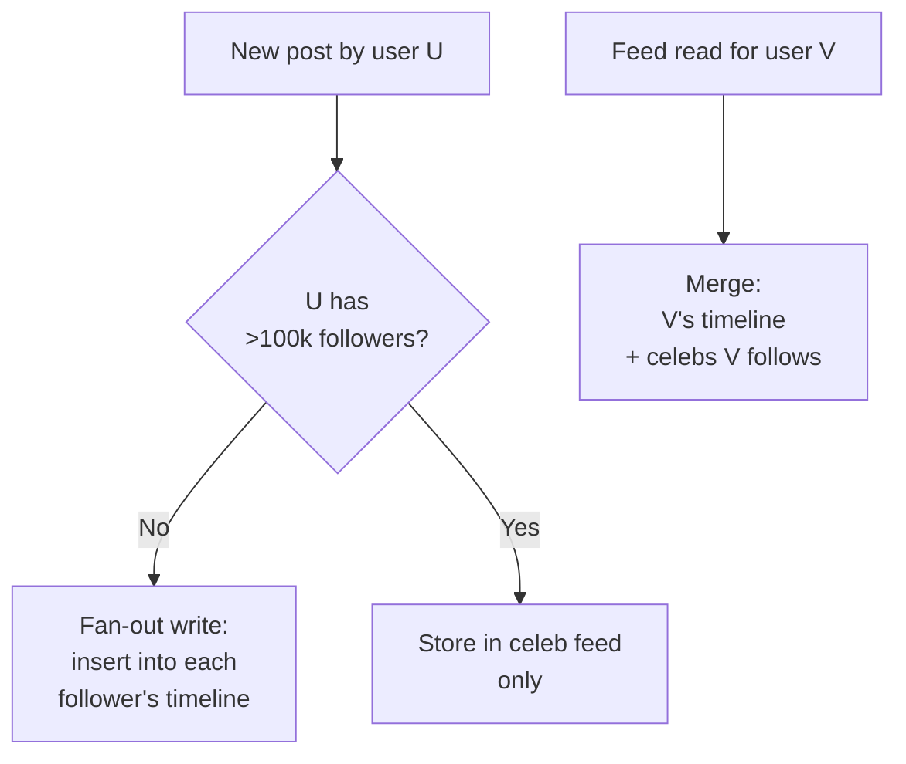
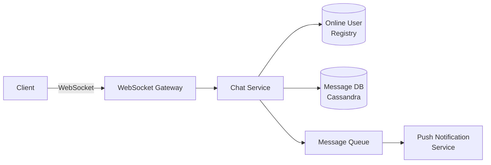
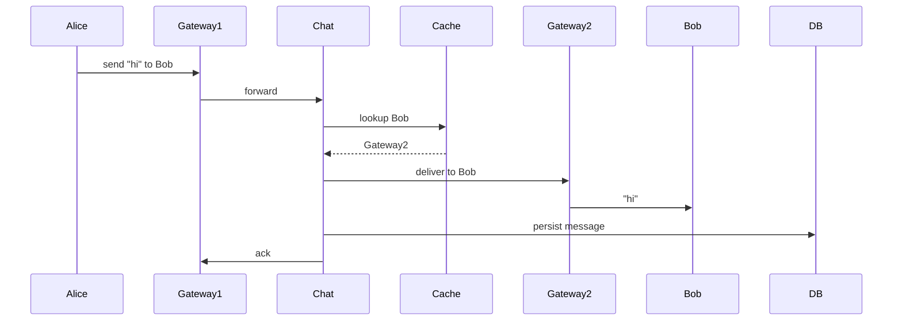
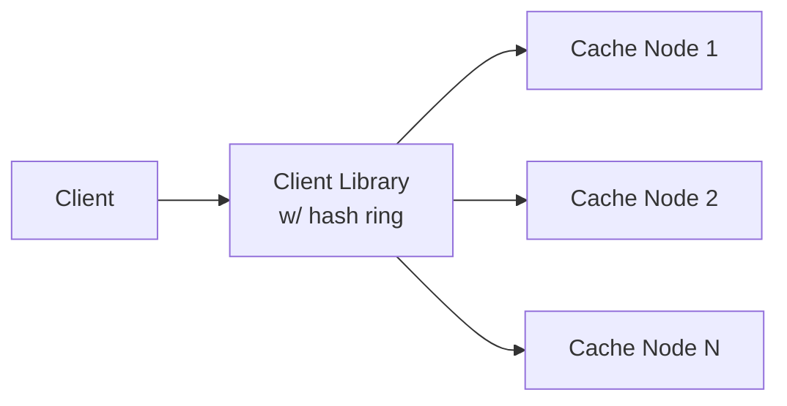
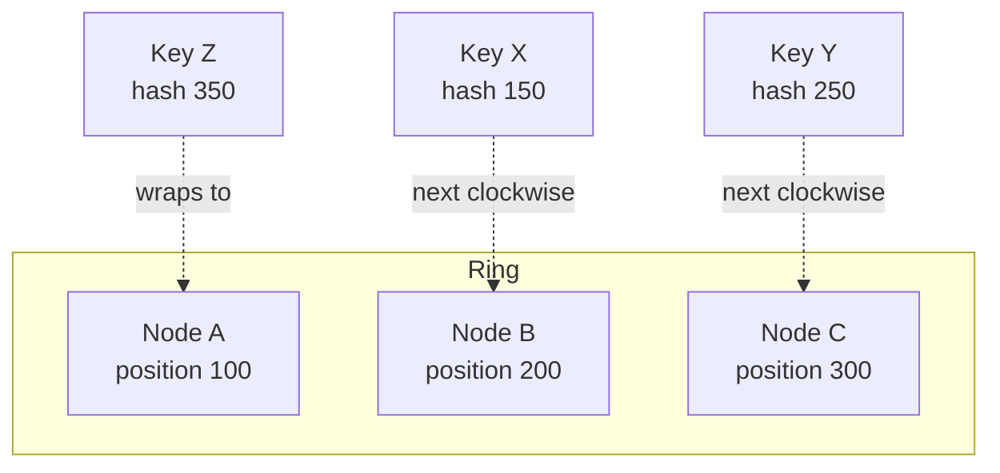
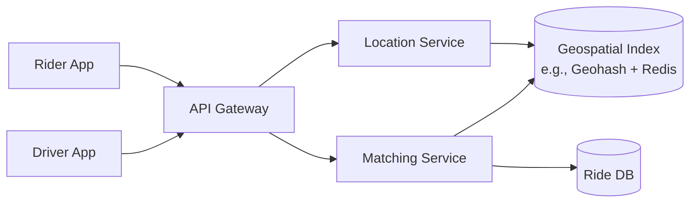

# Lecture 3 — The Six Classic 101-Level Problems

> **Duration:** ~2 hours. **Outcome:** You know the canonical 101-level shape of the six most-asked design problems: URL shortener, rate limiter, news feed, chat, distributed cache, ride-sharing match. You can sketch each from cold in under five minutes and identify the deep-dive target for each. You can also distinguish the new-grad bar from the senior bar on each.

## 1. The taxonomy

The six 101-level problems cover most of the surface area a new-grad or L4 candidate is asked to design. Each one tests a different building block as the load-bearing element:

| Problem | Load-bearing block | The hard part at the 101 level |
|---------|-------------------|---------------------------------|
| URL shortener | Storage + caching | Generating short codes; read-heavy redirect path |
| Rate limiter | In-memory state + algorithm choice | The algorithm: token bucket vs. leaky bucket vs. sliding window |
| News feed | Compute + queue (fan-out) | Fan-out on write vs. fan-out on read |
| Chat | Compute (WebSocket) + storage | Real-time delivery + message history |
| Distributed cache | Storage + sharding | Consistent hashing; eviction policy |
| Ride-sharing match | Geospatial index + matching | Finding nearby drivers efficiently |

Each problem has a canonical 101-level solution. The candidate who knows the canonical solution and can defend the trade-offs against the alternatives is at the new-grad-passing bar. The candidate who improvises a solution from first principles can sometimes do better, often does worse, and never knows in advance which.

The right move for new-grad prep: learn the canonical solution for each. Treat the round as recognition first, design second. When the prompt matches a known problem (six of seven prompts will), recognise the problem and produce the canonical solution with your own narration. When it doesn't, compose from the building blocks of the closest match.

## 2. URL shortener (TinyURL)

The most-asked design problem. The mini-project for this week. The simplest of the six because the system has minimal real-time state, the data model is two tables, and the read path dominates.

### Requirements (Phase 1)

- **Core:** shorten a long URL; redirect from short URL to long URL.
- **Scale:** ~100M new URLs/day; ~10B redirects/day (100:1 read-to-write).
- **SLO:** redirect p99 latency < 100ms; durability for created URLs.
- **Out of scope:** analytics, custom domains, user authentication beyond owner-of-URL.

### High level (Phase 2)



### API and data model (Phase 3)

```text
POST /api/v1/urls          → 201 { "short_url": "https://x.co/abc123" }
GET  /:short_code          → 302 redirect to long_url
DELETE /api/v1/urls/:code  → 204
```

```text
Url
  id          BIGINT PK
  short_code  VARCHAR(8) UNIQUE INDEX
  long_url    TEXT
  user_id     BIGINT FK NULLABLE
  created_at  TIMESTAMP
  expires_at  TIMESTAMP NULLABLE
```

### Deep dive (Phase 4)

The candidate target: **short-code generation**. Three approaches: random + retry, hash + truncate, counter + base62. Walk through; commit to **counter + base62** with a ticket server. Reasoning: guaranteed uniqueness, no collision retry, fixed short-code length, supports ID-range pre-allocation per app server.

The ticket server pattern:



The candidate that knows this is the Twitter Snowflake pattern (adapted) is at the senior-trending bar; the new-grad just needs to describe the idea.

### Trade-offs and scale (Phase 5)

- Postgres over Cassandra: simplicity wins; the workload fits a single sharded Postgres setup at projected scale.
- Cache hit rate at 95%: the 5% miss rate goes to Postgres at 5,000 reads/sec, which a sharded Postgres handles.
- Bandwidth: a 302 redirect is ~200 bytes; at 100K peak QPS that's 20MB/s, negligible.
- What scales: read traffic on cache, write traffic on ticket server. The ticket server is the single point of risk; deploy two with leader election.

### The numbers

- 100M writes/day = ~1,200 writes/sec average, ~5,000 peak
- 10B reads/day = ~120K reads/sec average, ~500K peak
- Storage: 100M × 200 bytes/row × 365 days = ~7 TB/year raw, ~30 TB with overhead

### New-grad bar vs. senior bar

**New-grad passes by:** producing the architecture, the API, the data model, a short-code-generation deep dive, and one trade-off.

**Senior adds:** capacity-planning detail, multi-region replication for the ticket server, click-stream analytics pipeline (with the queue and worker pattern), abuse detection (rate limiting on URL creation), custom short-code handling with race conditions.

## 3. Rate limiter

A common round at companies that operate public APIs. Tests algorithm fluency more than architecture; the 101 candidate is scored on choosing an algorithm and reasoning about its trade-offs.

### Requirements (Phase 1)

- **Core:** allow N requests per user per window; reject the (N+1)th with HTTP 429.
- **Scale:** ~1M requests/sec across the protected API.
- **SLO:** the rate limiter must add <10ms to each request; must be fail-open (do not block traffic on rate-limiter failure).
- **Out of scope:** the API being protected; user authentication; billing.

### High level (Phase 2)



The rate limiter is typically middleware: in-process inside the load balancer or app server, with a shared backing store (Redis) for cross-instance counting.

### API and data model (Phase 3)

The rate limiter is invisible to callers when they are under the limit. When over:

```text
HTTP/1.1 429 Too Many Requests
X-RateLimit-Limit: 100
X-RateLimit-Remaining: 0
X-RateLimit-Reset: 1715712345
Retry-After: 60
```

Data model in Redis:

```text
Key: "rl:{user_id}:{minute_bucket}"
Value: counter (integer)
TTL: 120 seconds
```

### Deep dive (Phase 4)

The candidate target: **algorithm choice**. Three canonical algorithms:

- **Fixed window:** count requests in a fixed time bucket (e.g., per minute). Simplest; suffers from the boundary problem (a user can send 2N requests in 1 second by straddling the minute boundary).
- **Sliding window:** count requests in the last N seconds, weighted across two adjacent fixed buckets. Smoother; slightly more state.
- **Token bucket:** the bucket fills at a steady rate; each request consumes one token; requests when empty are rejected. Allows bursts up to the bucket size.

Commit to **sliding window** for general API protection (smooth, simple to reason about), or **token bucket** when bursts are desirable (e.g., a UI that triggers many requests on page load).

Sample sliding-window calculation:

```text
current_count = bucket[minute_N] × (60 - elapsed_in_N+1) / 60
              + bucket[minute_N+1]
```

A request is allowed if `current_count < limit`.

### Trade-offs and scale (Phase 5)

- Redis as the counter store: 1M ops/sec on a single Redis cluster is achievable; the rate limiter operations are O(1) and fit Redis's strengths.
- Eventual consistency: a small window of error (1-2% over-limit allowed across a cluster) is acceptable for nearly all rate-limiter use cases; this lets you avoid distributed locks.
- Fail-open: if Redis is unreachable, the middleware lets traffic through. The alternative (fail-closed) is unacceptable for most APIs.
- What scales: per-user state grows linearly in users. At 100M users, the Redis store holds ~100M keys; Redis handles this easily.

### The numbers

- 1M requests/sec across the API
- ~10 μs per Redis operation on a healthy network
- Total rate-limiter overhead: ~10-50 μs per request, comfortably under the 10ms SLO
- Memory: 100M users × ~100 bytes each = ~10 GB Redis cluster footprint

### New-grad bar vs. senior bar

**New-grad passes by:** picking an algorithm, defending it, sketching the Redis-backed counter, and identifying the fail-open requirement.

**Senior adds:** per-endpoint limits, per-tier limits (free vs. paid), distributed rate limiting across regions, the leaky-bucket variant for traffic shaping rather than rejection, the abuse-detection layer for IP-level limits.

## 4. News feed

The "design Twitter / Instagram / Facebook home feed" prompt. Tests the fan-out trade-off more than any other 101-level problem; the candidate is scored on understanding why the choice matters.

### Requirements (Phase 1)

- **Core:** a user opens the app and sees a feed of recent posts from accounts they follow, in reverse chronological order.
- **Scale:** 100M DAU; average user follows 200 accounts; average user posts 0.5 times/day.
- **SLO:** feed load p99 < 200ms; new post visible to followers within 30 seconds.
- **Out of scope:** ranking algorithm, advertising, direct messages.

### High level (Phase 2)



### API and data model (Phase 3)

```text
GET  /api/v1/feed?cursor=X      → 200 { posts: [...], next_cursor: Y }
POST /api/v1/posts              → 201 { id, content, created_at }
POST /api/v1/follow/:user_id    → 204
```

```text
Post
  id           BIGINT PK
  author_id    BIGINT
  content      TEXT
  created_at   TIMESTAMP

Follow
  follower_id  BIGINT
  followee_id  BIGINT
  PK (follower_id, followee_id)

UserTimeline (the precomputed feed, per user)
  user_id      BIGINT
  post_id      BIGINT
  posted_at    TIMESTAMP
  PK (user_id, posted_at DESC)
```

### Deep dive (Phase 4)

The candidate target: **fan-out on write vs. fan-out on read**.

- **Fan-out on write:** when a user posts, the post is written to each follower's UserTimeline. Read is a single fast index lookup. Write is expensive for users with many followers.
- **Fan-out on read:** when a user opens the feed, the server fetches recent posts from each followed account and merges them. Read is expensive; write is a single insert.
- **Hybrid (the production answer):** fan-out on write for normal users; fan-out on read for celebrity users (with >100k followers); merge the two streams on read.

Commit to **hybrid** with the celebrity threshold explained:



### Trade-offs and scale (Phase 5)

- Fan-out workers must be horizontally scalable; the queue absorbs bursts (a viral post triggers a fan-out spike).
- Cache the feed per user; cache miss rate is low because feed reads are dominated by active users.
- Storage: 100M users × 1,000 cached posts each × 100 bytes/reference = ~10 TB raw; replicated 3x is ~30 TB.
- Celebrity threshold is a tunable knob: too low and the merge is expensive; too high and the fan-out cost is wasteful.

### The numbers

- 100M DAU × 50 feed loads/day = 5B reads/day = ~60K reads/sec average
- 100M DAU × 0.5 posts/day = 50M writes/day = ~600 writes/sec average
- Average post by a 200-follower user triggers 200 fan-out writes → ~120K fan-out writes/sec average
- A 10M-follower celebrity posting once produces 10M writes — at 100K writes/sec on the fan-out workers, this takes 100 seconds, which is why celebs are read-side instead

### New-grad bar vs. senior bar

**New-grad passes by:** recognising the fan-out trade-off, picking the hybrid, sketching the fan-out worker, and identifying the celebrity case.

**Senior adds:** the ranking model (chronological vs. ranked), the staleness vs. freshness trade-off, the cross-region fan-out, the cold-start problem for new users.

## 5. Chat (one-to-one and group)

A WebSocket-heavy design that tests real-time delivery in addition to storage. The 101 candidate is scored on understanding why HTTP polling is wrong and what the alternative is.

### Requirements (Phase 1)

- **Core:** send a message; receive it in real time on the recipient's device; show message history when the app opens.
- **Scale:** 10M DAU; average 30 messages sent/user/day.
- **SLO:** delivery p99 < 500ms; message history loads in p99 < 1s.
- **Out of scope:** voice, video, end-to-end encryption (mention but defer).

### High level (Phase 2)



### API and data model (Phase 3)

Over the WebSocket:

```text
client → server: { "type": "send", "to_user": ..., "content": ... }
server → recipient: { "type": "message", "from_user": ..., "content": ..., "timestamp": ... }
server → sender: { "type": "ack", "message_id": ... }
```

HTTP for history:

```text
GET /api/v1/conversations/:id/messages?before=cursor → 200 { messages: [...] }
```

Data model:

```text
Message (Cassandra; partition key = conversation_id, clustering by created_at)
  conversation_id  BIGINT
  message_id       UUID
  sender_id        BIGINT
  content          TEXT
  created_at       TIMESTAMP
```

### Deep dive (Phase 4)

The candidate target: **delivery to online vs. offline recipients**.

- If the recipient is online (WebSocket connection on a known gateway), the chat service publishes the message to the gateway, which delivers over the existing connection. ~100ms latency.
- If the recipient is offline, the message is persisted to Cassandra and a push notification is queued.
- The online-user registry (Redis) tracks "user → gateway server" mappings; on message send, the chat service looks up the gateway and routes.



### Trade-offs and scale (Phase 5)

- Cassandra over Postgres: write-heavy workload, time-ordered access by conversation, native partitioning. The canonical "chat at scale" database; Discord's published architecture confirms.
- WebSocket gateway capacity: each modern server holds ~50-100K concurrent connections; at 10M concurrent users, that's ~200 gateway servers.
- Group chat fans out at send: a group of 100 means 100 deliveries per message. Use the same online-registry pattern.
- E2E encryption is the senior follow-up; mention as a non-trivial design constraint that changes the message-storage shape.

### The numbers

- 10M DAU × 30 messages/day = 300M messages/day = ~3,500 messages/sec average, ~15K peak
- Each message ~200 bytes: ~60GB/day raw, ~22TB/year, ~90TB with overhead and replication
- Concurrent WebSocket connections: estimate 30-50% of DAU = ~3-5M concurrent

### New-grad bar vs. senior bar

**New-grad passes by:** picking WebSocket over polling, sketching the gateway + registry pattern, picking Cassandra, handling offline delivery via push.

**Senior adds:** group-chat fan-out optimisation, E2E encryption protocol, gateway failover when a server crashes (and reconnect logic), cross-region delivery, read-receipt and typing-indicator protocols.

## 6. Distributed cache

A meta-design problem: design the cache, not a system that uses one. Tests sharding fluency and the canonical "consistent hashing" pattern.

### Requirements (Phase 1)

- **Core:** a key-value store, in memory, distributed across a cluster of nodes; supports GET, SET, DELETE.
- **Scale:** 1M ops/sec; cluster of 100 nodes; total data ~10TB.
- **SLO:** p99 latency < 5ms; survives single-node failure with minimal disruption.
- **Out of scope:** persistence (this is a cache); strong consistency; transactions.

### High level (Phase 2)



The client library is the load balancer here; it knows the hash ring and routes each key to the correct node directly.

### API and data model (Phase 3)

```text
GET    key            → value | null
SET    key, value, ttl → ok
DELETE key            → ok
```

No data model on the server side beyond a hash table.

### Deep dive (Phase 4)

The candidate target: **consistent hashing**.

The naive approach: hash(key) mod N picks a node. Problem: when a node is added or removed, almost every key remaps. The cache cold-starts.

The consistent-hashing approach: hash the nodes onto a ring (0 to 2^32). Hash the keys onto the same ring. Each key goes to the next node clockwise. When a node is added, only the keys between it and its predecessor move; ~1/N of keys.



Virtual nodes: each physical node gets ~150 positions on the ring, smoothing the distribution.

### Trade-offs and scale (Phase 5)

- Replication: each key is stored on the next 2-3 nodes for fault tolerance. On node failure, reads fall through to replicas; the cluster heals when the node returns or is replaced.
- Eviction policy: LRU is the default for general use; LFU for stable workloads; FIFO for time-bounded data. Mention all three; commit to LRU.
- Memcached vs. Redis: Memcached is simpler (just KV, multi-threaded); Redis adds data structures (lists, sets, sorted sets) and persistence. For a pure cache, Memcached is often preferred; for a cache that also serves as a small data store, Redis.

### The numbers

- 1M ops/sec across 100 nodes = 10K ops/sec/node, well within capacity
- ~1ms p99 for an intra-DC cache hit
- 10TB / 100 nodes = 100GB/node; commodity 256GB-RAM nodes fit comfortably

### New-grad bar vs. senior bar

**New-grad passes by:** consistent hashing, virtual nodes, replication factor, LRU eviction.

**Senior adds:** the cache-aside vs. write-through vs. write-behind comparison, hot-key handling (when one key dominates traffic), cross-region cache invalidation, the cache stampede problem and its mitigations.

## 7. Ride-sharing match

A geospatial round with a real-time matching component. The hardest of the six at the 101 level because the geospatial index is unfamiliar to most new-grad candidates.

### Requirements (Phase 1)

- **Core:** a rider requests a ride; the system finds the nearest available driver within 5 minutes; the ride is matched and tracked.
- **Scale:** 10M DAU; 1M active drivers; 100K ride requests/hour peak.
- **SLO:** match p99 < 5s; driver location update every 5s.
- **Out of scope:** payment, ratings, route planning.

### High level (Phase 2)



### API and data model (Phase 3)

```text
POST /api/v1/rides                 → 200 { ride_id, estimated_pickup_time }
POST /api/v1/drivers/:id/location  → 204
GET  /api/v1/rides/:id             → 200 { status, driver_id, location }
```

```text
Ride
  id           BIGINT PK
  rider_id     BIGINT
  driver_id    BIGINT NULLABLE
  pickup_lat   FLOAT
  pickup_lng   FLOAT
  status       ENUM (requested, matched, in_progress, complete)
  requested_at TIMESTAMP

DriverLocation (in Redis, geospatial)
  driver_id     BIGINT
  geohash       VARCHAR(12)
  last_update   TIMESTAMP
```

### Deep dive (Phase 4)

The candidate target: **the geospatial index**.

The problem: given a (lat, lng), find all drivers within 5km. Naive: scan all drivers, compute distance, filter. Cost: O(N) per query; with 1M drivers and 100K queries/hour, ~30 queries/sec × 1M comparisons = 30M ops/sec. Not viable.

The geohash approach: each location is encoded as a base-32 string where shared prefixes mean geographic proximity. To find nearby drivers, look up the rider's geohash and the 8 neighbouring geohashes; return all drivers in those 9 cells.

```text
Rider at SF Financial District: geohash "9q8yyk"
Neighbouring cells (9 total): 9q8yyk, 9q8yym, 9q8yyt, 9q8yyj, 9q8yys, 9q8yyh, 9q8yyu, 9q8yyv, 9q8yym
Query: SET MEMBERS of 9 Redis sets; union; filter to active drivers
```

Redis has native geospatial commands (GEOADD, GEORADIUS, GEOSEARCH) that implement this directly.

### Trade-offs and scale (Phase 5)

- Geohash precision (6 characters ≈ 1.2km cells) is the right granularity for ride-sharing in dense cities; sparser regions may need a wider radius search.
- Driver location updates at 5s intervals from 1M drivers = 200K writes/sec to the geospatial index. Redis cluster handles this.
- Matching algorithm: nearest-driver-first is the default; surge-pricing variants and ETA optimisation are senior territory.
- Hotspot problem: a major event (concert, sports game) produces a query hot-spot on a few geohashes. Mention; defer.

### The numbers

- 100K ride requests/hour = ~30 requests/sec average, peak maybe 100/sec
- 1M drivers × 1 location update / 5s = 200K writes/sec to Redis
- Each geohash lookup: 9 set operations + filter ≈ 1-5ms
- Total match latency: ~10-50ms (well under the 5s SLO)

### New-grad bar vs. senior bar

**New-grad passes by:** geohash or Redis geospatial commands, the 9-cell neighbourhood search, the driver-location-update pattern.

**Senior adds:** the H3 hexagonal index (Uber's actual approach), surge-pricing algorithms, multi-leg trip matching, the cross-region matching problem for airports/borders, the ETA prediction model.

## 8. Reading the prompt — which problem is this?

The interviewer rarely says "design a URL shortener." They say "design a service that takes a long URL and returns a short one." The candidate's first job is recognition.

Pattern → problem mapping:

| Prompt clue | Likely problem |
|-------------|----------------|
| Short / share / link / redirect | URL shortener |
| Throttle / limit / quota / abuse | Rate limiter |
| Feed / timeline / following / posts | News feed |
| Messages / real-time / chat / typing | Chat |
| Cache / Redis / Memcached / KV store | Distributed cache |
| Driver / ride / nearby / dispatch | Ride-sharing match |

Less-canonical prompts that map to the same patterns: "design Twitter" → news feed; "design WhatsApp" → chat; "design Yelp's 'nearby restaurants'" → ride-sharing match (geospatial subset); "design API throttling for a public API" → rate limiter; "design a Pinterest-style feed" → news feed.

When the prompt is novel — "design a real-time bidding system" or "design a stock-ticker dashboard" — compose from the closest canonical problem: a bidding system is rate-limiter-shaped at the gateway, news-feed-shaped at the auction-result distribution, with a custom matching service in the middle. State the composition explicitly.

## 9. The new-grad bar across all six

The bar to pass a new-grad design round, restated:

- **Run the structure.** All six phases. Transitions out loud. Time budget approximate but visible.
- **Hit the four building blocks.** Compute, storage, caching, queues. Each named in the high-level. Defaults committed.
- **Produce numbers.** DAU → QPS → storage → bandwidth, in under two minutes. One sanity check.
- **One deep dive.** Three approaches, trade-offs, commit to one. A second diagram.
- **Two trade-offs.** Explicit. Named. Defensible.
- **One thing the senior bar would add.** Mention to show calibration.

The bar is not "design a complete production system." The bar is "demonstrate the method while producing a defensible 101-level design." The interviewer's debrief writeup is graded against the method, not the final diagram's perfection. Two candidates can submit different final diagrams and both pass, as long as both demonstrated the method.

## What to take into the exercises

Three exercises follow this lecture: URL shortener, rate limiter, news feed. The other three problems (chat, distributed cache, ride-sharing) are in the homework. The mini-project is the full TinyURL write-up.

For each exercise:

1. **Set a 60-minute timer.** Run the structure; produce the artefacts.
2. **Diff against the SOLUTIONS.md** in the same folder. The solution is one strong answer, not the only one.
3. **Score yourself against the rubric** in Challenge 2.
4. **Identify one gap.** One specific thing to drill before the real round.

The drill is the muscle. The lectures are the calibration. By Sunday night, both should be on muscle memory; the round should feel like recognition rather than invention.
