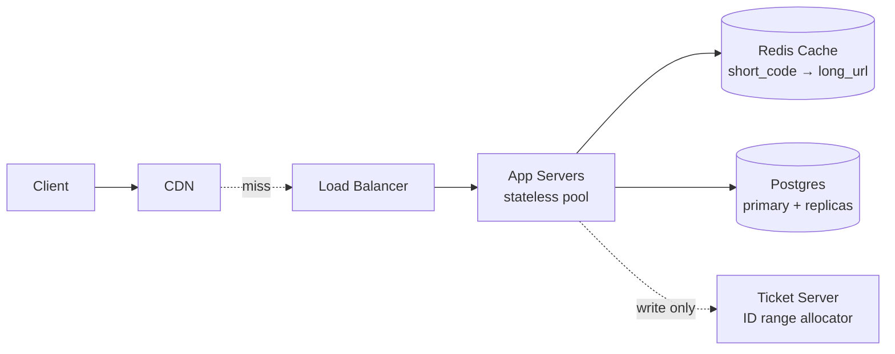
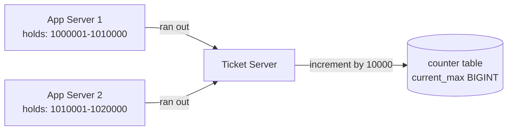
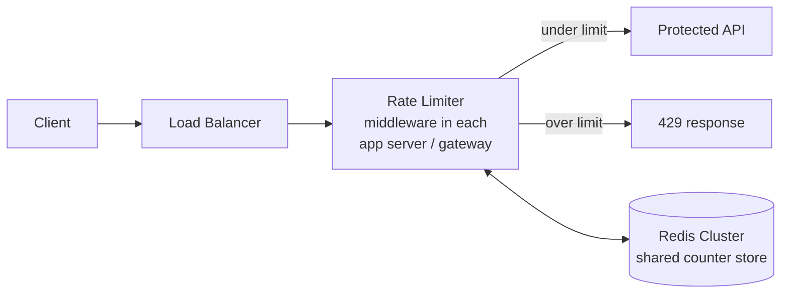
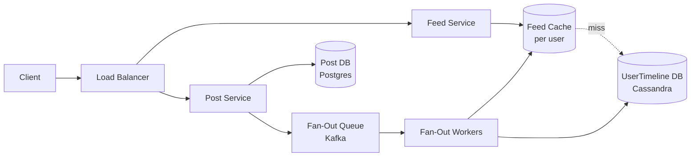
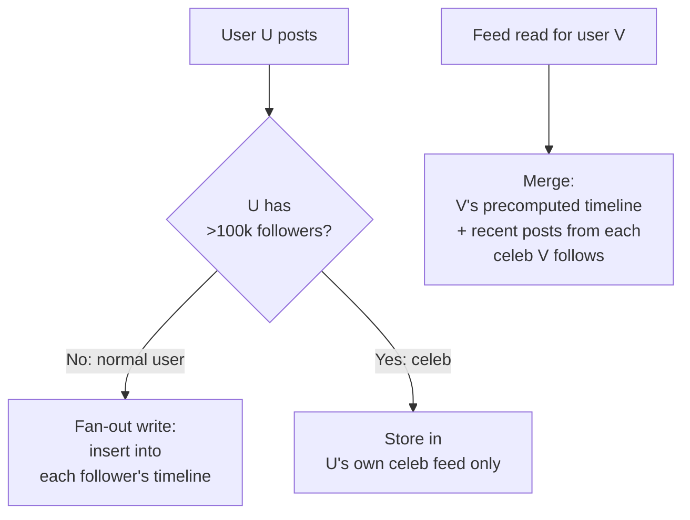

# Exercises — Sample Strong Answers

Each section is one strong answer for the corresponding exercise. The answers are written as if the candidate produced them in a 45-minute round. They are not the only correct answer; the design space for each problem is large. Use them as a reference for what depth and structure look like at the new-grad-passing bar, not as a target to memorise.

The answers are intentionally less polished than published architecture documents. A real round produces handwritten diagrams, half-sentences, and arithmetic on the margin. The artefacts below preserve that voice.

---

## Exercise 1 — URL Shortener (sample strong answer)

### Phase 1 — Requirements (5 min)

**Spoken at the start:**
> "Let me start by clarifying — by URL shortener you mean a service like bit.ly: I send a long URL, get back a short URL, and when someone visits the short URL they redirect to the long one. Right?"

(Interviewer: "Right.")

> "What's the scale we're designing for?"

(Interviewer: "Let's say 100 million new URLs per day.")

> "Okay, and reads — redirects — are typically much higher than writes. I'll assume roughly 100:1, so 10 billion redirects per day. Does that match your expectation?"

(Interviewer: "Sounds reasonable.")

> "I'll prioritise low-latency reads — the redirect should feel instant, so well under 100ms p99 — and high availability. I'll trade a bit of write latency for those. Out of scope: I won't design the user-facing web app, custom domains, or analytics. I'll focus on the shorten-and-redirect core. Sound good?"

(Interviewer: "Good.")

**Numbers, captured on the board:**

- 100M writes/day = ~1,200 writes/sec average, ~5,000 peak
- 10B reads/day = ~120K reads/sec average, ~500K peak
- Storage: 100M × ~200 bytes/row × 365 days = ~7TB/year raw

### Phase 2 — High-level architecture (5 min)



**Narration:**
> "Client hits a CDN — on cache hit, the redirect is served from the edge, which is the dominant case for hot URLs. On miss, through the load balancer to a pool of stateless app servers. The app servers check a Redis cache first; on miss, they go to Postgres. Writes only — URL creation — also hit a separate ticket server that allocates ranges of IDs, which I'll explain in the deep dive."

### Phase 3 — API and data model (10 min)

**API:**

```text
POST /api/v1/urls
  body: { "long_url": "https://example.com/...", "custom_alias": "optional", "expires_at": "optional ISO8601" }
  returns: 201 Created { "short_url": "https://x.co/abc123", "short_code": "abc123" }
           400 if invalid URL
           409 if custom_alias taken

GET /:short_code
  returns: 302 Found, Location: <long_url>
           404 if not found or expired

DELETE /api/v1/urls/:short_code
  returns: 204 No Content
           403 if not owner
```

**Data model:**

```text
Url
  id           BIGINT       PK
  short_code   VARCHAR(8)   UNIQUE INDEX
  long_url     TEXT
  user_id      BIGINT       FK -> User.id NULLABLE
  created_at   TIMESTAMP    NOT NULL
  expires_at   TIMESTAMP    NULLABLE
  is_active    BOOLEAN      DEFAULT TRUE

User
  id           BIGINT       PK
  email        VARCHAR(255) UNIQUE
  created_at   TIMESTAMP    NOT NULL
```

**Narration:**
> "Three endpoints — create, redirect, delete. POST creates and returns 201 with the short URL. GET is the redirect itself, returning a 302 to the long URL. DELETE is owner-only. The schema is two tables — Url is the core, with a unique index on short_code because every read is by short_code. User is minimal; I'm not building auth in this round, just enough to attribute ownership."

### Phase 4 — Deep dive: short-code generation (15 min)

**Narration:**
> "The interesting part of the URL shortener is how we generate the short code. There are three reasonable approaches."

1. **Random + collision retry.** Generate a random 6-character base62 string; check the DB; if collision, retry. Simple, but at write volume with a sparsely-populated namespace it's fine; as the namespace fills it slows down. 62^6 = 56 billion combinations; at 100M/day, we fill it in ~1.5 years and collision rate climbs.
2. **Hash + truncate.** SHA-256 of the long URL, take the first 6 base62 characters. Deterministic — duplicate URLs collapse to the same short code, which is sometimes desirable, sometimes a privacy leak. Collisions are unlikely but possible.
3. **Counter + base62.** A monotonic 64-bit counter, base62-encoded into a 6-11 character short code. No collisions. Predictable, which is fine for public URLs but bad for security tokens.

> "I'll go with (3) — counter plus base62. The reasoning: guaranteed uniqueness without a collision check, no growth-dependent slowdown, fixed maximum length. The predictability is acceptable because these are public short URLs, not security tokens."

**Implementation: the ticket server pattern.**



> "Each app server pre-allocates a range of 10,000 IDs from the ticket server. The ticket server reads, increments by 10,000, and returns the range. The app server hands out IDs from the range without coordination. When the range is exhausted, it asks for the next. The ticket server's database update is a single row update with row-level locking — about 1 write per 10,000 user requests, so the load on the ticket server is negligible."

> "Base62 encoding: 64-bit ID maps to 11 characters; we can truncate the leading zeros for low values, so the first billion URLs get 6-character codes."

> "Failure handling: the ticket server is a single point of failure for new URL creation. Deploy two with leader election (e.g., via etcd or ZooKeeper). If both fail, each app server has its current range to last hours; long enough to recover."

### Phase 5 — Trade-offs and scale (5 min)

> "Trade-offs I made:
> 1. **Postgres over a key-value store like DynamoDB.** Simpler operational model; the workload fits a single sharded Postgres at projected scale. DynamoDB would give us auto-scaling but is more expensive per operation and we'd lose the relational schema flexibility. Trade-off: I'm betting we won't outgrow Postgres in the next 2 years.
> 2. **Strong consistency on short-code uniqueness.** The ticket server pattern gives us guaranteed uniqueness. The alternative is a probabilistic ID with collision retry, which I rejected because a duplicate short_code is a hard-to-debug failure mode.
>
> What changes at 10x scale (1 billion URLs/day): the single Postgres setup hits IO limits. Shard by short_code prefix — say, first character, giving 62 shards. Each shard sees ~16M writes/day, well within a single Postgres node. The cache layer scales linearly; Redis cluster can absorb the read volume.
>
> Failure mode I didn't handle: multi-region durability. If the primary region goes down, the service is down. The fix is async replication to a secondary region with planned failover, but it introduces consistency concerns on the ticket server — happy to talk about that if useful.
>
> What a senior design would add: explicit capacity planning numbers, an SLO and error budget, click-stream analytics with the queue and worker pattern, abuse detection on URL creation (rate limiting per IP)."

### Phase 6 — Questions (5 min)

> "A couple of questions for you:
> 1. We didn't get into the analytics side — does your team handle the analytics for URL-shortener-style products, or is that a separate team?
> 2. I picked Postgres; which databases does your team typically use for similar workloads?"

---

## Exercise 2 — Rate Limiter (sample strong answer)

### Phase 1 — Requirements (5 min)

> "When you say rate limiter — you mean middleware that enforces 'no more than N requests per user per time window' for a public API? With a 429 response when over?"

(Interviewer: "Yes.")

> "What scale are we protecting?"

(Interviewer: "Roughly 1 million requests per second across the API.")

> "And the SLO — what's the maximum acceptable overhead the rate limiter adds?"

(Interviewer: "Under 10 milliseconds per request.")

> "I'll prioritise low overhead, fail-open behaviour — if the rate limiter is down, we let traffic through rather than block legitimate users — and accurate enforcement within a small tolerance. Out of scope: the API itself, billing, authentication. I'll assume requests arrive with a user identifier already extracted."

### Phase 2 — High-level architecture (5 min)



> "The rate limiter is middleware inside the gateway or each app server. The state — request counts per user per window — lives in a shared Redis cluster, because the middleware runs across many app servers and needs a consistent count. Decision is in-process; state is centralised."

### Phase 3 — API and data model (10 min)

**Caller-facing API:** the rate limiter is invisible when under the limit. When over:

```text
HTTP/1.1 429 Too Many Requests
X-RateLimit-Limit: 100
X-RateLimit-Remaining: 0
X-RateLimit-Reset: 1715712345
Retry-After: 60
```

**Internal Redis schema:**

```text
Key:   "rl:{user_id}:{minute_bucket}"
       e.g., "rl:user_42:28595195"
Value: integer counter
TTL:   120 seconds (two windows of history for sliding-window math)

Key:   "rl:config:{tier}"
Value: JSON { limit: 100, window_seconds: 60 }
TTL:   none (read at gateway startup, cached in-process)
```

### Phase 4 — Deep dive: algorithm choice (15 min)

> "There are three canonical algorithms. Let me walk through each."

1. **Fixed window.** Count requests in a bucket per minute. Simplest; one INCR per request. Problem: a user can send 2N requests in 1 second by straddling the minute boundary. Bad approximation of intent.
2. **Sliding window.** Use two adjacent fixed buckets and weight them by where in the current window we are. Smoother. Slightly more state (two buckets instead of one).
3. **Token bucket.** A bucket starts full with N tokens; refills at a steady rate (e.g., 1 token/second); each request consumes a token; over-limit means empty bucket. Allows bursts up to bucket size, which is sometimes desirable.

> "I'll commit to **sliding window** for general API protection. It gives a smooth approximation of 'requests in the last N seconds' without the boundary problem, with only a small amount of additional state. If we needed to allow controlled bursts — say, for a UI that loads many resources on page open — I'd switch to token bucket."

**Sliding window math:**

```text
Let current_minute = now / 60
Let elapsed = now mod 60       # seconds into current minute
Let weight = (60 - elapsed) / 60

count = bucket[current_minute - 1] * weight
      + bucket[current_minute]

if count < limit: allow, INCR bucket[current_minute]
else: reject
```

**Redis ops per request:**

```text
GET rl:user_42:28595194
GET rl:user_42:28595195
(compute weighted count)
if under limit: INCR rl:user_42:28595195 + EXPIRE if new
```

> "Two GETs and at most one INCR — about 100 microseconds round-trip on a local Redis cluster. Well under the 10ms SLO."

> "Optimisation: collapse the two GETs into a single MGET, and pipeline the INCR — drops to about 60 microseconds."

### Phase 5 — Trade-offs and scale (5 min)

> "Trade-offs:
> 1. **Eventual consistency on count.** Two app servers may both check Redis and both allow a request that puts the user 1 over the limit. The error band is ~1% of the limit at the per-request frequency we're operating at. Acceptable for rate limiting; not acceptable for, say, transaction processing.
> 2. **Fail-open.** If Redis is unreachable, the middleware lets traffic through. The alternative — fail-closed — would take down the whole API on Redis failure, which is worse than briefly under-limiting.
>
> What scales: per-user state grows linearly in active users. At 100M active users with ~100 bytes of state each, ~10GB Redis cluster. Easily handled.
>
> At 10x request volume (10M req/sec), the bottleneck is the Redis cluster's ops/sec, not memory. Shard Redis by user_id hash; the workload is embarrassingly parallel.
>
> What a senior design would add: per-endpoint limits, per-tier limits (free vs. paid users), cross-region rate limiting (which has interesting consistency questions), IP-level abuse detection as a separate layer."

### Phase 6 — Questions (5 min)

> "Two questions:
> 1. Is the limit per user, per endpoint, or some combination? I went with per-user; if your real design is per-endpoint, the key structure changes.
> 2. How is your team handling rate limiting today, and what's the pain point that brought this up?"

---

## Exercise 3 — News Feed (sample strong answer)

### Phase 1 — Requirements (5 min)

> "When you say news feed — you mean: a user opens the app, sees a feed of recent posts from accounts they follow, reverse chronological. Like Twitter or Instagram in their pre-ranking days?"

(Interviewer: "Yes — let's stay reverse chronological for simplicity; no ranking algorithm.")

> "What's the scale?"

(Interviewer: "100 million DAU, average user follows 200 accounts, average user posts half a post per day.")

> "SLO?"

(Interviewer: "Feed should load in under 200ms p99. New posts visible within 30 seconds to followers.")

> "I'll prioritise feed-load latency, freshness of new posts within the 30-second budget, and graceful handling of celebrity users — the biggest accounts with millions of followers create asymmetric load. Out of scope: ranking, ads, direct messages, video."

**Numbers:**

- 100M DAU × 50 feed loads/day = 5B reads/day = ~60K reads/sec average, ~250K peak
- 100M DAU × 0.5 posts/day = 50M writes/day = ~600 writes/sec average, ~3K peak
- Each post × 200 followers = 200 fan-out writes on average = 120K fan-out writes/sec average

### Phase 2 — High-level architecture (5 min)



> "Two read paths and one write path. The post service handles new posts: persists to Postgres, publishes to a Kafka topic. Fan-out workers consume from the topic and push the new post into each follower's timeline cache and DB. The feed service handles reads: cache first, on miss, the per-user UserTimeline in Cassandra."

### Phase 3 — API and data model (10 min)

```text
GET  /api/v1/feed?cursor=X         → 200 { posts: [...], next_cursor: Y }
POST /api/v1/posts                 → 201 { id, content, created_at }
POST /api/v1/follow/:user_id       → 204
DELETE /api/v1/follow/:user_id     → 204
```

```text
Post (Postgres)
  id            BIGINT PK
  author_id     BIGINT
  content       TEXT
  created_at    TIMESTAMP

Follow (Postgres)
  follower_id   BIGINT
  followee_id   BIGINT
  PK (follower_id, followee_id)
  INDEX (followee_id)  # for "who follows X?" queries

UserTimeline (Cassandra)
  partition: user_id
  clustering: posted_at DESC
  columns: post_id, author_id, posted_at
```

### Phase 4 — Deep dive: fan-out (15 min)

> "The central trade-off in news feeds is fan-out on write vs. fan-out on read."

1. **Fan-out on write.** When a user posts, the post is written into each follower's timeline. Reads are O(1) — a single index lookup of the precomputed timeline. Writes are expensive for users with many followers.
2. **Fan-out on read.** When a user opens the feed, the server fetches recent posts from each followed account and merges them. Writes are O(1). Reads are O(F × P) for F follows and P recent posts each.

> "Fan-out on write looks good for the average case. The problem is celebrities. A user with 10 million followers posts once; that's 10 million fan-out writes for one post. Cost asymmetric."

**The hybrid:**



> "Below the celebrity threshold — say, 100,000 followers — we fan-out on write. Above, we don't fan-out; we store the post in the celeb's own feed and merge it in at read time. The threshold is a knob; we'd tune empirically."

> "Implementation of fan-out: the post service writes the new post to the Post table, then publishes a 'new_post' event to a Kafka topic. Fan-out workers consume the event, look up the author's followers (in batches of 1,000), and write to each follower's UserTimeline. Workers are horizontally scalable; the work is embarrassingly parallel."

> "Cache: each user's feed is cached in Redis as a sorted set keyed by post_id, scored by timestamp. Cache TTL is 1 hour for active users; rebuilt from Cassandra on miss."

### Phase 5 — Trade-offs and scale (5 min)

> "Trade-offs:
> 1. **Cassandra over Postgres for UserTimeline.** Write-heavy access, time-ordered by user, native partitioning by user_id. The canonical choice; Discord and several others have published similar architectures.
> 2. **Hybrid fan-out over pure fan-out on write.** The celeb case is asymmetric enough to justify the complexity.
>
> At 10x scale (1B DAU): fan-out workers scale linearly; queue absorbs bursts; cache and Cassandra shard naturally. The celebrity threshold may need lowering (10k instead of 100k).
>
> Failure mode I didn't handle: cross-region delivery. A user in EU posts; an EU follower expects to see it in 30 seconds; if the celeb is in the US, the cross-region latency matters. Senior design would replicate the celeb feed regionally.
>
> What senior adds: the ranking model (chronological vs. ranked), the cold-start problem for new users with no follows, the deduplication problem (same post appearing twice from different sources), advertising injection."

### Phase 6 — Questions (5 min)

> "Two questions:
> 1. Is your team doing chronological or ranked feeds? The architecture is the same baseline either way; the ranking layer is a major add-on.
> 2. How is your team handling the celebrity-fan-out problem today?"
