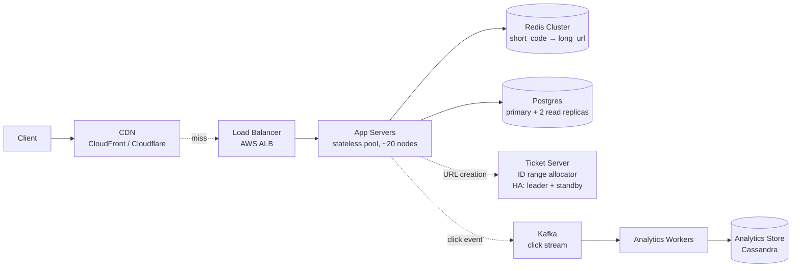
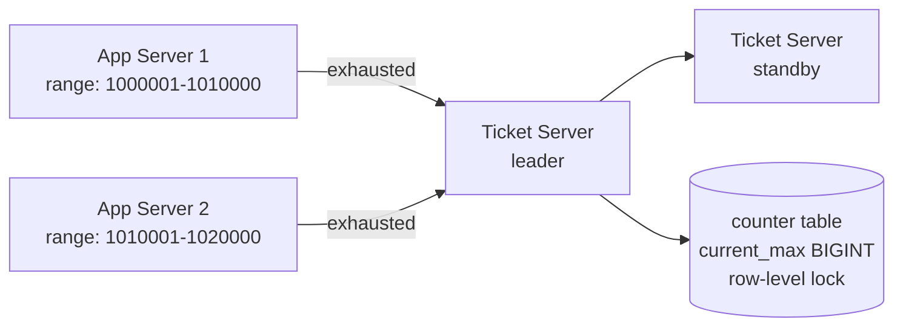
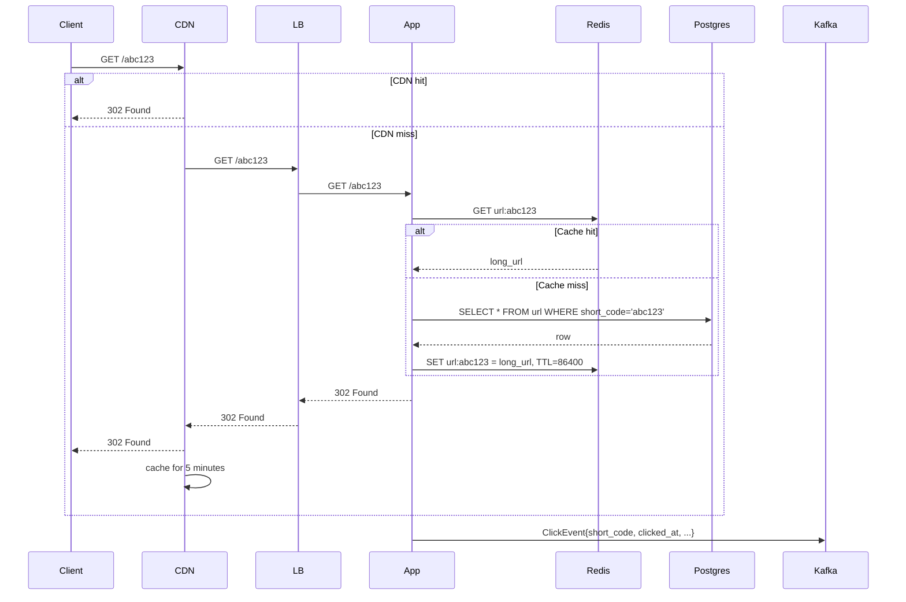

# Mini-Project — TinyURL Clone: End-to-End Design Write-Up

**Time:** ~3.5 hours over Saturday plus a 30-minute review on Sunday.
**Format:** A written design document, with Mermaid diagrams, that a hiring panel could read and form a clear opinion of your design fluency. Not a 45-minute round artefact — a longer, more careful piece of writing that demonstrates the depth a new-grad-passing candidate can produce given the time to write deliberately.
**Prerequisite:** Exercise 1 (URL shortener walkthrough) and its SOLUTIONS.md.

## Why this exists

The exercises rehearsed the 45-minute round. The homework drilled volume across the six classic problems. The mini-project is different: it asks you to produce a polished design document for the most-asked design problem (URL shortener), at the depth a new-grad candidate could carry into a senior peer's review.

The document is a portfolio artefact. It belongs on your GitHub. It belongs in the "design samples" section of a take-home submission. It is the artefact you point to when a recruiter asks "have you ever written up a system design?" It is also the rehearsal vehicle for everything the week taught: the six-phase structure, the four building blocks, the back-of-envelope estimation, the latency calibration, the trade-offs vocabulary, the diagram conventions.

The document is also the input to Sunday's peer review. If a C13 peer is doing the mini-project the same week, swap documents and review each other's. The peer-review pass takes ~30 minutes and catches the kind of gap your self-review will not.

## The brief

Design a TinyURL clone — a service that:

1. Accepts a long URL and returns a short URL.
2. Redirects from the short URL to the long URL with low latency.
3. Supports custom short codes (user-specified aliases).
4. Supports URL expiration.
5. Tracks basic click counts per short URL (the analytics surface; not a full analytics product).
6. Has an authenticated owner for each URL (the user who created it) and supports deletion by owner.

The brief is deliberately a bit larger than the Exercise 1 prompt. The exercise was the 45-minute round version; the mini-project includes the features that fall just outside the 45-minute round but inside the real-world product.

## Scale anchor

- 100M new URLs/day (writes)
- 10B redirects/day (reads, 100:1 ratio)
- 100M total active users
- Average URL has ~100 clicks total (mostly within 24 hours of creation)

## SLOs

- Redirect p99 latency: < 100ms
- URL creation p99 latency: < 500ms
- Service availability: 99.95% (~4.4 hours of downtime per year)
- Durability: no data loss for created URLs once the API has returned 201

## The document you will write

Produce a file at `mini-project/DESIGN.md` (you will create it) with these sections, in order:

### 1. Requirements and scope (~300 words)

- The functional requirements (the six features above), confirmed and elaborated.
- The non-functional requirements (latency, availability, durability), with the SLO numbers.
- The scope boundary: what is explicitly out of scope (e.g., user-facing UI, payment for premium tiers, advanced analytics).
- Any assumption you are making that was not in the brief (e.g., "I assume short codes are case-sensitive base62").

### 2. Back-of-envelope estimation (~300 words, with a table)

- DAU and write/read math: 100M writes/day → ~1,200 writes/sec average, ~5,000 peak.
- 10B reads/day → ~120K reads/sec average, ~500K peak.
- Storage per year (raw and with overhead): ~7TB raw, ~30TB with indexes/replication/backups.
- Bandwidth at peak: 500K reads/sec × ~200 bytes = ~100MB/s peak egress (without CDN); ~10MB/s peak with a 90%-hit-rate CDN.
- One latency walk (the redirect path): client → CDN → LB → app → cache → 302.

### 3. High-level architecture (~400 words, with a Mermaid diagram)

The diagram. Five to seven boxes. Each labelled. Narrate each box: what it does, what technology it is (Postgres, Redis, etc.), why.

The Mermaid block:



The narration explains each box and arrow. The diagram is the conversational anchor for the rest of the document.

### 4. API design (~500 words, with code blocks)

Every endpoint, with HTTP method, path, request body, response, and status codes. The full list:

```text
POST   /api/v1/urls
GET    /:short_code
DELETE /api/v1/urls/:short_code
GET    /api/v1/urls/:short_code/clicks
POST   /api/v1/auth/login
POST   /api/v1/auth/signup
```

Each endpoint gets a sub-section with request/response examples, status code rationale, and a note on edge cases.

### 5. Data model (~400 words, with schemas)

Every table or collection, with field names, types, indexes, and foreign keys.

```text
Url (Postgres, sharded by short_code prefix)
  id            BIGINT       PK
  short_code    VARCHAR(11)  UNIQUE INDEX
  long_url      TEXT
  user_id       BIGINT       FK -> User.id, NULLABLE
  created_at    TIMESTAMP    NOT NULL
  expires_at    TIMESTAMP    NULLABLE
  is_active     BOOLEAN      DEFAULT TRUE
  custom_alias  BOOLEAN      DEFAULT FALSE

User (Postgres)
  id            BIGINT       PK
  email         VARCHAR(255) UNIQUE
  password_hash VARCHAR(128)
  created_at    TIMESTAMP    NOT NULL

ClickEvent (Cassandra, partition by short_code, clustering by clicked_at DESC)
  short_code    VARCHAR(11)
  clicked_at    TIMESTAMP
  ip_hash       VARCHAR(64)
  user_agent    TEXT
  referrer      TEXT
```

Explain each choice. Why Postgres for Url? Why Cassandra for ClickEvent? Why a separate User table? Why is short_code the unique index rather than the primary key?

### 6. Deep dive 1 — Short-code generation (~600 words, with a Mermaid diagram)

The canonical deep dive from Exercise 1, written out in full. Three approaches (random+retry, hash+truncate, counter+base62). Trade-offs of each. Commit to counter+base62 with the ticket-server pattern. Sketch the ticket server:



Discuss: the failover behaviour, the range-exhaustion math (10K-range × 5K writes/sec = ~2 seconds to exhaust = the ticket server sees ~0.5 queries/sec per app server, well within capacity), the base62 encoding scheme.

Touch on the custom_alias case: how it coexists with the auto-generated codes (a UNIQUE constraint on short_code, with the custom alias path doing INSERT ... ON CONFLICT). The race condition when two users attempt the same alias simultaneously: handled by the database constraint, returning 409 Conflict.

### 7. Deep dive 2 — Read path and caching (~500 words, with a Mermaid sequence diagram)

The redirect path:



Discuss: cache TTL (24 hours; short URLs have low long-tail traffic), cache stampede (request coalescing on the app server if 1000 concurrent requests miss the same key), the read-through pattern, why we asynchronously push the click event to Kafka rather than blocking on it.

### 8. Trade-offs (~400 words)

At least four explicit trade-offs:

- **Postgres over DynamoDB.** Operational simplicity; the workload fits Postgres at projected scale; we will migrate if/when we outgrow it. The cost: we accept the operational overhead of running Postgres ourselves (or paying for RDS).
- **Strong consistency on short-code generation.** Ticket server with sequential ID allocation gives us guaranteed uniqueness. The cost: a single point of risk (mitigated by leader-standby HA) and a couple extra ms per range exhaustion.
- **Asynchronous analytics.** Click events go to Kafka and are processed by workers, not synchronously inserted. The cost: a small window during which click counts lag reality.
- **24-hour cache TTL.** Reduces cache memory footprint at the cost of slightly higher cache-miss rate after 24 hours. Alternative: longer TTL with explicit invalidation on URL deletion.

For each trade-off, name what you traded away and what you got.

### 9. Scale and what would change at 10x (~400 words)

10x scale = 1B URLs/day. What changes:

- **Postgres** becomes a hard limit. Shard by short_code prefix (first 2 base62 chars = 3844 shards is overkill; 62 shards is more practical). Each shard sees ~16M writes/day, well within a single node.
- **Ticket server** must allocate larger ranges (100K instead of 10K) and add more standbys.
- **Cache** scales by adding Redis nodes; consistent hashing avoids the cold-restart.
- **CDN** becomes mandatory rather than optional. The origin bandwidth is unfeasible without it.
- **Multi-region** considerations begin: replicating the URL data to a secondary region for failover, with the ticket server as the central bottleneck for write consistency.

What remains unchanged: the API, the data model (per shard), the high-level six-box architecture.

### 10. Failure modes and what was not designed for (~300 words)

Honest list of what the document does not cover:

- Multi-region durability — single-region risk remains.
- Abuse and rate limiting on URL creation — a senior design would include per-IP and per-user rate limiting at the gateway, with a separate abuse-detection pipeline.
- The case of a URL pointing to a malicious destination — link-safety scanning is a real production requirement; not in scope here.
- Custom domains (e.g., user.example.com) — out of scope.
- A staffed on-call rotation, runbooks, incident response — operational concerns deferred.

Each item with one sentence of "the senior version would handle this by..."

### 11. What the senior bar would add (~200 words)

The single paragraph that signals calibration. The senior design would include:

- Capacity-planning numbers for every component (compute pool size, cache memory, network bandwidth).
- An SLO and error budget per service, with alerting thresholds.
- Multi-region active-active with the ticket server as the consistency point.
- A graceful-degradation mode when Postgres is slow (serve from cache only, return 503 for cache misses).
- Click-stream analytics with cardinality estimates (HyperLogLog) for unique-visitor counts.
- A planned migration path from the single-tenant Postgres to a sharded setup, with a feature flag and dual-write logic.

### 12. Appendix — Glossary (~150 words)

Brief definitions of terms used in the document: base62, ticket server, cache stampede, fan-out, geohash, consistent hashing. The glossary is for the reader (or future-you) who returns to the document and needs a refresher.

## Total length target

~3,500-4,500 words. Around 8-12 pages when rendered.

If your draft is under 2,500 words, you have under-engaged with one or more sections. If it is over 6,000, you have over-engaged and probably gone above the new-grad bar. Aim for the middle.

## Diagrams

Use Mermaid for every diagram. There should be at least three diagrams in the final document:

1. The high-level architecture (Section 3).
2. The ticket-server deep dive (Section 6).
3. The redirect sequence diagram (Section 7).

Optionally, a fourth diagram in Section 9 (showing the sharded Postgres at 10x scale).

Test every Mermaid block in the live editor (<https://mermaid.live>) before committing. A broken Mermaid block is a small but real signal that you did not check your work.

## Sunday peer review

If you have a C13 peer doing the mini-project the same week, swap documents. The peer's review takes ~30 minutes and produces:

- A self-score on the rubric (your peer scores you on each of the seven dimensions).
- Three specific call-outs of the strongest parts of the document.
- Three specific gaps or weaknesses.
- One single recommendation for what to fix before treating the document as portfolio-ready.

If no peer is available, do a solo review on Sunday with at least 24 hours between the writing and the review. The gap lets fresh eyes catch what the tired eyes missed on Saturday.

## Acceptance criteria

- `DESIGN.md` produced with all 12 sections.
- At least 3 Mermaid diagrams (rendered correctly in the live editor).
- 3,500-4,500 words.
- The rubric self-score (or peer-score) attached at the end of the document, or in a separate `REVIEW.md` in the same folder.
- One identified gap, with a one-line plan to close it.

## What this artefact is for

After Sunday:

- **In your portfolio.** Push to GitHub as a standalone repo or as part of a "design samples" folder in your main portfolio repo. The artefact demonstrates fluency that no LeetCode score can.
- **As take-home reference.** If a company asks for a system-design take-home, you have a template and a voice already established.
- **As round preparation.** The morning of any future onsite with a design round, re-read your own DESIGN.md. The voice and the structure prime the round; the act of having produced the document means the structure is in your head when the round starts.

This is the deliverable of Week 8. The exercises and homework are the volume; the mini-project is the polished artefact.
