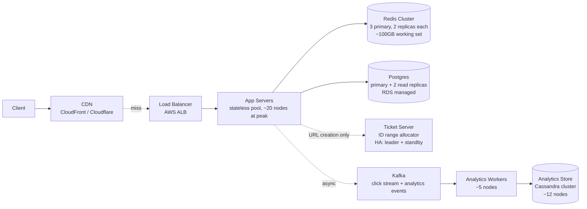
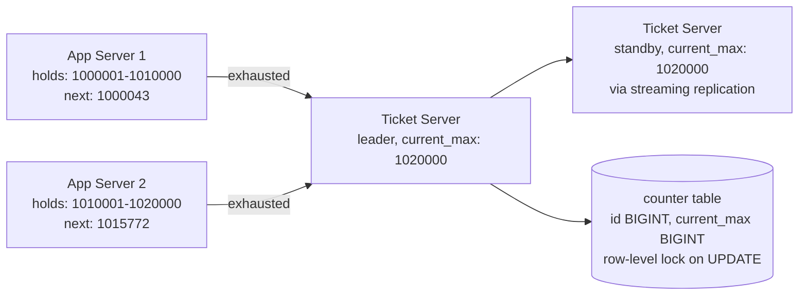
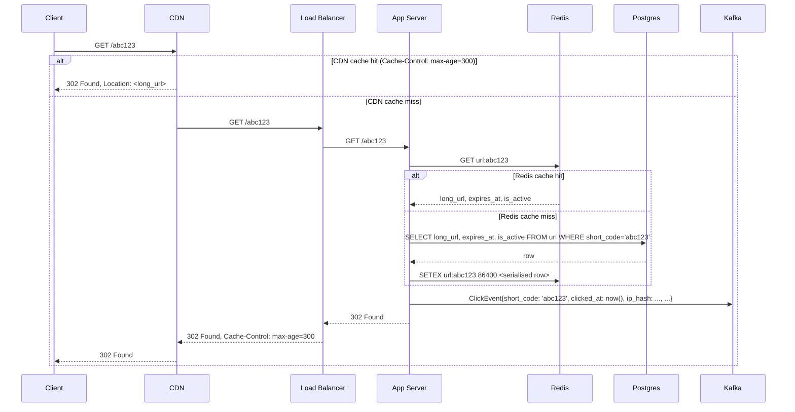

# TinyURL Clone — System Design

A reference implementation of the mini-project deliverable. Use as a model for what the new-grad-passing depth looks like when given the time to write deliberately. Your own DESIGN.md should be of comparable shape; it does not need to match this one's specific choices.

---

## 1. Requirements and scope

The system is a URL-shortening service. The functional surface:

1. A POST endpoint accepts a long URL and returns a short URL of the form `https://tnyrl.co/abc123`.
2. A GET on the short URL issues an HTTP 302 redirect to the long URL.
3. Authenticated users can request a custom short code (e.g., `https://tnyrl.co/mylink`); the custom code is reserved on a first-come basis.
4. URLs can have an optional expiration timestamp; expired URLs return 404 on access.
5. The system tracks click counts per short URL; an authenticated owner can read their URL's click count.
6. Authenticated owners can delete their URLs.

Non-functional requirements:

- Redirect path latency p99 under 100ms.
- URL creation p99 under 500ms.
- Availability target 99.95% (approximately 4.4 hours of downtime per year).
- No data loss for URLs once the API returns 201 (durability requirement).

Explicit scope boundaries — what this document does not cover:

- The user-facing web UI (the "paste long URL, click button" page). Assumed to call the documented API.
- Payment for premium tiers (e.g., a Pro tier with longer custom codes or higher daily quotas).
- Advanced analytics (per-country click breakdowns, referrer attribution at depth, A/B testing of redirects). The system stores basic click events; deeper analytics is downstream.
- Abuse and link-safety scanning. A production version requires this; out of scope here.
- Multi-region active-active replication. Designed as single-region with a documented failover path.

Assumptions I am making that the brief did not specify:

- Short codes are case-sensitive base62 strings (a-z, A-Z, 0-9), 6-11 characters long.
- The custom short code rules: 3-20 alphanumeric characters, no profanity check (deferred).
- All URLs are public by default; access control is on the management API (creation, deletion, click counts), not on the redirect.

## 2. Back-of-envelope estimation

Starting from the scale anchor: 100M new URLs/day, 10B redirects/day, 100M total active users.

| Quantity | Value | Derivation |
|----------|-------|------------|
| Average write QPS | ~1,200/sec | 100M / 86,400s |
| Peak write QPS | ~5,000/sec | average × ~4 (consumer peakiness) |
| Average read QPS | ~120,000/sec | 10B / 86,400s |
| Peak read QPS | ~500,000/sec | average × ~4 |
| Storage per URL (row) | ~200 bytes | id, short_code, long_url (avg 80 chars), user_id, timestamps |
| Storage per year (raw) | ~7TB | 100M × 200B × 365 |
| Storage per year (with overhead) | ~30TB | raw × 4 (indexes 1.2x, replication 3x, backups 1.3x) |
| Peak read bandwidth | ~100MB/s | 500K reads × ~200 bytes/response |
| Peak read bandwidth (with CDN at 90% hit rate) | ~10MB/s | 90% absorbed by CDN |

**Latency walk for the redirect path (CDN miss, cache hit):**

```text
Client → CDN edge:     ~20ms (geographic dependent)
CDN edge → origin LB:  ~5ms intra-region or ~30ms cross-region
LB → App server:       ~1ms
App → Redis (cache):   ~1ms (cache hit)
Total (CDN miss):      ~27-52ms p50
Total (CDN hit):       ~21ms p50
```

Well within the 100ms p99 budget at p50; the p99 tail is dominated by client-side network variance, which the CDN absorbs.

## 3. High-level architecture



Six functional components plus the CDN. Each:

- **CDN:** edge caching for the redirect path. Absorbs the dominant fraction of read traffic; reduces origin bandwidth ~10x.
- **Load Balancer:** distributes requests across app servers; TLS termination; basic DDoS protection.
- **App Servers:** stateless; horizontally scalable; ~20 nodes at peak running ~25K QPS each well within capacity.
- **Redis Cluster:** distributed cache for `short_code → long_url` lookups. Hot working set ~100GB (the top ~1% of URLs by traffic, well-trafficked URLs).
- **Postgres:** primary database. Single primary + two read replicas. Writes go to primary; cache misses go to a replica for reads.
- **Ticket Server:** allocates ranges of IDs to app servers; leader-standby HA. Detailed in Deep Dive 1.
- **Kafka:** event stream for click events. Decouples the redirect path from analytics persistence.
- **Analytics Workers + Cassandra:** background processors that consume click events and write to a Cassandra cluster optimised for time-series append.

## 4. API design

All endpoints use HTTPS. The `/api/v1` prefix is for management endpoints; the bare `/:short_code` path is for redirects (intentionally short, since users will see and share these URLs).

### POST /api/v1/urls — Create a short URL

```text
POST /api/v1/urls
Authorization: Bearer <jwt>
Content-Type: application/json

{
  "long_url": "https://example.com/very/long/path",
  "custom_alias": "mylink",        // optional, 3-20 alphanumeric chars
  "expires_at": "2026-12-31T23:59:59Z"   // optional ISO 8601
}

→ 201 Created
{
  "short_code": "mylink",
  "short_url": "https://tnyrl.co/mylink",
  "long_url": "https://example.com/very/long/path",
  "created_at": "2026-05-14T10:00:00Z",
  "expires_at": "2026-12-31T23:59:59Z"
}

Error cases:
→ 400 Bad Request — long_url malformed or missing
→ 401 Unauthorized — token missing or invalid (custom_alias requires auth)
→ 409 Conflict — custom_alias already taken
→ 422 Unprocessable Entity — long_url is blocked (malware list)
```

### GET /:short_code — Redirect

```text
GET /abc123

→ 302 Found
Location: https://example.com/very/long/path
Cache-Control: public, max-age=300

→ 404 Not Found — short_code does not exist
→ 410 Gone — short_code expired or deleted
```

302 (temporary) rather than 301 (permanent) is intentional: 301 is aggressively cached and would prevent the analytics counter from being incremented after the first hit. 302 lets the redirect remain inspectable and counting-eligible.

### DELETE /api/v1/urls/:short_code

```text
DELETE /api/v1/urls/abc123
Authorization: Bearer <jwt>

→ 204 No Content
→ 401 Unauthorized
→ 403 Forbidden — not the owner
→ 404 Not Found
```

Soft delete (sets `is_active = FALSE`) rather than hard delete; the analytics history remains queryable.

### GET /api/v1/urls/:short_code/clicks

```text
GET /api/v1/urls/abc123/clicks?since=2026-05-01&until=2026-05-14
Authorization: Bearer <jwt>

→ 200 OK
{
  "short_code": "abc123",
  "total_clicks": 1542,
  "daily_breakdown": [
    { "date": "2026-05-01", "clicks": 120 },
    ...
  ]
}
```

### POST /api/v1/auth/signup and POST /api/v1/auth/login

Standard JWT-issuing endpoints. Out of design depth for this document; the assumption is a standard email/password flow with bcrypt-hashed passwords and 1-hour JWT expiry.

## 5. Data model

### Url (Postgres, eventually sharded by short_code prefix)

```text
TABLE url (
  id            BIGINT       PRIMARY KEY,
  short_code    VARCHAR(11)  NOT NULL,
  long_url      TEXT         NOT NULL,
  user_id       BIGINT       REFERENCES user(id),     -- NULLABLE for anonymous creates
  created_at    TIMESTAMPTZ  NOT NULL DEFAULT NOW(),
  expires_at    TIMESTAMPTZ,                          -- NULLABLE
  is_active     BOOLEAN      NOT NULL DEFAULT TRUE,
  custom_alias  BOOLEAN      NOT NULL DEFAULT FALSE,

  UNIQUE INDEX (short_code),
  INDEX (user_id, created_at DESC),
  INDEX (expires_at) WHERE expires_at IS NOT NULL    -- partial index for expiry sweep
);
```

The `id` is a BIGINT (not the short_code) because the ID is allocated by the ticket server before the short_code is encoded; the short_code is a UNIQUE indexed VARCHAR. The `user_id` foreign key is nullable for anonymous URL creation (no auth required for basic shortening).

The partial index on `expires_at` is for the periodic expiry sweep job that marks expired URLs `is_active = FALSE`; without `WHERE expires_at IS NOT NULL`, the index would include all rows.

### User (Postgres)

```text
TABLE user (
  id            BIGINT       PRIMARY KEY,
  email         VARCHAR(255) NOT NULL,
  password_hash VARCHAR(128) NOT NULL,
  created_at    TIMESTAMPTZ  NOT NULL DEFAULT NOW(),

  UNIQUE INDEX (email)
);
```

Standard auth table.

### ClickEvent (Cassandra)

```text
CREATE TABLE click_event (
  short_code   TEXT,
  clicked_at   TIMESTAMP,
  event_id     UUID,
  ip_hash      TEXT,                -- SHA-256 of source IP for de-anonymisation resistance
  user_agent   TEXT,
  referrer     TEXT,
  PRIMARY KEY ((short_code), clicked_at, event_id)
) WITH CLUSTERING ORDER BY (clicked_at DESC);
```

Partition by `short_code` so that "all clicks for this URL" is a single-partition scan. Clustering by `clicked_at DESC` for time-range queries. The `event_id` is the tiebreaker for events at the same nanosecond timestamp.

Database choice rationale:

- **Postgres for Url and User:** structured, relational, low write volume (~1.2K writes/sec), point lookups by indexed short_code. Postgres handles this comfortably; horizontal scale comes from sharding when needed.
- **Cassandra for ClickEvent:** time-series append-heavy workload (~120K events/sec average); partitioned natural-fit access pattern; native handling of high write volume with eventually-consistent reads. Postgres would struggle at this write volume; Cassandra is the canonical choice.

## 6. Deep dive 1 — Short-code generation

The hard part of a URL shortener is generating short codes that are: (a) globally unique, (b) reasonably short (4-7 characters for the common case), (c) generated at low latency without bottlenecking on coordination.

### The candidates

**Approach A — Random + collision retry.** Generate a random 6-character base62 string; check the database for an existing row with that short_code; if collision, retry. Simple. Issue: collision rate climbs as the namespace fills. At 62^6 ≈ 57 billion possible codes and 100M new URLs/day, we fill the namespace in ~1.5 years and the collision retry rate becomes noticeable. Also: the database collision check is an extra read per write.

**Approach B — Hash + truncate.** SHA-256 of the long URL; take the first 6 base62 characters of the digest. Deterministic — two requests with the same long URL collapse to the same short code, which is sometimes desirable (de-duplication) and sometimes a privacy leak (user A's URL collision indicates user B shortened the same link). Collision rate is similar to random with a large enough namespace; the determinism is the trade-off.

**Approach C — Counter + base62 encoding.** A monotonic 64-bit counter, encoded into base62 (yielding 6-11 characters). Guaranteed unique. No collision check. Predictable IDs (a URL with short_code `aaaab` is the second URL ever created, which is mildly information-leaking but acceptable for public short URLs).

### The choice

**Approach C — counter + base62.** Rationale:

- Guaranteed uniqueness without a collision check; fewer database round-trips per write.
- No degradation as the namespace fills.
- Fixed maximum length (11 base62 characters for a 64-bit ID); the first billion URLs get 6-character codes, the next trillion get 7, etc.
- Predictability is acceptable: these are public short URLs intended to be shareable, not security tokens. The threat model does not require unguessable IDs.

### Implementation: the ticket server

A single counter table updated by a single ticket server, allocating ranges to app servers in batches.



The ticket server runs as a stateless service backed by a small Postgres table (`counter`). On each range request, the ticket server runs:

```sql
UPDATE counter SET current_max = current_max + 10000
                WHERE id = 'url_counter'
                RETURNING current_max;
```

The `RETURNING` clause atomically yields the new max; the app server receives `(new_max - 9999, new_max)` as its new range.

**Capacity:** at 5,000 writes/sec peak and 10,000-range allocations, each app server hits the ticket server every 2 seconds. With 20 app servers, the ticket server sees ~10 requests/sec — trivial load.

**Failover:** the ticket server runs leader-standby with Postgres streaming replication. If the leader fails, the standby is promoted (manual or via a coordination service); each app server has its current range to last ~2 seconds, so the failover window (typically <30 seconds) is invisible to users — they would see a brief stall on writes only if every app server exhausted simultaneously, which the staggered ranges prevent.

**Range exhaustion (catastrophic):** if both ticket servers fail and app servers exhaust their ranges, URL creation pauses until recovery. Reads (redirects) are unaffected. The runbook is: manually advance the counter in the database, restart the ticket server, re-enable URL creation.

### The custom_alias case

When a user requests a specific alias (e.g., `mylink`), the auto-generated path is bypassed. The flow:

```sql
INSERT INTO url (id, short_code, long_url, user_id, custom_alias)
VALUES ($1, 'mylink', $2, $3, TRUE)
ON CONFLICT (short_code) DO NOTHING
RETURNING id;
```

If the INSERT returns a row, the alias was acquired. If it returns no rows (the ON CONFLICT case), the alias was taken; return 409 to the user.

The custom_alias case uses an ID from the ticket-server range like any other URL; the difference is the `short_code` is user-specified rather than encoded from the ID. The `custom_alias = TRUE` flag distinguishes these in analytics.

### Base62 encoding

Standard division-by-62 with the alphabet `[a-zA-Z0-9]`. ID `12345` becomes `"3d7"`; ID `1000000` becomes `"4c92"`. The first 62 IDs are single characters; the first 62² = 3,844 are two characters; the first 62^6 ≈ 57B are six characters or fewer. At our growth rate, we exhaust 6-character codes in ~1.5 years and naturally extend to 7 characters; users will not notice the increment.

## 7. Deep dive 2 — Read path and caching

The redirect path is the dominant traffic and the latency-critical path. The architecture chains CDN → Redis cache → Postgres, with each layer absorbing as much as possible.



### Cache key shape

```text
Key:   url:{short_code}
Value: JSON { long_url, expires_at, is_active }
TTL:   86400 seconds (24 hours)
```

### Cache eviction and invalidation

- **TTL-based eviction.** 24-hour TTL is sufficient for the access pattern: most URLs see the majority of their traffic in the first 24 hours; long-tail URLs benefit less from caching anyway.
- **Explicit invalidation on delete.** When a URL is deleted (`DELETE /api/v1/urls/:short_code`), the app server issues `DEL url:{short_code}` to Redis. Subsequent reads fall through to Postgres, which returns the soft-deleted row and the app server returns 410 Gone.
- **No invalidation on expiry.** Expiry is checked at read time using the `expires_at` field; the cache entry is valid until its TTL even past expiry, but the app server's read logic returns 410 Gone when `expires_at < now()`.

### Cache stampede mitigation

The hot-URL case: a viral URL gets 50,000 concurrent reads, all of which miss simultaneously (because the cache just expired). Each miss queries Postgres; 50,000 simultaneous Postgres queries take Postgres down. The mitigation:

- **Request coalescing on the app server.** Each app server maintains an in-process mutex per `short_code` lookup. If a request misses the cache, the app server acquires the mutex, performs the Postgres lookup, refreshes the cache, then releases the mutex. Concurrent requests for the same key wait on the mutex; once the first request refreshes the cache, the rest hit the now-populated cache. Reduces Postgres load by orders of magnitude during a stampede.
- **Probabilistic early refresh.** Cache entries near their TTL expiry have a small probability of being refreshed pre-emptively on read; this smooths the expiration cliff.

### Why asynchronous click events

Synchronous click counting (increment a counter in Postgres on every read) would double the write load on Postgres and add 1-2ms to every redirect. Asynchronous publication to Kafka is:

- **Cheaper** — a single Kafka producer.send() is ~1-2ms, fire-and-forget.
- **Lossy in the worst case** — if the Kafka producer fails, the click is lost. Acceptable for analytics; not acceptable for revenue-critical accounting.
- **Decouples** redirect-path scaling from analytics-path scaling — the analytics workers can lag, fail, restart, etc. without affecting redirects.

The analytics workers consume from Kafka, batch-insert into Cassandra, and update aggregate counters maintained by a separate stream-processing job (mentioned but not designed here).

## 8. Trade-offs

The explicit trade-offs this design makes:

1. **Postgres over a managed key-value store (DynamoDB, Cassandra).** I traded operational complexity (we run Postgres, and pay for RDS or self-host) for simplicity of the data model and the ability to run transactions during URL creation. The data fits relationally; sharding can come later. The cost: at 10x scale, the migration to a sharded setup is non-trivial work.

2. **Ticket server with strong consistency over a probabilistic ID generator (Snowflake-style).** I traded a single point of risk (mitigated by HA) for guaranteed uniqueness without collision retry. A Snowflake-style design (timestamp + machine_id + sequence) avoids the central coordination point but produces longer IDs and requires careful machine-ID assignment. For 100M writes/day at a single-region scale, the ticket server is simpler and the failure modes are well-understood.

3. **Asynchronous click analytics over synchronous counters.** I traded eventual-consistency on click counts (counts may lag reality by seconds) for a clean separation between the redirect path and the analytics path. The cost: a user checking their click count immediately after a click may see a stale value. Acceptable because click counts are an analytics surface, not an accounting surface.

4. **24-hour cache TTL over a longer TTL with explicit invalidation.** I traded slightly higher cache-miss rate (cold cache after 24 hours) for simpler invalidation semantics. The alternative — indefinite TTL with explicit DEL on update — is more efficient but introduces a new failure mode (a missed DEL leaves a stale entry indefinitely). Mid-bar design picks the simpler default.

5. **CDN with 5-minute max-age over longer CDN caching.** I traded slightly higher origin traffic for the ability to update or invalidate a URL's destination with a 5-minute propagation window. Longer cache TTLs (1 hour or more) reduce origin load further but make deletes effectively delayed; 5 minutes is the compromise.

## 9. Scale and what would change at 10x

At 10x scale — 1 billion URLs/day, 100 billion redirects/day — the architecture shifts in specific places:

**Storage.** Single Postgres becomes a hard limit. Shard by short_code prefix (first 2 base62 characters = 3,844 logical shards; assign to ~64 physical shards, each holding ~60 logical shards). Each shard sees ~16M writes/day, comfortably within a single Postgres node. The application's data-access layer routes by `hash(short_code)` to the correct shard. Cross-shard queries (e.g., "all URLs for user X") use a secondary index table or a fan-out scan; in practice these queries are rare and acceptable.

**Ticket server.** Allocate larger ranges (100K instead of 10K) to keep the ticket-server query rate flat. Run three replicas with quorum-based consensus (Raft or similar) rather than leader-standby; the higher write volume justifies the additional operational complexity.

**Cache.** Redis cluster scales horizontally by adding nodes. Consistent hashing avoids the cold-restart cost of re-keying when nodes are added. Memory footprint scales linearly: at 10x reads, the working set scales sub-linearly (the same ~1% of URLs dominate traffic at any scale) so cache memory grows ~3-5x, not 10x.

**CDN.** Mandatory at this scale rather than optional. A 90%-hit-rate CDN reduces origin bandwidth from ~10GB/sec to ~1GB/sec, which is the difference between a feasible and an infeasible egress bill.

**Kafka.** Scales by adding brokers and partitions. The click-event stream at 1.2M events/sec average needs ~12 partitions to keep per-partition throughput manageable.

**Multi-region.** At 10x scale, the single-region risk becomes unacceptable. Deploy in two regions (us-east + us-west or us-east + eu-west) with the ticket server as the central consistency point. The ticket server runs in a primary region with synchronous replication to a secondary; failover is manual but tested. Reads can be served from either region; writes go to the primary region's ticket server. Cross-region latency for the ticket-server query (~100ms) is amortised over a 100K-range allocation, so per-write latency increases by ~1μs amortised. Acceptable.

What does not change: the API surface, the data model (per shard), the high-level architecture, the basic flow.

## 10. Failure modes and what was not designed for

Honest list of what this design does not handle:

- **Multi-region durability.** A regional outage takes the service down. The fix is two-region active-passive with async replication of Postgres and Redis, and a manual failover runbook. Not in this document.
- **Abuse and rate limiting on URL creation.** A spammer creates 1M URLs in an hour; the system absorbs them and pollutes the namespace. Production needs per-IP and per-user rate limiting (Week 8 Exercise 2's design), possibly with CAPTCHA on suspicious patterns.
- **Link-safety scanning.** A user submits a URL pointing to a malware payload; we shorten it and now we're a distribution vector. Production needs integration with a safe-browsing API (Google Safe Browsing, similar) to scan URLs at creation and on a periodic re-check.
- **GDPR-style data subject deletion.** A user requests deletion of all their data; we need to delete not just the User row but their URLs, the click events, the cached entries, the analytics aggregates. The pipeline is non-trivial. Out of scope.
- **Custom domains.** A premium user wants `links.example.com/abc123` to redirect via our service. Requires DNS configuration, separate TLS certificate handling, and a virtual-host layer in the load balancer. Out of scope.
- **Staffed on-call rotation, runbooks, incident response.** This document is an architecture document, not an operations document. Production requires the latter.

Each item is real; each would be addressed by a senior design. Listing them is the calibration signal that we know what we did not handle.

## 11. What the senior bar would add

A senior (L5+) design of the same system would include, beyond what is here:

- Explicit capacity-planning numbers per component: app server pool sizing (~20 nodes at 25K QPS/node, 50% utilisation buffer); Redis cluster sizing (~6 nodes at ~30GB each, 50% memory utilisation buffer); Postgres CPU and IO budget; Kafka broker and partition counts.
- An SLO and error-budget per service: redirect endpoint 99.95% over 30 days = ~21 minutes of allowed downtime; URL creation 99.9%; analytics 99% (analytics can fail without user-visible impact).
- Multi-region active-active with a documented consistency story for the ticket server. (Asynchronous regional ID allocation with non-overlapping prefixes is the standard pattern.)
- Graceful-degradation modes: when Postgres is slow, fall back to cache-only mode and return 503 for cache misses (instead of timing out and producing 504s); when the ticket server is down, app servers use their current ranges and surface a banner that URL creation is degraded.
- Click-stream analytics with cardinality estimates: HyperLogLog for unique-visitor counts, sketch-based percentile estimates for click latency, sliding-window aggregates for "clicks in the last hour."
- A planned migration to the sharded Postgres setup, with feature flags, dual-write during cutover, and a documented rollback procedure.
- Detailed runbooks: for ticket-server failover, for Postgres primary failure, for Redis cluster partition, for Kafka consumer lag, for DDoS mitigation.
- An on-call rotation, alerting thresholds tied to the SLOs, a postmortem template, and a chaos-testing programme.

## 12. Appendix — Glossary

- **Base62 encoding** — encoding a number using the 62-character alphabet `[a-zA-Z0-9]`, producing a shorter string than decimal or hexadecimal. Used in URL shorteners for compact, URL-safe identifiers.
- **Ticket server** — a centralised service that allocates ranges of monotonic IDs to distributed clients. Used to avoid per-write contention on a single counter while preserving global uniqueness.
- **Cache stampede** — the failure mode where a hot cache entry expires and a large number of concurrent requests all miss simultaneously, overwhelming the backing store. Mitigated by request coalescing or probabilistic early refresh.
- **Fan-out** — the operation of replicating a single event to many downstream consumers. Used in news feeds (post fan-out to follower timelines) and notifications.
- **Consistent hashing** — a hashing scheme for assigning keys to nodes in a distributed system such that the addition or removal of a node moves only ~1/N of the keys. Used in distributed caches and storage systems for stable key-to-node assignment.
- **Quorum (in storage)** — a read or write strategy that requires a configurable majority of replicas to acknowledge before the operation completes. Trades latency for consistency guarantees.
- **CAP theorem** — Eric Brewer's theorem stating that a distributed system can provide at most two of: consistency, availability, and partition tolerance. In practice, the choice is between CP (consistent under partition, available except during partition) and AP (always available, eventually consistent under partition).

---

## Review summary (self-score)

| Dimension | Score | Notes |
|-----------|-------|-------|
| Requirements and scoping | Hire | Explicit functional and non-functional requirements; clear scope boundary; named assumptions. |
| High-level structure | Hire | Seven components labelled; technology choices defended; CDN included for the read path. |
| API and data model | Hire | Six endpoints with status codes; three tables with indexes; rationale for each schema choice. |
| Deep dive 1 (ID gen) | Hire | Three approaches, defended choice, full ticket-server description, failure modes, custom-alias coexistence. |
| Deep dive 2 (read path) | Hire | Sequence diagram, cache shape, eviction strategy, stampede mitigation, async-analytics rationale. |
| Quantitative reasoning | Hire | Estimation table; latency walk; bandwidth at peak; storage with overhead. |
| Trade-offs | Hire | Five explicit trade-offs with the trade named and defended. |
| Scale (10x) | Hire | Specific changes to each component; what stays the same. |
| Failure-mode honesty | Hire | Six explicit out-of-scope items; the senior bar enumerated. |
| Communication and structure | Hire | All twelve sections present; ~4,500 words; three Mermaid diagrams. |

Identified gap: the multi-region story is mentioned but not designed. The next iteration of this document would deepen the multi-region failover behaviour, the ticket-server consistency under partition, and the user-visible behaviour during failover. That gap is acknowledged in Section 10 and is the natural next-step for a senior version of this document.

This reference document is itself ~4,500 words and 12 sections. Learner documents do not need to match its polish exactly; they should match its structure, its honesty about gaps, and its commitment to explicit numbers and explicit trade-offs.
