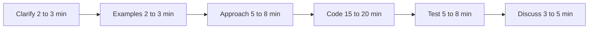

# Lecture 1 — The 45-Minute Structure: Six Phases, One Clock

> *The live coding round is not a coding round. It is a 45-minute structured performance in which coding is the medium and the actual evaluated artifact is your method. The interviewer is scoring two things in parallel: did the code, when it finally compiled and ran, do the right thing — and, more importantly, did the method that produced the code resemble the method of a person they would want to ship code next to on a Monday morning. The second axis dominates the scoring. A candidate who arrived at the wrong answer with a clean method usually scores better than a candidate who arrived at the right answer with a panicked, silent, jagged method. Week 9 is the systematic correction of the second axis.*

## The six phases

Every well-run live coding round walks through six phases, in order. Skipping a phase, getting stuck in a phase, or letting one phase eat another phase's budget is the most common single failure mode. The phases and their rough time budgets:

| Phase    | Duration   | What you do                                                              |
|----------|-----------:|--------------------------------------------------------------------------|
| Clarify  |   2-3 min  | Restate the problem, ask the clarifying questions, confirm constraints   |
| Examples |   2-3 min  | Walk through 2-3 concrete inputs and the expected outputs                |
| Approach |   5-8 min  | Talk through the algorithm before writing any code; surface trade-offs   |
| Code     | 15-20 min  | Write the code; narrate as you write; do not vanish into silence         |
| Test     |   5-8 min  | Walk the test inputs through the code line-by-line; find and fix bugs    |
| Discuss  |   3-5 min  | Talk through trade-offs, scaling, what you would do differently          |

The total is 32-47 minutes — close to but not exactly the 45-minute round length. The slack is intentional: the round occasionally starts late, the interviewer occasionally asks a follow-up that absorbs five minutes, the "any questions for me?" wrap occasionally lasts longer than expected. Plan for 40 minutes; the extra five is a buffer, not a phase.


*The six phases of the round, each with its budgeted minutes.*

### Why the structure exists

The structure is not arbitrary. Each phase removes a specific category of risk:

- **Clarify** removes the risk of solving the wrong problem. The single most-painful failure mode in any interview is the one where the candidate spent 35 minutes producing a correct solution to a problem that was not the one the interviewer asked. The clarify phase, done well, makes this failure mode impossible.
- **Examples** removes the risk of misunderstanding the problem at the input-output level. Even when the problem statement was understood, the candidate often holds a subtly wrong mental model of the expected output. Walking through two concrete examples surfaces this mismatch before it gets encoded into the algorithm.
- **Approach** removes the risk of starting to code with the wrong algorithm. The most-expensive correction in a 45-minute round is the "I have written 30 lines and just realised my approach does not work" moment at minute 25. The approach phase, done well, catches the wrong approach at minute 8, when the cost of switching is 3 minutes of talking, not 12 minutes of deleting code.
- **Code** is where the artifact gets produced. The narration-during-coding muscle from Week 6 carries this phase; the only Week-9-specific addition is the phase-boundary discipline (do not start coding until the approach is confirmed, do not start testing until the code compiles).
- **Test** removes the risk of shipping silently-broken code. The candidate who codes, says "okay I think it works," and stops is shipping the round on faith. The candidate who walks two concrete test inputs through the code line-by-line is shipping the round on evidence.
- **Discuss** is where the senior signal gets surfaced. A new-grad-passing round can be light on this phase; an L4-passing round usually requires it. The trade-off conversation in the last 5 minutes is the highest-leverage signal-per-minute window of the entire round.

Each phase is the cheapest correction-window for a specific class of bug. Skipping a phase moves the correction-window later, when the correction is more expensive — sometimes too expensive for the round to recover from.

## The transitions out loud

The phase structure is invisible to the interviewer unless you say it. The single most-common Week-6 mistake — the silent transition — is also the single most-common Week-9 mistake. The candidate moves from clarify into examples, from examples into approach, from approach into code, with no verbal marker, and the interviewer cannot tell whether the candidate is still thinking about the problem statement or has already moved on to the algorithm.

The transition phrases are short and conventional. Use yours; rehearse one set; do not improvise the language in the round.

| Transition           | What you say                                                                              |
|----------------------|-------------------------------------------------------------------------------------------|
| Clarify  → Examples  | "Okay, let me walk through a couple of examples to make sure I have the right shape."     |
| Examples → Approach  | "Good — I think I understand the problem. Let me think out loud about the approach."      |
| Approach → Code      | "Okay, I think this approach works. Let me start coding it up — I will narrate as I go."  |
| Code     → Test      | "I think that is the implementation. Let me walk through a test case line by line."       |
| Test     → Discuss   | "Great — the test case passes. Let me talk about trade-offs and what I would do next."    |

Each transition does two jobs. It tells the interviewer where you are in the round, which lets them calibrate whether you are on pace. And it tells *you* where you are in the round, which prevents the most-common loss-of-time-awareness failure mode.

If you say "let me walk through an example" at minute 4 and you are still walking through examples at minute 12, the language itself becomes the alarm clock. The candidate who never verbalised the phase boundary has no alarm clock; the minutes leak out.

## The clarify phase, in detail

The first 2-3 minutes of the round are the highest-leverage minutes of the entire round. The interviewer has just read or stated the problem. The candidate's first move sets the tempo for the whole conversation.

The pattern that works:

1. **Restate the problem in your own words.** Not verbatim. The restatement proves you understood, and the act of restating surfaces any subtle misunderstanding.
2. **Identify the inputs.** What is the type? What is the range? Can it be empty? Can it have duplicates? Can it have negatives? Can it be very large?
3. **Identify the output.** What is the return type? Are we returning the result, or modifying in place? If returning a collection, in what order?
4. **Identify the constraints.** Is there a time complexity requirement? A space complexity requirement? Are we allowed to modify the input? Can we use extra data structures?
5. **Surface ambiguity.** If there is anything that could be interpreted two ways, ask. "When you say 'find the shortest path,' do you mean shortest by number of edges or shortest by total weight?" The interviewer will pick one; you will not have to guess.

The discipline is to ask these questions even when you "know" the answer. If you immediately recognise the problem as Two Sum and you "know" the inputs are an integer array — *ask anyway*. The interviewer's variant might have negatives, might have duplicates, might not be sorted, might be very large. The 30 seconds you spend confirming costs you nothing; the wrong assumption costs you the round.

### Sample clarify phase (Two Sum variant)

Interviewer: *Given an array of integers and a target, return the indices of the two numbers that add up to the target.*

Candidate: "Okay, let me make sure I understand. The input is an array of integers, and a target integer. I need to return the indices of two numbers in the array whose sum equals the target. A few questions: can the array be empty, or contain a single element? Can it contain duplicates? Can the integers be negative? And — is there guaranteed to be exactly one answer, or could there be zero answers or multiple answers? Also: am I returning the indices in any particular order, or as a pair, or as a list?"

Interviewer: *The array has at least two elements. Duplicates are allowed. Integers can be negative. There is exactly one answer. Return the two indices as a list, smaller index first.*

Candidate: "Got it. So the API is `def two_sum(nums: list[int], target: int) -> list[int]:`, and the return is a two-element list with the smaller index first. Let me walk through a couple of examples to confirm I have the shape right."

Total time: ~90 seconds. Five clarifying questions, all answered, all resolved. The candidate has confirmed the function signature, the input contract, the output contract, and the uniqueness assumption. The next phase can start cleanly.

## The examples phase, in detail

The examples phase is the cheapest bug-catcher in the round. Walking through 2-3 concrete input-output pairs surfaces two classes of misunderstanding: the wrong-output-shape misunderstanding (you thought the answer was the value, the interviewer wanted the index) and the edge-case misunderstanding (you assumed the array was non-empty, the interviewer specified the empty array returns null).

The pattern:

1. **Happy path.** A "normal" input that exercises the main logic.
2. **Edge case.** Empty, single-element, all-the-same, all-negative, very large — whichever edges apply to the problem.
3. **Failure-mode input** (optional but high-leverage). An input that breaks the naive approach. For Two Sum, a sorted array with the answer at the two ends (the brute-force is fast on this; the hash-map approach is the same speed; this is where the candidate gets to surface the "I'm using a hash map" choice).

If the interviewer interjects with their own example, follow their example, not yours. The interviewer-provided example is usually the one they want to see exercised; following it earns the signal directly.

### Sample examples phase (Two Sum continuing)

Candidate: "Let me try `nums = [2, 7, 11, 15]`, `target = 9`. The answer is `[0, 1]` because `nums[0] + nums[1] = 2 + 7 = 9`. Let me try a case with negatives: `nums = [-1, -3, 4, 2]`, `target = 1`. The pairs are `(-1, 2)` at indices 0 and 3, and `(-3, 4)` at indices 1 and 2. Both sum to 1 — but you said there is exactly one answer. So the input would be constrained to have only one pair. Let me re-check: if the inputs guarantee exactly one answer, that input would not be valid because it has two pairs. Good — that confirms my reading."

Total time: ~70 seconds. The candidate walked one happy case, attempted a negative-numbers case, noticed the duplicate-pair conflict, re-grounded against the constraint, and confirmed the reading. This is the calibrated examples phase. The wrong way to do this phase is to walk one example silently, type a comment with the example, and start coding. The candidate just bought 60 seconds of clarification and the round is now on rails.

## The approach phase, in detail

The approach phase is where most candidates lose the round. The temptation is to skip it — the candidate "knows" the answer, wants to start typing, treats the approach as a formality, says "I'll use a hash map" and dives into code.

This is the round-losing move. Even when the candidate is correct that the answer is a hash map, the *interviewer cannot see that the candidate is correct* without the approach narration. The interviewer's scoring rubric for the approach phase usually includes:

- Did the candidate consider the brute-force solution at all?
- Did the candidate articulate the time-space trade-off?
- Did the candidate identify the data structure choice and justify it?
- Did the candidate state the expected time complexity before coding?

A candidate who answers "I'll use a hash map" answers none of those four questions. The candidate who walks the full approach narration, in 5-8 minutes, answers all four.

The pattern:

1. **State the brute-force first**, even if you know you will not write it. "The brute force is the two-pointer scan in O(n²)."
2. **Identify the bottleneck.** "The bottleneck is the inner loop — for each element, we are scanning the rest of the array for its complement, which is O(n) per element."
3. **Propose the optimisation.** "If we had O(1) lookup of 'has the complement been seen yet,' the inner loop becomes O(1) per element."
4. **Pick the data structure.** "A hash map maps value to index; we can look up the complement in O(1)."
5. **State the new complexity.** "That brings us to O(n) time, O(n) space."
6. **Confirm with the interviewer.** "Does that approach work? Should I code it up?"

The whole arc is 90 seconds of talking. The candidate has shown awareness of the brute force, the bottleneck, the optimisation, the data-structure choice, the complexity trade-off, and has invited interviewer feedback. This is the strong-approach-phase signal. The interviewer who hears it has already mentally checked four rubric boxes.

### When the approach is wrong

Sometimes the candidate's approach is wrong, and the interviewer will say so during the approach phase. *This is the best possible time to find out.* The cost of pivoting at minute 8 (verbal pivot, no code yet) is 60 seconds. The cost of pivoting at minute 25 (delete the code, restart) is 15 minutes. The approach phase is the cheapest correction-window in the round, by an order of magnitude.

If the interviewer pushes back during the approach phase — "have you thought about whether the input could be sorted?" — *take the pushback*. The pushback is a hint. The hint is not the interviewer being mean; it is the interviewer doing you a favour, surfacing the issue at the cheap time rather than the expensive time. Lecture 2 covers the failure mode of ignoring hints; the approach phase is the most-common phase for hints to land.

## The code phase, in detail

The code phase is the longest phase, the most-visible phase, and the phase most candidates over-prepare for. The Week-6 narration loop is the core of the code phase; the Week-9 addition is the discipline around *when* to code and *when* not to.

The rules:

1. **Do not start coding until the approach is confirmed.** If you start typing while the interviewer is still talking, you are signalling that you are not listening. Wait for the explicit "okay, sounds good, go ahead."
2. **Type the function signature first.** Including type hints. Including the return type. This is a 10-second move that anchors the rest of the code in a typed shape and proves you can handle real Python (or Java, or C++, or whatever the language).
3. **Narrate as you type.** "I'm initialising the hash map. Now I'm iterating over the array — for each element, I check if the complement is in the map." The Week-6 narration loop is the backbone here.
4. **Do not optimise on the first pass.** Write the straightforward version of the algorithm. The clever one-liner version is the second pass, after the round has time for it. Premature one-liners are Lecture 2's "over-engineering" failure mode.
5. **Pause at meaningful structural moments.** After the function signature, after the main loop, after the return statement. Let the interviewer interject if they want to. The pauses are not loss of momentum; they are explicit check-in moments.

Type hints are mandatory in any language that supports them. The C13 voice rule is: any code you write in a Python interview should have `list[int]`, `dict[str, int]`, `Optional[Node]`, `-> bool`, type annotations on every function. This is not because the interviewer will mark you down for omitting them — most will not — but because the annotations are a free signal that you write production-quality code rather than throwaway prototype code. The signal is asymmetric: adding them helps; omitting them is neutral; the upside is free.

### Sample code phase (Two Sum continuing)

```python
def two_sum(nums: list[int], target: int) -> list[int]:
    # Map from value to its index in nums.
    seen: dict[int, int] = {}
    for i, num in enumerate(nums):
        complement: int = target - num
        if complement in seen:
            return [seen[complement], i]
        seen[num] = i
    # Per problem constraint, exactly one answer exists.
    # This return is unreachable but satisfies the type checker.
    return []
```

Note the type hints on every variable. Note the comment explaining the unreachable return — that comment is a signal of production-engineering instinct, not a waste of two lines. The whole snippet is 7 lines of actual logic; the candidate should write it in 4-5 minutes including narration. Faster is fine but not required.

## The test phase, in detail

The test phase is the cheapest signal the round produces. A candidate who tests their own code in front of the interviewer signals one specific thing: this person will not ship code without testing it. The signal is small but binary; the candidate who skips this phase does not get it.

The pattern:

1. **Pick one of the examples from the earlier examples phase.** Re-walk it through the actual code.
2. **Trace through line by line.** "Iteration 1: `i=0`, `num=2`, `complement=7`. `seen` is empty, so `7` is not in seen. Add `seen[2]=0`. Iteration 2: `i=1`, `num=7`, `complement=2`. `2` is in seen as index 0. Return `[0, 1]`. Correct."
3. **Pick the edge case.** Walk the edge case through. If the code breaks, fix it. If the code does not break, say so out loud.
4. **Run the code if a runnable environment is available.** Some shared editors (CoderPad, HackerRank, CodeSignal) allow running. Use the run-button if available; do not assume the code is correct.

The most-common failure mode in the test phase is the "I think it works" sign-off without actually walking the trace. This signals laziness — or, worse, signals that the candidate did not actually know whether the code worked and was hoping the interviewer would not check. Either signal is a round-losing one.

## The discuss phase, in detail

The last 3-5 minutes of the round are where the senior signal lives. The new-grad bar can pass without a strong discuss phase, but the L4 bar at most companies expects it. The discuss phase is the one where you proactively surface trade-offs and follow-up questions without waiting for the interviewer to ask.

The pattern:

1. **State the complexity, out loud.** "This is O(n) time, O(n) space. The space is the hash map; the time is the single pass through the array."
2. **State one trade-off.** "If we needed O(1) space, the alternative is the two-pointer approach on a sorted copy of the input — but that pays O(n log n) for the sort, which is worse asymptotically."
3. **State one follow-up.** "If the input were a stream rather than an array, we would need a different approach — we could not see the full array up front, so the hash map approach still works but we would need to think about when to commit to a return."
4. **Invite the interviewer to ask.** "Any direction you want to take this further? Should I think about the variant where there might be more than one answer?"

The whole discuss phase is 3-5 minutes. The candidate who proactively surfaces the trade-offs without prompting earns the discuss-phase signal. The candidate who waits for the interviewer to ask "what is the complexity" earns the same complexity points but loses the proactive-trade-offs points. The proactive version is the strong-candidate move; rehearse it.

## When one phase eats another

The structure above is the ideal. The reality is that one phase frequently eats into the next. The candidate spends 8 minutes on clarify-and-examples (good — the problem was ambiguous). The candidate's approach phase runs to 12 minutes (the interviewer asked a follow-up). The code phase has 18 minutes left, not 20. The test phase has 5 minutes, not 8.

This is fine. The structure is not rigid. The discipline is to *notice the overrun* and adjust visibly. The phrasing:

- "We are about 10 minutes in and I want to make sure I leave time for testing, so let me start coding the straightforward version first and we can optimise if there is time."
- "I have spent more time on the approach than I planned; let me commit to this and start coding."
- "I want to leave 5 minutes for trade-offs at the end, so let me wrap the testing pass on this one example and we can discuss."

Each of these signals time-awareness, which is itself a senior signal. The candidate who notices and adjusts visibly is read as the candidate who would notice and adjust an over-running project at work. The candidate who runs out of time silently is read as the candidate who would run a project into a deadline without flagging.

The single most-important time-awareness move is the **20-minute check-in**. At the 20-minute mark of the round (usually about half-way through), say out loud: "We are about half-way through; I have the code mostly written, I want to leave time for testing, let me wrap this up and move to testing." This phrase, said once, recalibrates the round for both you and the interviewer.

## The 90-second pre-round warm-up

The phase structure starts at minute zero of the round. The 90 seconds before minute zero — the elevator ride, the walk to the room, the moment the interviewer is logging into the shared editor — are the warm-up window.

The warm-up:

1. **Breathe.** Three slow breaths. Cardiovascular calm is half the round.
2. **Rehearse the opening line.** "Thanks for taking the time today. Should I introduce myself briefly, or jump into the problem?" — the candidate-driven opening is a small signal of confidence.
3. **Open the editor to a blank file.** Some shared editors default to a Python template, some to a Java template; flip to the language you have prepared.
4. **Pre-type your function-signature template** in scratch space. `def foo(arg: type) -> ret_type:` — when the problem lands, you swap names, not structure. The 10 seconds you save at minute 2 of the round is 10 seconds of cognitive load you do not have to carry.

This is the cheapest preparation in the round. Most candidates do not do any of it. The candidates who do it walk into the round with calmer heart-rate, faster first-90-seconds, and visibly better composure. The signal is asymmetric.

## What the strong candidates do differently

The strong-candidate version of the live coding round, condensed into one paragraph, is: they say the phase boundaries out loud, they ask the clarifying questions even when they "know" the answer, they walk concrete examples before they touch the keyboard, they propose the brute force before they propose the optimal solution, they narrate as they type, they test their own code without being asked, they surface trade-offs proactively in the last 3 minutes, they take hints inside 10 seconds when offered, and they noticed at minute 20 that they were running long and they said so. Every move is small. None is impressive. The whole package, run for 40 minutes, is what passes the round. The weak-candidate version is identical in technical content but missing five or six of those moves; the round fails on the missing moves, not on the technical content.

Lecture 2 covers the four failure modes that produce the weak-candidate version, and the recovery patterns. Lecture 3 walks two complete transcripts so the structure is visible at the line level. The exercises and the mini-project are the rehearsal loop.
