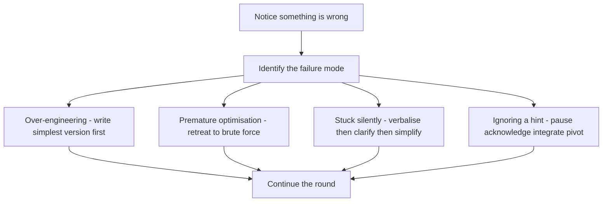

# Lecture 2 — The Four Failure Modes and the Recovery Patterns

> *Every failed live coding round, observed from the interviewer's side of the table, falls into one of four recognisable patterns. The candidate over-engineered the problem and ran out of time before the over-engineered version compiled. The candidate jumped to the optimal solution without first surfacing the brute force, then got stuck in the optimal solution and could not retreat. The candidate hit a wall and went silent for four minutes while the keyboard sat untouched. The candidate received a hint, did not register it, and kept executing the original wrong plan. Each failure mode has a recovery pattern that, applied inside the round, turns the round around. The candidates who recover are not smarter than the candidates who fail — they have practised the recovery pattern in advance, and the recovery is a reflex.*

## The four failure modes

The failure modes are not exotic. They are common. The interviewers who sit on the other side of the table see one or more of them in roughly 60% of new-grad rounds. The candidates who avoid them and the candidates who recover from them are over-represented in the offer pile; the candidates who do neither are over-represented in the rejection pile. The four:

| Failure mode             | What it looks like from inside the candidate's head                       |
|--------------------------|---------------------------------------------------------------------------|
| Over-engineering         | "I should write a general framework for this so the abstractions are clean." |
| Premature optimisation   | "I see the brute-force; let me skip it and jump to the O(n log n)."        |
| Getting stuck silently   | "I do not know what to do — I'll think for a minute. The minute becomes four." |
| Ignoring the hint        | "The interviewer just said something but I am committed to my plan."       |

Each of these failure modes can produce a passing round if recovered from quickly. The unrecovered version of each is the canonical losing round.

## Failure mode 1: over-engineering

### What it looks like

The candidate, faced with a 25-line problem, reaches for the 80-line solution. The interviewer asked for a function that returns the most-frequent element in an array; the candidate is half-way through writing a `FrequencyCounter` class with `add`, `remove`, `query_most_frequent`, and `merge_with_another_counter` methods. The interviewer asked for a function that returns whether a string is a palindrome; the candidate is writing a `PalindromeChecker` that supports case-insensitivity, Unicode normalisation, and a strategy pattern for different definitions of "palindrome."

The signature symptom is that the candidate is producing more *infrastructure* than *logic*. The classes, the abstract base classes, the named tuples, the helper functions are all proliferating. The actual algorithm — the 7-line core that solves the problem — is not yet written.

### Why candidates do this

Three reasons, usually overlapping:

1. **They want to signal seniority.** The candidate has read about clean code, design patterns, separation of concerns. They want to demonstrate that they know about these things. The demonstration consumes their interview time.
2. **They are uncertain about the algorithm.** The candidate does not yet have a clear picture of the solution. Building the scaffolding feels productive — typing is happening — without forcing them to commit to the actual algorithm.
3. **They are reading the wrong cue from the question prompt.** "Design a function..." is sometimes read as "design a system." It is not. "Design a function" means "write a function." The function is the artifact.

The over-engineering candidate often produces beautiful code that does not solve the problem. The interviewer notices and scores accordingly.

### Recovery pattern

The recovery is the **"simplest possible version first"** move. As soon as you notice you are writing infrastructure rather than algorithm, stop. Out loud:

"Let me step back. I think I am over-engineering this. Let me write the simplest possible version that solves the problem, and we can refactor if there is time."

Then write the 7-line version. The class scaffolding can be added back later if the round permits. Most rounds do not, and the simple version is what gets graded.

The trigger to notice this failure mode is the **5-minute coding check**. At the 5-minute mark of the code phase, look at what you have written. If the answer to "does this function actually solve the problem yet?" is no — if you are still in the setup, the helpers, the abstractions — pause and re-evaluate. If the answer is yes, keep going.

### The over-engineering tell

The single most-reliable tell is the **second helper function**. The first helper function is sometimes legitimate (parsing input, formatting output). The second helper function is almost always over-engineering. If you are writing your second helper before the main function has any logic in its body, stop and ask whether the helpers are actually buying you something.

The other reliable tell is the **comment-driven design**:

```python
# TODO: implement the main logic
class Solver:
    def __init__(self) -> None:
        # State for the solver
        pass

    def parse_input(self, raw: str) -> list[int]:
        # TODO: handle edge cases
        pass

    def solve(self) -> int:
        # TODO: main algorithm
        pass
```

This is the over-engineering candidate's signature. Every method is a TODO. The scaffolding is done; the algorithm is absent. The recovery is to delete the scaffolding and write the algorithm as a single function. Five minutes of typing time can be reclaimed this way at minute 12 of the round.

## Failure mode 2: premature optimisation

### What it looks like

The candidate is asked for "the most efficient way" to find the two-sum pair. The candidate skips the O(n²) brute force entirely and starts writing the hash-map O(n) solution. Two minutes in, the candidate gets confused about the indexing — does the hash map store "value-to-index" or "complement-to-index"? — and now they are debugging the optimal solution without ever having a working baseline to fall back to.

The signature symptom is the candidate is debugging an optimisation before they have a baseline to compare against. They cannot test their hash-map solution against the brute force because the brute force does not exist. They cannot retreat to a slower-but-correct solution because no slower solution was written.

### Why candidates do this

The premature optimisation failure mode comes from two specific habits, both built by LeetCode grinding:

1. **The "what is the optimal" reflex.** LeetCode's editorial section labels the optimal complexity for every problem. The candidate has trained themselves to immediately ask "what is the optimal solution to this pattern" and write that, skipping the brute force.
2. **The fear of being marked down for brute-force.** The candidate believes that proposing the brute force at all is a sign of weakness. It is not. *Stating* the brute force, naming its complexity, and then proposing the optimisation is the canonical strong-approach pattern from Lecture 1. *Writing* the brute force is unnecessary; *naming* it is mandatory.

### Recovery pattern

The recovery is the **retreat-to-baseline** move. When you are stuck in the optimal solution, stop trying to debug the optimisation. Out loud:

"Let me retreat to the brute force for a second to make sure I have the logic right. I'll write the O(n²) version, get it working, then refactor to the O(n) version."

The brute force takes 60 seconds to write. It serves two purposes: it gives you a working solution you can test against, and it gives the interviewer the signal that you have a fallback. The optimisation, when it lands, is now a *refactor* of working code rather than a from-scratch attempt at clever code.

This is the recovery move most candidates resist. It feels like giving up. It is not — it is the engineering move of having a baseline before optimising. The interviewer recognises the move and scores it well.

### When the optimisation is actually wrong

Sometimes the candidate's "optimal" solution is wrong — the O(n) hash-map approach has a subtle bug, or the candidate has misremembered the algorithm, or the algorithm they are reaching for does not actually apply to this problem. The retreat-to-baseline move rescues this case automatically: the brute force, written fresh, has fewer moving parts and surfaces the misunderstanding.

The candidate who does not retreat and instead burns 15 minutes debugging the wrong optimisation has produced the canonical failed round. The candidate who retreats at minute 18, writes the brute force in 90 seconds, has working code at minute 20, and refactors to the optimisation at minute 28 has produced a passing round on the same problem.

## Failure mode 3: getting stuck silently

### What it looks like

The candidate hits a wall. They do not know what to do next. They go quiet. The keyboard sits untouched. The cursor blinks. The interviewer waits. After 90 seconds the interviewer asks "what are you thinking about?" The candidate says "I'm thinking." The interviewer waits another 60 seconds. After 2-3 minutes of silence with no observable progress, the round is effectively over — the interviewer has lost the signal of what the candidate's reasoning is, and the rubric has no way to score silence positively.

The signature symptom is the keyboard-stops-and-narration-stops combination. Either the keyboard moving (typing, even slow typing) or the narration continuing (talking, even uncertain talking) keeps the round alive. The two stopping together is the death state.

### Why candidates do this

The silent-stuck failure mode comes from a specific cognitive trap: the candidate is afraid of saying something wrong. They are not actually thinking unproductively; they have a half-formed thought that they have evaluated as "too uncertain to share" and so they are silently waiting for the thought to firm up before they speak.

This is the wrong instinct. The interviewer is not scoring you on the correctness of every utterance. The interviewer is scoring you on the visibility of your reasoning. A wrong half-formed thought said out loud is a signal the interviewer can engage with; a wrong half-formed thought thought silently is a signal that the interviewer cannot engage with. The silent version scores lower than the spoken version, even when the silent version was internally correct.

### Recovery pattern — the three moves

The recovery is one of three explicit moves, used in order:

**Move 1: Verbalise the stuck-point.** Say what is blocking you, out loud. "I am stuck because I need to track the count of each character but I cannot do that in O(1) lookup with my current data structure." The act of verbalising forces the stuck-point into specific shape, and often the verbalisation itself reveals the answer.

**Move 2: Ask a clarifying question.** "Just to double-check — can the input have negative numbers? Does case matter? Are duplicates allowed?" The clarifying question buys you 30 seconds of thinking time without going silent, and occasionally the interviewer's answer is the hint you needed.

**Move 3: Simplify the problem.** "Let me solve a simpler version of this first. Imagine the input is sorted — what would the algorithm look like? Now let me think about how to adapt that to the unsorted case." Simplification is the canonical algorithm-design move; demonstrating it under pressure is itself a positive signal.

Run the moves in order. Verbalise first because it is cheapest. Clarify second because it is collaborative. Simplify third because it is the most-aggressive intervention but the one that most-often produces the actual answer.

### The unstuck phrases

The exact phrases to use, rehearsed:

- "I'm going to think out loud for a moment — I'm trying to figure out whether I should use [option A] or [option B]."
- "Let me restate what I think I need to do here, in case I am missing something."
- "I want to make sure I understand — can the input have [edge case]?"
- "Let me try a smaller version of this first. If the input were just [simpler case], the algorithm would be [simpler algorithm]."
- "I think I'm overcomplicating this. Let me try the most-obvious approach and see what its complexity is."

Each phrase is 5-10 seconds long. The phrases are not eloquent. They do not need to be. They need to keep the round alive while you regroup. Rehearse one or two until they come out automatically; the rehearsed phrase is the lifeline when the cognitive load of the round has filled all your other capacity.

## Failure mode 4: ignoring the hint

### What it looks like

The interviewer says, mid-round, "have you thought about whether the input might be sorted?" or "what would your approach look like if you could not use extra space?" or "the brute force gets us to O(n²) — is there a way to do better?"

These are hints. They are not casual questions. The interviewer has identified that your current trajectory will not produce a passing round, and is intervening to redirect you. The intervention is rare and expensive — the interviewer has explicitly told you that something needs to change.

The failure mode is the candidate who hears the hint, processes it as "just a question," answers it briefly, and continues executing the original plan. The hint is wasted.

The signature symptom is the candidate's response to the hint is "yes, I considered that, and I think my current approach works." This response is almost always wrong. The interviewer would not have spent the hint if the current approach worked.

### Why candidates do this

Three reasons, usually overlapping:

1. **Ego.** The candidate is committed to their plan and does not want to admit that the plan needs changing. Pivoting feels like losing face.
2. **Cognitive momentum.** The candidate is half-way through executing the plan and the cost of switching feels too high. The candidate is wrong about this cost — pivoting at the hint is much cheaper than failing the round.
3. **Misreading the signal.** The candidate genuinely thinks the interviewer's question was casual. It rarely is. If the interviewer is asking a leading question in the middle of the round, the leading question is a hint. Treat it as one.

### Recovery pattern

The recovery is the **take-the-hint** move. When you receive a hint, your response should be, in this order:

1. **Pause.** Stop typing. Think for 5-10 seconds. The pause is the signal that you registered the hint.
2. **Acknowledge it explicitly.** "That is a good question. Let me think about what changes if [the hint's premise] is true."
3. **Integrate the hint into your plan, out loud.** "If the input is sorted, the two-pointer approach lets us avoid the hash map entirely and we drop to O(1) space." This is the explicit-integration step.
4. **Pivot.** Stop executing the old plan. Start executing the new plan. The interviewer's hint was not a suggestion; it was a course correction.

The whole sequence takes 30-60 seconds. The candidate emerges from it with a redirected plan and an interviewer who has watched the candidate take a hint cleanly — which is itself a positive signal, often a stronger signal than if the candidate had arrived at the new plan on their own.

### The take-the-hint phrases

The exact phrases to use, rehearsed:

- "Good question — let me think about that for a moment."
- "I think you're pointing at something I missed. Let me reconsider."
- "If that is the case, then my current approach does not work — let me think about what does."
- "Thanks, that is a useful pivot. Let me restart the approach with that in mind."

Each phrase has zero ego in it. The candidate is not defending. The candidate is collaborating. This is the framing Carl Tashian's free essays repeatedly emphasise: the interviewer is a future colleague, not an adversary, and the response to a useful prompt from a future colleague is gratitude, not defence.

## Test-driven thinking during the interview

The four failure modes are recoverable mid-round. The deeper preventive move — the move that *prevents* failure modes from emerging in the first place — is test-driven thinking. The pattern: write the test cases out loud *before* the code, not after.

### Why this works

Most of the failure modes above come from a candidate who started coding before they had a complete model of the problem. The over-engineerer started writing infrastructure because they did not have a clear picture of the algorithm. The premature optimiser jumped to the optimisation because they did not have a clear picture of why the brute force was a brute force. The silent-stuck candidate hit a wall because the wall was the place where their incomplete model met the actual problem.

The test-cases-before-code discipline forces the model to be complete before the code starts. To write three test cases — happy path, edge case, failure-mode input — you have to know:

- What is a valid input?
- What is the expected output for that input?
- What is an input that exercises an edge?
- What is an input that breaks the obvious approach?

You cannot answer these four questions without a complete model of the problem. Writing them out loud, in 90 seconds, forces the model to be there. The 90 seconds of investment buy you the prevention of all four failure modes.

### The three categories

| Category       | What it tests                                                    |
|----------------|------------------------------------------------------------------|
| Happy path     | The main logic of the algorithm                                  |
| Edge case      | Boundaries: empty, single, max-size, duplicates, negatives, etc. |
| Failure-mode   | An input that breaks the naive approach (forces the optimisation) |

The failure-mode input is the highest-leverage of the three. It is the input where the brute force runs in 10 seconds but the optimal runs in 10 milliseconds. Naming this input forces you to acknowledge why you are reaching for the optimisation — and it gives you a concrete trace to walk through when you do the test phase.

### Example: writing the test cases for "longest substring without repeating characters"

Before any code:

- **Happy path.** `"abcabcbb"` → `3` (the substring `"abc"`).
- **Edge case 1: empty.** `""` → `0`.
- **Edge case 2: single character.** `"a"` → `1`.
- **Edge case 3: all the same.** `"bbbbb"` → `1`.
- **Failure-mode input.** A long string with the longest substring near the end, e.g. `"pwwkew"` → `3` (the substring `"wke"`, not `"pww"` because of the repeated `w`).

Writing these five cases out loud, in 90 seconds, surfaces the entire shape of the problem. The empty case, the single-character case, and the all-the-same case are the three edges that catch the most off-by-one bugs. The failure-mode input is the case that distinguishes "find the first substring" from "find the longest" — a distinction the candidate often gets wrong if they have not written this case out before coding.

## The complexity push: "is this O(n) or O(n log n)?"

The interviewer's mid-round question "what is the complexity?" is two questions sitting on top of each other:

1. **Is your stated complexity correct?** A factual question. If you say "this is O(n)" and your code has a nested loop, the answer is no, and the interviewer wants you to notice.
2. **Is this the optimal complexity for this problem?** A different question. Sometimes "yes." Sometimes "I do not know, here is the trade-off I am making, can you push me on whether there is better?"

Most candidates conflate the two questions and give the wrong answer to one of them. The strong candidate separates them and answers each cleanly.

### The two-step response

The pattern:

**Step 1: Answer the factual question.** "My code is O(n log n) because of the sort on line 3 — the rest of the code is O(n), but the sort dominates."

**Step 2: Answer the optimisation question.** "Is this the best possible? I think so for the general case, because we need to compare every element, which is at least Ω(n log n) on the lower bound. But if the input were sorted already, we could drop to O(n)."

The first response is the factual statement. The second response is the optimisation analysis. Both are short. Together they signal that you understand complexity at two levels — the mechanical (what does my code cost?) and the theoretical (what is the lower bound for this problem?).

### When you do not know the optimal

Sometimes you genuinely do not know whether your O(n log n) is the best possible. The correct response is:

"My code is O(n log n) because of the sort. I think this might be optimal but I am not 100% sure — there might be a hash-based approach that gets to O(n) in expectation. Would you like me to think about that, or move on to the trade-offs phase?"

This response is honest, surfaces the uncertainty, and invites the interviewer to drive. The interviewer will either say "yes, let's think about the O(n) version" (and now you have an explicit prompt to think) or "no, the O(n log n) is fine, let's move on" (and now you have explicit permission to move on without losing points for not pursuing the optimisation).

Both outcomes are better than silently writing the O(n log n), pretending you know it is optimal, and being wrong.

### The premature-optimisation antibody

The two-step response is also the antibody to failure mode 2 (premature optimisation). The candidate who has rehearsed the "step 1 = factual, step 2 = optimisation" pattern is much less likely to skip the brute-force in the approach phase — because they know they will need to defend the choice of complexity in the discuss phase, and the cleanest defence is the one where you have explicitly traversed brute-force-to-optimal in the approach.

## Combining the patterns: the recovery flowchart

When something feels wrong mid-round, the decision sequence:

1. **Notice that something is wrong.** This is the hardest single step. The candidate who notices at minute 18 that the approach is failing has 22 minutes to recover. The candidate who notices at minute 35 has 5 minutes. The notice-early discipline is what makes recovery feasible.
2. **Identify which failure mode you are in.** Over-engineering? Premature optimisation? Stuck silently? Ignoring a hint? The categories are small enough that you can do this in 10 seconds.
3. **Apply the corresponding recovery pattern.** Simpler version first / retreat to brute force / verbalise-clarify-simplify / take the hint and pivot.
4. **Continue.** The recovery is a 30-60 second move, not a restart. The round is still on the clock; recover and resume.


*The recovery flowchart: notice, identify the failure mode, apply the matching recovery, continue.*

The flowchart is rehearseable. Drill it once a week with the exercises in this folder; by the time you sit a real round, the recovery is reflex rather than deliberation.

## What the strong candidates do differently

The strong-candidate response to a stuck moment is visible in three behaviours that the weak-candidate response lacks: (1) they verbalise within 15 seconds of hitting the wall, (2) they take a hint without defending their original plan, (3) they retreat to a simpler version before the simpler version is required. None of these is a smarter move; all of them are rehearsed moves. The same candidate who has done five mock interviews where they deliberately got stuck and practised the recovery pattern is the candidate who, in the real round, executes the recovery as muscle memory while the cognitive load is going elsewhere. The candidate who has never rehearsed the recovery has no muscle memory to fall back on; their cognitive load is spent inventing the recovery in real time, and the round runs out before they finish inventing.

Lecture 3 shows two complete worked transcripts — one round that went well, one round that went badly and recovered — at the line level. The transcripts are the calibration baseline against which you can grade your own recordings in the mini-project.
