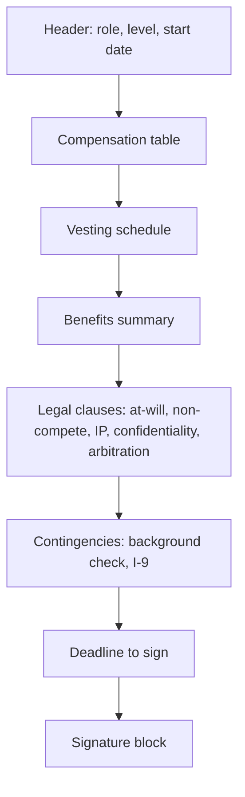
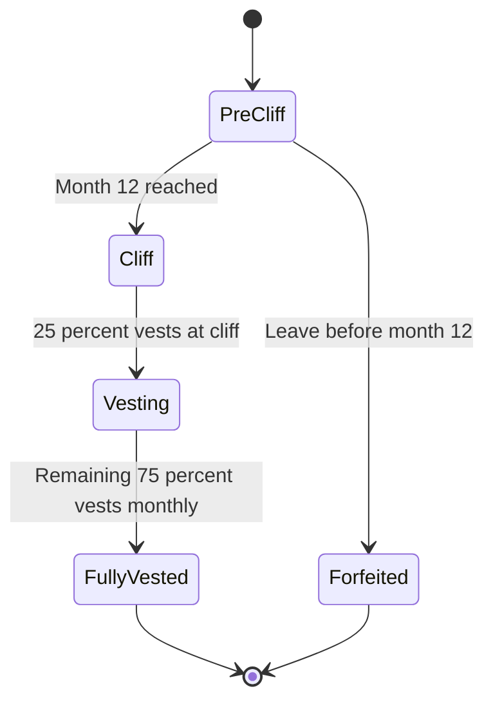

# Lecture 1 — Reading the Offer Letter, Line by Line

> *The offer letter is a three-page PDF. The candidate, opening it for the first time, reads the first page, sees a six-figure base, sees a five-figure sign-on, sees a six-figure stock grant, sees the word "congratulations," and stops reading. The remaining two pages — the vesting schedule, the cliff, the at-will clause, the assignment of inventions, the arbitration, the deadline — are the pages where the actual offer lives. The candidate who has only read page one has not read the offer.*

This lecture is the line-by-line read of a standard tech offer letter. The structure of the document is broadly the same across Google, Meta, Microsoft, Amazon, and most of the mid-tier companies that have copied their template. Startups vary more; the variations are noted where they matter. The goal of the lecture is that, by the end, you can open a real offer letter and identify every section without looking anything up.

## The standard offer letter structure

A typical offer letter for a software engineering role in the U.S. has eight to twelve sections. The order varies; the substance does not. The sections are:

1. **The header.** Candidate name, role title, level, start date, work location, manager name (sometimes), recruiter name.
2. **The compensation table.** Base salary, signing bonus, stock grant, target performance bonus.
3. **The vesting schedule.** How the stock grant converts to vested shares over time.
4. **The benefits summary.** PTO, health coverage, 401(k) match, the rest of the standard benefits.
5. **The at-will employment clause.** The legal frame for the relationship.
6. **The non-solicit and non-compete clauses.** What you cannot do during and after employment.
7. **The assignment-of-inventions clause.** What the company owns of what you create.
8. **The confidentiality and trade-secrets clause.** What you cannot disclose.
9. **The arbitration clause.** How disputes are resolved.
10. **The contingencies.** Background check, drug test (rare in tech but still occasionally present), I-9 verification, sometimes a reference check.
11. **The deadline.** When the offer expires if you do not sign.
12. **The signature block.** Your signature, the company's signature, the date.


*The order in which a standard tech offer letter's sections build toward the signature.*

We will walk each in turn. The compensation table is the section that gets the most attention from candidates and the least from this lecture, because the compensation table is where the negotiable numbers live — and the negotiation is the subject of Lecture 3. Lecture 1 is about reading the document, not negotiating it.

## Section 1 — The header

The header is the section the candidate skims fastest and should slow down on the most. The role title and the level are the two numbers that anchor the rest of the offer. A "Software Engineer II" at Microsoft is a different role from a "Software Engineer 63" at Microsoft, and the comp band is different by a factor of 1.4. A "L3" at Google and a "E3" at Meta are roughly equivalent (both are entry-level engineer); a "L4" at Google and a "E4" at Meta are also roughly equivalent (both are post-promotion-from-new-grad). The level is the gateway to the comp band; the comp band is the gateway to the total comp.

If the level on the offer letter is one rung lower than what you expected based on your interviews — for example, you interviewed at the L4 loop and the offer is at L3 — this is the section to raise the level question on, not the comp section. Levels in tech are sticky; the level you start at determines the level you negotiate up from in a year. Trading $5k of sign-on for a one-rung level bump is, over four years, almost always the better trade.

The start date is the second number in the header to watch. The standard practice is two to four weeks from signing for an external hire. If you need longer — a final semester to complete, a relocation across the country, a graduation ceremony in five weeks — the start date is negotiable. Recruiters will say "yes" to a six-week extension almost without exception; the cost to the company of waiting is low and the cost of losing you is high. Do not sign a start date you cannot meet.

## Section 2 — The compensation table

The compensation table is the section that contains the negotiable numbers. The standard four-line table looks like this:

```text
Base salary:               $145,000 / year
Signing bonus:             $20,000 (one-time, paid in first paycheck, claw-back if you leave within 12 months)
Stock grant (RSUs):        $200,000 over 4 years, 25/25/25/25 with 1-year cliff
Target performance bonus:  10% of base annual, paid at year-end (subject to company performance)
```

Walk each line.

**Base salary** is the line the candidate most often focuses on. It is also, in absolute dollar terms, often the smallest of the three primary lines at senior levels (where stock dominates) and a similar size at the new-grad level. Base is paid every two weeks (twenty-six paychecks a year at most U.S. tech companies; some pay monthly), is the basis for the bonus computation, and is the number that goes on every loan application for the rest of your life. Base raises happen at the annual review cycle; the typical raise is 3-5% in a normal year and 0-2% in a year with macro pressure. The base is the floor of your comp.

**Signing bonus** (or "sign-on") is a one-time payment, paid usually within the first month, typically with a one-year claw-back. The claw-back means that if you leave within 12 months, you owe some or all of the sign-on back. The claw-back schedule is on the offer letter — read it. The common pattern is "full claw-back in the first 12 months" or "prorated claw-back, 1/12 per month vested." Sign-on is the most negotiable line on the offer because it does not affect the company's base-salary band and does not compound into future raises. Recruiters give sign-on bumps more readily than base bumps.

**Stock grant (RSUs or options)** is the line that produces the most confusion. RSUs are "restricted stock units" — promises of company shares, delivered to you on a vesting schedule, taxed as ordinary income at the moment of vest. Options are different: they give you the right to buy shares at a fixed strike price; they are taxed differently; they have value only if the share price exceeds the strike price.

For a public company (Google, Meta, Microsoft, Amazon, most of the mid-tier), the grant is RSUs in 99% of cases. The dollar value of the grant is "the share price on the grant date times the number of shares" — but the share price drifts over the vesting window, so the dollar value of what you actually receive will be different. When recruiters quote stock as a dollar number, they are quoting the grant-date value, not the vest-date value. The grant-date value is the right number to plan against; the vest-date value is the number you will actually receive.

For a private pre-IPO company, the grant is usually options or pre-IPO RSUs. Options at private companies are the topic of an entire lecture series in the C13 senior-track companion week; the short version is that a private-company option grant of "$200k" has an expected value that depends critically on (a) the strike price, (b) the company's actual valuation versus the 409A on the grant date, (c) the probability of liquidity within the option-exercise window, and (d) the tax treatment when you eventually exercise. The dollar value on the offer letter is, for a private company, a best-case scenario and not a planning number.

**Target performance bonus** is the annual cash bonus, computed as a percentage of base, paid at year-end. The percentage is typically 10-15% at the new-grad level, 15-20% at mid-level, 20-30% at senior, and 30-50%+ at staff and principal. The "target" word matters: the actual bonus is target × company-performance multiplier × individual-performance multiplier. In a flat company-performance year with a "meets expectations" individual rating, the bonus is approximately target. In a bad year, it can be 60-70% of target. In a banner year with an "exceeds expectations" rating, it can be 130-150% of target.

The first-year bonus is sometimes prorated based on start date — if you start in October, your first-year bonus is roughly 3/12 of target. Read this on the offer letter; it is sometimes spelled out and sometimes hidden in the bonus-plan document referenced as an appendix.

## Section 3 — The vesting schedule

The vesting schedule is the line that determines how the stock grant actually arrives in your account. The standard schedules are:

### 25/25/25/25 with a 1-year cliff (most companies)

- Year 1: nothing vests for the first 12 months (the "cliff"). On the one-year anniversary of your start date, 25% of the grant vests in a single chunk.
- Years 2 through 4: the remaining 75% vests either in equal annual chunks at the anniversary (25% per year) or in equal monthly chunks (approximately 2.08% per month, vesting on the same day of the month as your start date).
- Google and Meta typically vest monthly post-cliff. Microsoft typically vests quarterly. Amazon — see below.

The cliff is the consequential clause. If you leave or are terminated within the first 12 months, you forfeit 100% of the unvested stock — which, given the cliff, is 100% of the grant. The cliff exists to incentivise retention through the first year, when the company has spent the most on onboarding and the candidate has produced the least.


*Before month 12 nothing vests; miss the cliff and the whole grant is forfeited.*

### 5/15/40/40 with a 1-year cliff (Amazon)

Amazon's standard new-grad-to-L5 vesting schedule is back-loaded:

- Year 1: 5% of the grant vests.
- Year 2: 15% of the grant vests.
- Year 3: 40% of the grant vests.
- Year 4: 40% of the grant vests.

The schedule is mathematically front-loaded toward the company's retention interest (most of the equity arrives in years 3 and 4, when the cost of you leaving is highest) and away from the candidate's interest. Amazon offsets the back-loading with year-1 and year-2 cash sign-on payments that approximate what a 25/25/25/25 schedule would have paid out. The candidate who joins Amazon and leaves at month 25 receives 5% + 15% = 20% of the grant — substantially less than the 50% they would have received on a flat schedule. This is the structural reason Amazon retention statistics look the way they do.

When negotiating with Amazon, do not try to negotiate the vesting schedule itself — it is fixed across the company. Negotiate the year-1 and year-2 sign-on cash to compensate for the back-loading.

### Other schedules

- **33/33/34, no cliff, monthly.** Some startups. The lack of cliff is candidate-friendly; the no-year-4 means a shorter retention horizon.
- **Performance-share units (PSUs).** Senior+ at Microsoft, Apple, and some others. The vest is contingent on company performance (typically tied to total shareholder return versus peer companies) and can be anywhere from 0% to 200% of the nominal grant. Read the PSU plan document if your offer has them; the variability is real.
- **Double-trigger acceleration.** Some startup offers include "double-trigger" acceleration — if the company is acquired AND you are terminated within 12 months of the acquisition, your unvested stock vests immediately. This is candidate-friendly and is occasionally negotiable at startup offers. Public-company offers do not typically have this clause; it is not needed.

## Section 4 — The benefits summary

The benefits section is often given as a summary table with a reference to a longer benefits document. Read both. The lines that matter at the new-grad-to-L4 level:

- **PTO accrual.** Typically 15-25 days per year at new-grad level, accrued bi-weekly or monthly. Some companies (Netflix, GitLab, others) use "unlimited PTO" which means no accrual and no carryover. Unlimited PTO sounds candidate-friendly and is typically not; studies show employees at unlimited-PTO companies take fewer days off than employees at accrual-based plans.
- **PTO carryover.** Can you roll unused PTO into next year, or does it expire on December 31? Some companies cap carryover at 5 days; some allow unlimited; some are use-it-or-lose-it. The carryover policy is rarely on the offer letter; ask the recruiter in writing before signing.
- **Health insurance.** What plans, what employee contribution. The standard tech-company offer covers most or all of the employee premium; family coverage often requires an employee contribution of $200-$600 per month. Check the plan documents — at some companies, the deductible is $0 and the plan is gold-tier; at others, the deductible is $3,000+ and the plan is bronze-tier with a wellness incentive.
- **401(k) match.** Typically 50% match up to 6% of salary (so a 3% effective contribution from the company), or 100% match up to 4-6%. Some companies offer a "true-up" at year-end if you front-loaded contributions; some do not. The match is free money — contribute at least enough to capture it.
- **Mega backdoor Roth (advanced).** A subset of tech companies (Microsoft, Google, Meta, others) allow after-tax 401(k) contributions up to the IRS limit (~$70k total in 2025), with in-plan Roth conversion. This is one of the highest-value benefits at companies that offer it. Most new-grads do not have enough income to max it out; senior engineers who do should optimise hard.
- **Equity refresh policy.** Some companies grant a "refresh" RSU grant annually at the performance review. The refresh is on top of the initial grant. The refresh policy is rarely on the offer letter; ask the recruiter what the typical refresh band is for your level.
- **Parental leave, sabbatical, fertility benefits, etc.** Read what is there. None of these are negotiable at the offer-letter level; they are policy. They affect the offer's total value but not the negotiation conversation.

## Section 5 — The at-will employment clause

The at-will clause states that either party can terminate the employment relationship at any time, with or without cause, with or without notice. The clause is in every U.S. employment contract. It is not negotiable. Read it once; recognise it; move on.

The at-will clause is partially constrained by federal and state law — you cannot be fired for a protected-class reason (race, sex, age, disability, etc.) and you cannot be fired in retaliation for a whistleblower claim. The clause is otherwise as broad as it reads.

Some at-will clauses include a "notice period" — typically 14 days from the employee to the employer. This is a courtesy clause, not a binding one in most states; the standard professional norm is two weeks' notice when leaving voluntarily.

## Section 6 — Non-solicit and non-compete

The non-solicit clause prohibits you, for some period after leaving (typically 12 months), from recruiting your former colleagues to join your next company. Non-solicits are broadly enforceable in most U.S. states. The clause is usually boilerplate and not negotiable.

The non-compete clause prohibits you, for some period after leaving, from joining a competitor or starting a competing business. Non-competes are the most state-variable clause in U.S. employment law:

- **California:** Non-competes are unenforceable. The state's Business and Professions Code Section 16600 has voided non-competes since 1872. A California non-compete in an offer letter is unenforceable, even if the offer letter says it is. Some companies still include the clause as boilerplate; the clause has no legal effect.
- **New York:** Non-competes are enforceable but heavily scrutinised. Recent legislation (2023) has narrowed enforceability. The clause is real but the bar to enforcement is high.
- **Texas:** Non-competes are enforceable if they are "reasonable in scope, time, and geography" and supported by consideration (a sign-on bonus typically suffices). New-grad non-competes are typically reasonable in court's view.
- **Florida:** Non-competes are enforceable; Florida is the most non-compete-friendly state. The clause should be read carefully if you are signing a Florida offer.
- **Federal level (2024 FTC rule):** The FTC issued a final rule in 2024 banning most non-competes. The rule was partially enjoined by a Texas federal court in August 2024 and remains in litigation as of 2026. The directional signal is that non-competes are increasingly disfavoured at the federal level, but enforcement at the state level continues until the rule is fully in effect.

The practical advice for the new-grad signing a non-compete in 2026:

1. If you are in California, the clause is unenforceable. Sign it; move on.
2. If you are in any other state, read the clause for scope (which companies count as competitors), time (12 months is standard; 24 is aggressive; 6 is candidate-friendly), and geography (national, regional, or worldwide).
3. The scope is often negotiable. The "all companies in software" definition is overly broad; ask for a narrower list of named competitors. Recruiters will sometimes agree.
4. Do not assume an unenforceable clause is not consequential. Even an unenforceable non-compete can be used to threaten litigation against your next employer, which they will not appreciate. The signed clause is friction even when not enforceable.

## Section 7 — Assignment of inventions

The assignment-of-inventions clause states that any IP you create during your employment, using company time or resources, belongs to the company. This is standard. The variations to watch:

- **Scope of "during employment."** Some clauses cover only work created during work hours on work projects; some cover any IP created during the employment period, including on weekends and on personal projects. The narrower scope is candidate-friendly.
- **Exclusion list.** Most clauses allow the candidate to list pre-existing IP and side projects that are excluded from the assignment. If you have a portfolio project, an open-source contribution, or a personal blog with substantial content, list it. The list is your protection that the company does not later claim ownership.
- **California Labor Code Section 2870.** California specifically excludes inventions developed entirely on the employee's own time, without company resources, that do not relate to the company's business. This is automatic in California; it is not in most other states. Other states (Washington, Illinois, Minnesota, Delaware, North Carolina, Utah) have similar protections via statute. Where the statute exists, the offer letter should reference it.

## Section 8 — Confidentiality and trade secrets

Standard. Boilerplate. Not negotiable. Read once. Recognise it. The clause prevents you from disclosing confidential information (customer lists, source code, business strategy) during and after employment. The clause is reasonable; the company is paying you for access to information that has value.

The clause does not prevent you from talking about your role generally, listing the company on your resume, or discussing your salary with peers. Salary discussion is explicitly protected by the National Labor Relations Act in the U.S.; a confidentiality clause that prohibits salary discussion is unenforceable. Some companies still include it; the clause has no effect.

## Section 9 — Arbitration

The arbitration clause states that disputes (employment-related claims, wage claims, discrimination claims) are resolved through private arbitration rather than court. Arbitration is faster than litigation but typically less favourable to the employee on average; you give up the right to a jury trial and to class-action participation.

In 2022, federal legislation (the Ending Forced Arbitration of Sexual Assault and Sexual Harassment Act) carved out sexual-harassment and sexual-assault claims from mandatory arbitration. The clause as a whole still applies to most other employment claims.

The arbitration clause is rarely negotiable at the offer-letter stage at large companies. At startups and smaller companies it is sometimes negotiable; the request to strike the arbitration clause should be made with a lawyer's draft language, not on a phone call.

## Section 10 — Contingencies

Background check, I-9 (work authorisation verification), occasional drug test, occasional reference check. The contingencies are not the offer; they are the gates between offer and start. If you have something on your record that may surface, raise it with the recruiter before signing. If you cannot pass the I-9 (you do not have work authorisation), the offer is void; this is the most common contingency failure for international candidates.

Some offers are also contingent on graduation, on completion of a final degree, or on starting by a specific date. Read these. A "you must start by August 31" contingency on a May offer is not a recruiter being aggressive; it is the company's fiscal-year planning. Negotiate the date if you need to; do not just miss it.

## Section 11 — The deadline

The deadline is the date by which you must sign or the offer expires. Standard practice is 7-14 days; some companies extend to 21 days; some try to compress to 48-72 hours. The compressed deadline is the "exploding offer" and is the topic of Challenge 1 this week.

The deadline is almost always negotiable upward. The recruiter wants you to sign; the company has invested 6-12 hours of interviewer time in you; the cost of you walking is high. Ask for an extension if you need one. The phrase is "I want to make sure I make the right decision for both of us, and I have a final-round interview at another company on Thursday — could we extend the deadline to the following Monday?" Recruiters say yes to this far more often than they say no.

The exception is when the deadline is tied to a fiscal-year or quarter-end constraint on the company's side. Some companies will not extend a deadline past December 31 because the hiring requisition is tied to the current fiscal year. The recruiter will tell you this explicitly; if they do, treat the deadline as real.

## Section 12 — The signature block

When you sign, sign. Date the signature. Return the signed PDF to the email address specified. Save a copy of the countersigned offer letter (with the company's signature) when it comes back. Print a paper copy if you are paranoid; the digital copy is what matters.

Do not sign while the negotiation is still open. Once you sign, the negotiation is closed. The candidate who signs and then asks for "one more thing" is asking the recruiter to reopen a closed deal, which the recruiter is now incentivised to refuse because they have already booked the close.

## Total compensation arithmetic

Now the math. The candidate who can compute total comp in their head in under three minutes is the candidate who can negotiate without a calculator.

The standard formula, for a 25/25/25/25 vesting schedule with a 1-year cliff:

```text
Year-1 total comp = base + sign-on + (stock_grant × 0.25) + (target_bonus × prorated)
Year-2 total comp = base + (stock_grant × 0.25) + target_bonus
Year-3 total comp = base + (stock_grant × 0.25) + target_bonus
Year-4 total comp = base + (stock_grant × 0.25) + target_bonus
4-year total = year-1 + year-2 + year-3 + year-4
```

For a $145k base, $20k sign-on, $200k 4-year stock, 10% target bonus, full first-year:

```text
Year-1: 145 + 20 + 50 + 14.5 = $229.5k
Year-2: 145 +  0 + 50 + 14.5 = $209.5k
Year-3: 145 +  0 + 50 + 14.5 = $209.5k
Year-4: 145 +  0 + 50 + 14.5 = $209.5k
4-year: $858k
4-year average annual: $214.5k
```

The "average annual" number is the one to quote in the negotiation. "I am looking at a total comp of approximately $215k per year on average over four years" is a stronger frame than "I am looking at $145k base." The first frame anchors on the right number; the second under-states by 30%.

For an Amazon-style 5/15/40/40 schedule, the year-by-year breakdown shifts dramatically:

```text
Year-1: base + sign-on-y1 + (stock × 0.05) + bonus
Year-2: base + sign-on-y2 + (stock × 0.15) + bonus
Year-3: base + (stock × 0.40) + bonus
Year-4: base + (stock × 0.40) + bonus
```

For Amazon, the year-1 and year-2 sign-on cash payments offset the back-loaded stock. The first two years' total comp at Amazon, with the sign-on, approximates what a flat-schedule company would pay. The candidate who joins Amazon and leaves after 24 months walks away with the sign-on plus 20% of the stock; the candidate who stays four years walks away with the full grant. The back-loading is the retention mechanism.

For a private pre-IPO startup, the stock-grant dollar value on the offer letter is approximately the number of options × (current 409A valuation - strike price). The "current 409A" is the company's official valuation, set by a third-party valuation firm and updated typically annually. The strike price of the options is the 409A at the grant date. If the company doubles its 409A in the next 12 months, your options gain value; if it halves, they lose it.

Three rules for private-company stock arithmetic:

1. **The dollar value on the offer letter is the company's optimistic case.** It assumes the 409A continues to appreciate, the company IPOs or is acquired, and the lock-up period ends before the option-exercise window does. The probability-weighted value is substantially lower.
2. **Plan around the cash compensation, not the stock.** Base + sign-on at a private company is your floor. Anything from the stock is upside.
3. **If the company is post-Series-C, post-revenue, and growing 100%+ year-over-year, the stock has a higher expected value than the offer-letter dollar.** If the company is pre-Series-A, pre-revenue, and burning cash, the stock has lower expected value than the offer-letter dollar. The expected-value curve is heavily right-skewed; most startups fail; the survivors pay multiples.

## What the offer letter does not tell you

The offer letter is the formal record of the compensation deal. It does not tell you:

- **The team you will be on.** The team name is sometimes in the header; the team's actual project, manager's reputation, and team morale are not. Ask before signing.
- **The on-call rotation.** Most software engineering roles include some on-call expectation. The frequency varies wildly — once a quarter for a small team to once a week for a service team. The offer letter rarely names the rotation; ask in writing.
- **The performance review cadence.** Annual at most companies; semi-annual at Amazon, Microsoft, and a few others; quarterly at some startups. The cadence determines how soon your next raise opportunity arrives.
- **The equity refresh policy.** As discussed in Section 4. Annual refresh grants compound substantially over a multi-year tenure; the absence of a refresh policy is a red flag for retention.
- **The remote-work policy in writing.** "We are hybrid" is not a written remote-work policy. Ask for the specific expectation in writing — three days per week, two days per week, manager's discretion. The policy you sign under is the policy you live under for at least the first year.
- **The relocation reimbursement claw-back.** If the company is paying for your relocation, ask whether the reimbursement claws back if you leave within 12 or 24 months. Most do. The claw-back is on a separate document; ask for it before signing.
- **The start-date flexibility window.** Most start dates are negotiable by a few weeks. Ask if you need to.

These are the questions for the recruiter, on the phone, before signing. The pre-signing question list is the topic of Lecture 3.

## A worked example — reading three offers side by side

To make the line-by-line read concrete, here are three offer letters at the same level (L4 / Senior Engineer I equivalent) at three different companies. Read each, identify which lines are which, and compute the four-year total in your head before reading the analysis.

### Offer A — Google L4, Mountain View

```text
Position:         Software Engineer III
Level:            L4
Location:         Mountain View, CA
Start date:       4 weeks from signing (flexible by ±2 weeks)
Compensation:
  Base salary:    $185,000 / year
  Sign-on bonus:  $40,000 (one-time, 12-month full claw-back)
  Stock grant:    $320,000 over 4 years (25/25/25/25, 1-year cliff, monthly post-cliff)
  Target bonus:   15% of base ($27,750)
Benefits:         Standard Google benefits package; see attached
Decision deadline: 14 business days
```

Year-1 total: $185 + $40 + $80 + $27.75 = $332.75k.
Year-2 through Year-4: $185 + $80 + $27.75 = $292.75k each.
Four-year total: $332.75 + (3 × $292.75) = $332.75 + $878.25 = $1,211k.
Four-year average: $302.75k per year.

### Offer B — Amazon L5, Seattle

```text
Position:         Software Development Engineer II
Level:            L5
Location:         Seattle, WA
Start date:       6 weeks from signing
Compensation:
  Base salary:    $190,000 / year (capped at L5 band ceiling)
  Sign-on Year 1: $80,000 (one-time, monthly proration; claw-back if you leave before 12 months)
  Sign-on Year 2: $60,000 (one-time, paid in 12 monthly installments during year 2)
  Stock grant:    $350,000 over 4 years (5/15/40/40 vesting, 1-year cliff)
  Target bonus:   None at Amazon; no annual performance bonus program
Benefits:         Standard Amazon benefits package
Decision deadline: 7 business days
```

Year-1 total: $190 + $80 + ($350 × 0.05) + $0 = $190 + $80 + $17.5 = $287.5k.
Year-2 total: $190 + $60 + ($350 × 0.15) + $0 = $190 + $60 + $52.5 = $302.5k.
Year-3 total: $190 + ($350 × 0.40) + $0 = $190 + $140 = $330k.
Year-4 total: $190 + ($350 × 0.40) + $0 = $190 + $140 = $330k.
Four-year total: $287.5 + $302.5 + $330 + $330 = $1,250k.
Four-year average: $312.5k per year.

The Amazon offer's four-year average is slightly higher than Google's, but the year-1 cash is lower because the back-loaded stock is offset only partially by the year-1 sign-on. The candidate who is comparing has to weigh "more cash in year 1" (Google) against "more total over 4 years if I stay" (Amazon). The candidate who plans to leave before year 3 should take Google; the candidate who is committed for 4 years should consider Amazon despite the year-1 gap.

### Offer C — Series-C startup, San Francisco

```text
Position:         Senior Software Engineer
Level:            Senior (no formal levels yet; founders signed off)
Location:         San Francisco, CA (in-office 4 days/week)
Start date:       3 weeks from signing
Compensation:
  Base salary:    $200,000 / year
  Sign-on bonus:  $20,000 (one-time, 12-month full claw-back)
  Equity grant:   80,000 stock options at $4.20 strike price
                  Most recent 409A valuation: $5.10/share
                  Vesting: 25/25/25/25 over 4 years, 1-year cliff
                  Notional value at current 409A: 80,000 × ($5.10 - $4.20) = $72,000
                  Notional value if Series D doubles 409A: 80,000 × ($10.20 - $4.20) = $480,000
  Target bonus:   None (startup)
Benefits:         Health insurance, 15 days PTO, no 401(k) match yet
Decision deadline: 10 business days
```

Year-1 total (using current 409A): $200 + $20 + $18 = $238k.
Year-2 through Year-4: $200 + $18 = $218k each.
Four-year total at current 409A: $238 + (3 × $218) = $892k.
Four-year total if Series D doubles 409A: $238 + (3 × $218) + ($480k - $72k upside) = $1,300k.

The startup offer's four-year arithmetic is highly sensitive to the company's valuation trajectory. At the current 409A, the offer is below Google and below Amazon. At a doubled 409A (one good Series D), the offer is above both. The probability-weighting is the candidate's call; for a Series-C company, the probability of a doubled 409A within the four-year vesting window is typically 30-50% (highly variable). Probability-weighted four-year total: somewhere between $892k and $1,300k; the expected value is around $1,050k.

### What the three offers teach

The three offers, read line by line, illustrate the failure modes of the offer-letter-only read:

- **Reading only the year-1 total favours Google.** Google's $332.75k year-1 is the highest of the three. The candidate who decides on year-1 picks Google.
- **Reading only the four-year average favours Amazon.** Amazon's $312.5k four-year average is the highest of the three (excluding the startup's upside scenario). The candidate who decides on the four-year compounding picks Amazon.
- **Reading only the upside-case dollar value favours the startup.** The startup's "$1,300k if Series D doubles 409A" is the headline number. The candidate who is risk-tolerant and reads only the upside picks the startup.

The strong candidate reads all three layers and weights them against their own situation: cash-flow needs in year 1, intended tenure, risk tolerance for startup equity, qualitative factors (commute, team, technology). The offer-letter arithmetic is the input to the decision; the decision is not the arithmetic.

## Equity refresh — the line not in the offer letter

A consequential line that is rarely in the offer letter but is consistently in the comp the candidate actually receives: the annual equity refresh grant. Most large tech companies (Google, Meta, Microsoft, Amazon, others) grant an additional RSU package each year at the performance review. The refresh is on top of the initial grant; for a Google L4 with a $320k initial grant, the typical annual refresh is $80-150k over four years (so an additional $20-37.5k per year vesting).

The refresh policy is a function of:

- **Performance rating.** Strong rating → strong refresh; "meets expectations" → standard refresh; "below expectations" → reduced or no refresh.
- **Company performance.** In banner years, refresh grants are larger; in down years, they shrink. The 2022-2023 hiring slowdown saw refresh grants reduced by 20-40% at several major companies.
- **Tenure.** Year-1 employees do not typically get a refresh (they have not yet had a review); year-2 and onward are eligible. The first refresh lands at month 13-14 typically.

The refresh policy is rarely on the offer letter. Ask the recruiter directly: "What is the typical equity refresh for someone at this level performing at the 'meets expectations' standard, and at what cadence are refreshes granted?" The recruiter may not have a precise answer (the team's calibration may have not been published) but should be able to give a range.

The refresh, over a 4-year tenure, can add 20-30% to the candidate's total comp versus the offer-letter-only computation. A Google L4 with a $1,211k offer-letter four-year total typically realises $1,400-1,500k actual four-year comp once the refresh grants land in years 2-4. The refresh is the silent variable that turns the offer letter from a four-year forecast into a four-year floor.

## What the offer letter says about the company

The offer letter is not just a contract; it is a signal. The way a company structures and presents the offer letter says something about how the company will treat you as an employee. Patterns to watch:

- **The offer letter is sent within 48 hours of the verbal offer.** Signal: the company is operationally tight; the recruiter has authority and is not waiting for committee sign-off. Positive.
- **The offer letter takes 5-7 days to arrive after the verbal offer.** Signal: there is internal committee work or comp-band approval happening. Common at large companies; neutral.
- **The offer letter has typos, inconsistent formatting, or copy-paste errors from a different candidate's offer.** Signal: the recruiting operation is sloppy. The same sloppiness will likely show up in onboarding, HR, and benefits administration. Negative.
- **The offer letter omits the vesting schedule or buries it in an appendix.** Signal: the company is hoping the candidate does not read closely. Negative.
- **The offer letter explicitly states the equity refresh policy.** Signal: the company is confident in their refresh program and wants candidates to factor it in. Positive; rare.
- **The offer letter includes a generous start-date flexibility window.** Signal: the team is willing to wait for the right candidate. Positive.
- **The offer letter has a non-compete clause in California.** Signal: the legal team copied a template without state-specific review. Neutral on its own; check whether other state-specific clauses are also copy-pasted.
- **The offer letter explicitly cites the California Labor Code 2870 carve-out on the assignment-of-inventions clause.** Signal: the legal team is sharp and respects the candidate's pre-existing IP. Positive.

The offer letter is the company's first formal communication of "this is how we will treat you." Read it for the contract, but also read it for the signal.

## Summary

The offer letter is twelve sections, three pages, and one signature line. The compensation table is the section the candidate focuses on first; the vesting schedule, the non-compete, the assignment-of-inventions, and the deadline are the sections the offer actually turns on. Read every section. Compute the four-year total comp. Identify the negotiable lines (base, sign-on, stock, start date, sometimes the non-compete scope) and the non-negotiable lines (the standard clauses). Bring the document to the negotiation conversation in Lecture 3 with the numbers already known.

The candidate who has read the offer line by line is the candidate who can negotiate from a position of understanding. The candidate who has read only page one is negotiating from a position of "what they told me sounds good." The difference, over four years, compounds.
