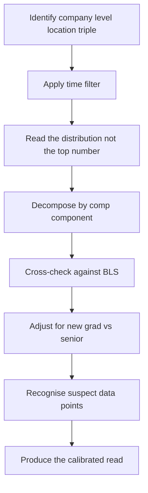

# Lecture 2 — The levels.fyi Reading Room and the BLS Calibration

> *Every candidate who is about to negotiate has a favourite number. The number came from somewhere: a Blind post they read at 2am, a friend who told them their offer at a barbecue, a Reddit comment with thirty upvotes, the recruiter's own published "compensation range" on the job posting. The favourite number is, almost always, wrong — either too high (drawn from the survivorship-biased top of the distribution) or too low (drawn from the median of a different company, level, or year). The negotiation conversation in which the candidate quotes a wrong favourite number is the negotiation conversation in which the candidate loses leverage. The calibrated read of the distribution is the precondition for the conversation.*

This lecture is the walkthrough of how to read compensation data. levels.fyi is the primary source; the BLS Occupational Employment and Wage Statistics is the calibration anchor; numbeo and NerdWallet are the cost-of-living adjustments. The four sources together produce a calibrated read of "what is this offer actually worth, in this metro, at this level, in this year." The single-source read — particularly the Blind-post-only read — is the wrong read.

## What levels.fyi is

levels.fyi is a crowdsourced compensation database, launched in 2017 by two ex-Google engineers, that has become the de facto reading room for tech compensation in the U.S. The data is contributed by employees who voluntarily submit their offer or current comp; the submissions are partially verified (some via email-domain check, some via offer-letter PDF upload) and partially unverified. The site is free; a paid tier exists for advanced filtering and "comp negotiation services," but the free tier is sufficient for everything in this week.

The site organises data along five primary dimensions:

1. **Company.** The named employer.
2. **Level.** The company-specific level (Google L3, Meta E4, Amazon L5, Microsoft 62, etc.).
3. **Location.** Metro area, occasionally state-level.
4. **Years of experience.** Total years in the industry, not years at this company.
5. **Submission year.** The year the data was contributed; older data is informative but should be inflation-adjusted.

For each submission, the database typically captures: base salary, signing bonus, stock grant (annual or total), target bonus, and sometimes additional benefits. The total compensation is computed as base + sign-on/year + stock/year + bonus. The "per year" normalisation is the standard view; it is what to compare across offers and across companies.

## The reading-room walkthrough — eight steps

### Step 1 — Identify the company-level-location triple

The triple is the smallest unit of compensation comparison. "Software engineer in San Francisco" is too broad to be useful. "Google L3 in Mountain View" is specific enough to produce a calibrated read.

If you have an offer in hand, the triple is given: the company is on the offer letter, the level is in the header, the location is the work site (or, for remote roles, the assigned-location for pay-band purposes). If you are pre-offer, the triple is your target: the company you most want to work for, the level you are interviewing at, the location you would be based in.

### Step 2 — Apply the time filter

Compensation in tech moves. The data from 2021 (a peak-of-cycle year with record-high stock grants) reads differently from the data from 2023 (a post-correction year with reduced grants and hiring freezes). For 2026 negotiations, use the most recent 18-24 months of data; anything older requires inflation adjustment.

The filter on levels.fyi: set the year range to "last 2 years" or "last 1 year." If the resulting sample is too small (fewer than 20 data points for the triple), expand to "last 3 years" but acknowledge the older data is less representative.

### Step 3 — Read the distribution, not the top number

The most common mistake on levels.fyi is to glance at the top of the table and quote the top number. The top number is, almost by definition, the survivorship-biased outlier — the candidate who negotiated unusually well, joined in a unique market moment, or made up the number. The top is not the typical.

The correct read is the distribution. levels.fyi displays a histogram (or a sortable table) of comp values; the four numbers to extract are:

- **The median (50th percentile).** The middle data point. This is the most representative number for "what a typical L3 at Google in Mountain View got in the last 24 months."
- **The 25th percentile.** The bottom of the upper-half. The 25th is the floor of "doing okay"; below it is "below market."
- **The 75th percentile.** The top of the lower-half of the upper distribution. The 75th is the ceiling of "doing well"; above it is "negotiated unusually hard or got an unusual market moment."
- **The 90th percentile.** The "top performer comp" — the floor of the outliers. Above the 90th, the data points are individual stories, not population statistics.

A typical Google L3 distribution in Mountain View in 2025-2026 reads roughly:

- 25th percentile: $185k total comp
- Median: $205k total comp
- 75th percentile: $230k total comp
- 90th percentile: $260k total comp

The spread between the 25th and the 75th is approximately 25% — meaning two candidates at the same company, same level, same location can have a $45k annual comp difference. The difference is not random; it is the negotiation premium.

### Step 4 — Decompose by comp component

The total comp number is the headline; the components are where the negotiation happens. levels.fyi breaks each submission into base + sign-on + stock + bonus. The decomposition matters because:

- **Base is the most stable.** Companies have base-salary bands by level and metro. The band has hard floors and soft ceilings. Negotiating $5k of base is moving within the band; negotiating $30k of base is asking to break the band.
- **Sign-on is the most variable.** Sign-on is a one-time payment; it does not affect the comp band; it has the most negotiation headroom. A sign-on bump of $10-30k is common when the candidate has competing offers.
- **Stock is the second most variable.** Stock grants have soft bands by level; they are the lever the recruiter pulls when the base band is saturated. Stock bumps of $10-50k over four years are common in competitive negotiations.
- **Bonus is the least negotiable.** Bonus percentage is set by the bonus plan and rarely varies by individual. Do not focus negotiation effort here.

Read the decomposition on levels.fyi for the typical L3-at-Google-Mountain-View submission:

- Base: $135-150k (range; median ~$140k)
- Sign-on: $20-40k (range; median ~$25k)
- Stock: $150-220k over 4 years (range; median ~$175k); per-year value $37.5-55k
- Bonus: 15% of base = $20-22k

Sum: ~$220k per year. The summed median should approximately match the displayed total-comp median; if it diverges substantially, the data has noise.

### Step 5 — Cross-check against BLS

The Bureau of Labor Statistics' Occupational Employment and Wage Statistics survey is the labour-market floor for the occupation. The OEWS data is collected from employers (not from employees) and is less subject to crowdsourced selection bias. The data is at the metro level and is updated annually (typically with a 6-12 month lag).

For "Software developers, applications" (SOC code 15-1252) in the San Francisco-Oakland-Hayward metro area, the OEWS data for the most recent year typically reads:

- 10th percentile: ~$120k
- 25th percentile: ~$145k
- Median: ~$185k
- 75th percentile: ~$225k
- 90th percentile: ~$260k+ (BLS top-codes at this level)

The BLS data is cash compensation (wages and bonuses) and does not include stock. For a tech-company candidate, the BLS number is the cash-comp comparison; the stock is on top.

The calibration: the BLS median for the metro is the labour-market floor. The levels.fyi median for the company-level-location is the tech-company premium over the labour-market floor. The ratio is typically:

- BLS median: $185k cash
- levels.fyi median for Google L3: $140k base + $22k bonus = $162k cash. Plus $25k/year sign-on amortised + $44k/year stock = $231k total comp.
- Cash-to-cash ratio: $162k / $185k = 0.88 (Google L3 cash is slightly below the BLS metro median for the broad occupation, because L3 is entry-level)
- Total-comp-to-BLS-cash ratio: $231k / $185k = 1.25 (Google L3 total comp, including stock, is 25% above the BLS metro median cash)

The ratios are diagnostic. If a company-level-location triple shows a cash-to-cash ratio of 1.5+ (50% above BLS), the company is paying a strong cash premium — usually a sign of a recruiting push or a less competitive market. If the ratio is 0.7 (30% below BLS), the company is under-paying on cash and likely making it up with stock — common at pre-IPO startups.

### Step 6 — Adjust for the new-grad versus senior reading

The reading of levels.fyi is qualitatively different at the new-grad level versus the senior level.

**For new-grads (L3 / E3 / SDE I, 0-2 years experience):**

- The distribution is tight. Companies have strong banding at the new-grad level; most new-grads at Google L3 land within $20k of the median. The spread is 10-15%, not 25%.
- The negotiation headroom is small in absolute dollar terms but large in percentage terms. A $5-15k sign-on bump on a $200k offer is 2.5-7.5% of total comp.
- Sign-on is the most movable line; base is almost fixed; stock has small headroom.
- The competing-offer leverage is the dominant negotiation lever; without it, the negotiation is a soft push on sign-on only.

**For senior engineers (L5 / E5 / Senior SDE, 5+ years experience):**

- The distribution is wide. Senior-level comp varies substantially by team, by the strength of the candidate's competing offers, and by the company's specific need. The spread between 25th and 75th can be 40%+.
- The negotiation headroom is large. A $50-100k bump on a $400k offer is real and common with strong competing offers.
- All four comp components are negotiable; stock is the most movable line because the band is widest.
- Equity refresh, sign-on, and starting level (e.g. negotiating from a written L5 to a verbal "we will consider L6 after first review") are all on the table.

The Week 10 baseline is the new-grad-to-L4 read. The senior-level read is in the C13 senior-track companion week.

### Step 7 — Recognise the suspect data points

Not every levels.fyi entry is reliable. The suspect categories:

- **The 99th-percentile outlier.** One submission claims a $500k offer at L3 Google Mountain View. The submission is either (a) a senior who self-mis-classified, (b) a unique circumstance the candidate cannot replicate, or (c) made up. Discard.
- **The "all stock, no base" entry.** Some startup submissions show $80k base + $400k stock + $0 sign-on. The total looks compelling but the stock-to-base ratio is wildly out of band for the company; the entry is either (a) misreported, (b) a unique pre-IPO grant that does not generalise, or (c) made up. Discard for negotiation purposes.
- **The zero-bonus entry at a company with a public bonus program.** If Google's bonus is 15% of base and the entry shows $0 bonus at L3 Google, the bonus was either omitted from the submission or the entry is corrupted. Re-impute or discard.
- **The data point dated 2019 in a 2025 filter.** Date drift; discard.

The strong reader of levels.fyi identifies these in five seconds and excludes them from the median calculation. The weak reader includes them and produces a noisy median.

### Step 8 — Produce the calibrated read

After steps 1-7, write down the calibrated read for the triple. The format:

```text
Company / Level / Location:    Google L3, Mountain View
Filter:                        Last 24 months, n=63 submissions (4 outliers excluded; effective n=59)
25th percentile total comp:    $185k/year
Median total comp:             $205k/year
75th percentile total comp:    $230k/year
Component decomposition (median):
  Base:                        $140k
  Sign-on (amortised over 1 year): $25k
  Stock (annual):              $44k (4-year grant of $175k, vesting 25/25/25/25)
  Bonus (target):              $21k (15% of base)
BLS metro median cash (SF):    $185k (Software developers, applications)
Tech-company-to-BLS ratio:     1.11 cash; 1.25 total
Walk-away (your number):       $190k total / $130k base
Target (your number):          $215k total / $145k base
```

The calibrated read is the document you bring to the negotiation conversation. The recruiter quotes a number; you reference the read silently; you respond from the read, not from the favourite-number you saw on Blind.


*The eight-step reading-room walkthrough, from raw levels.fyi data to a calibrated read.*

## Cost-of-living adjustment — the second calibration layer

Comparing offers across metros requires adjusting for cost of living. The standard tools are NerdWallet's free cost-of-living calculator and numbeo's crowdsourced cost-of-living index.

### NerdWallet's cost-of-living calculator

NerdWallet's calculator takes a source metro, a destination metro, and a salary, and returns the equivalent salary that preserves purchasing power. The calculation is based on:

- Housing (the largest component, typically 30-40% of cost-of-living differential)
- Transportation
- Food
- Healthcare
- Other goods and services

A $200k salary in San Francisco, converted to Austin via NerdWallet, typically lands around $135-145k. The conversion implies that $145k in Austin produces the same standard of living as $200k in San Francisco.

The calculator is a starting point, not a final answer. The conversion does not account for:

- **State income tax.** California's top rate is 13.3%; Texas is 0%. The tax-adjusted conversion produces a different number.
- **Federal tax brackets.** Higher gross income lands you in a higher federal bracket; the marginal tax matters.
- **Property tax.** Texas has high property taxes (~2.0-2.5% of home value) versus California's Proposition 13 cap (~1.0-1.25%). If you are renting, irrelevant; if you are buying, material.
- **Specific neighbourhood premium.** Austin's median is not Austin's downtown. San Francisco's median is not Pacific Heights. Adjust for where you would actually live.

### Numbeo's cost-of-living index

Numbeo is crowdsourced cost-of-living data covering most cities globally. The data is noisier than NerdWallet's but has broader coverage (including international moves) and reports the underlying line items (rent, groceries, utilities) rather than just the aggregate.

The numbeo and NerdWallet conversions typically disagree by 10-25% for the same source-destination pair. The disagreement is informative — it tells you the spread of crowdsourced cost-of-living data. The strong reader uses the BLS metro wage as the calibration anchor between them: the metro with the higher BLS median is the metro with the higher cost of living (the labour market is partially compensating for the cost).

### The practical cost-of-living calculation

For comparing two offers in different metros, the steps are:

1. Compute the total comp for each offer using the four-year arithmetic from Lecture 1.
2. Apply the NerdWallet conversion to bring one offer to the other's metro-equivalent.
3. Apply the numbeo conversion as a cross-check; note the spread.
4. Compute the state-income-tax adjustment by hand (state-by-state tables; see resources.md).
5. Compute the federal tax adjustment using the marginal rate at the comp level.
6. Add the unquantifiable line items as a written note: commute time, climate, friend/family proximity, access to outdoor recreation, public transit availability.

The output is two metro-equivalent total-comp numbers, plus a one-page note on the qualitative factors. The decision is rarely made on the metro-equivalent numbers alone; the qualitative factors carry weight that the spreadsheet cannot capture.

## What levels.fyi does not tell you

The crowdsourced data has structural blind spots:

- **The role within the level.** A "Google L3" might be on a frontline product team or on a 20%-time research team; the comp is the same; the day-to-day is not.
- **The manager.** Manager quality is the single highest-variance factor in early-career outcomes. levels.fyi does not capture it.
- **The team's growth prospects.** Some teams promote their L3s to L4 in 18 months; others take 30+ months. levels.fyi has the comp at the start; the promotion velocity is what compounds.
- **The future stock price.** levels.fyi reports the grant-date value of the stock. The vest-date value is what you actually receive; if the stock falls 30% in year 2, your year-2 stock comp falls 30%.
- **The benefits not in the headline.** PTO, on-call frequency, parental leave, sabbatical eligibility — none are in the comp number. They are real and they matter.

The calibrated read is the headline; the qualitative read is the rest.

## The 2024 FTC non-compete ruling — a brief detour

The compensation conversation intersects with the non-compete clause because the non-compete restricts your ability to take the next offer in 12-24 months. A non-compete that restricts you from working at any "competing company in software" for 24 months is, in effect, a 24-month claim on your career mobility — and the consideration for that claim is, typically, just the sign-on bonus.

The FTC's 2024 non-compete final rule was the federal-level attempt to ban most non-competes in U.S. employment contracts. The rule was finalised in April 2024 and was scheduled to take effect in September 2024. In August 2024, a Texas federal court partially enjoined the rule; as of 2026, the rule's enforcement status varies by jurisdiction and is still in litigation.

The directional signal is clear: non-competes are increasingly disfavoured at the federal level. The practical signal for the candidate negotiating in 2026:

1. In California (the largest tech employment market), non-competes have been unenforceable since 1872. The clause has no legal effect.
2. In other states with strong tech employment (Washington, New York), non-competes are enforceable but heavily scrutinised. The clause is real but the enforcement bar is high.
3. In states with weaker labour-market protections (Florida, Texas), non-competes are enforceable if reasonable. The clause should be read carefully.
4. The FTC rule, even if eventually upheld in part, will take years to fully roll through. Plan as if your current non-compete is enforceable in your current state and only ignore it on a lawyer's advice.

The non-compete is rarely a negotiable line on a new-grad offer. The scope (which companies count as competitors) sometimes is. If the offer's non-compete is broad — "any company in software" — ask for a narrow list of named competitors. Recruiters at large companies will sometimes agree; the request is reasonable; the cost to the company is low.

## Reading levels.fyi versus reading Blind versus reading Glassdoor

The candidate's three main free sources of crowdsourced compensation data are levels.fyi, Blind, and Glassdoor. Each has a different signal-to-noise profile.

**levels.fyi** is the most structured. The site explicitly captures the comp components (base, sign-on, stock, bonus), the level, the location, and the year. The submissions are partially verified (email-domain check, occasional offer-letter upload). The data is the cleanest of the three for population-level statistics. Use levels.fyi for the percentile distribution.

**Blind** is the least structured but the highest-volume in some segments. Blind is an anonymous app where employees discuss comp, manager quality, layoff rumours, and inside-baseball company gossip. The comp threads are useful for very recent data points (Blind's velocity is higher than levels.fyi's; data lands on Blind within hours of an offer being made) and for company-specific calibration ("Microsoft's new-grad comp dropped $15k in 2023; here are the new bands"). The downside is the noise: bragging, mis-reporting, and outright fabrication are common. Use Blind for directional signals and recent moves; do not use it for distributions.

**Glassdoor** is the most general-purpose. Glassdoor covers comp across all industries, not just tech, and the data is less granular by level. Glassdoor's value is in non-tech-company comparison (e.g. comparing a tech-company offer to a non-tech-company offer for the same role) and in the broader-than-comp data (interview reviews, company culture reviews, benefits descriptions). For tech comp at the company-level-location triple, Glassdoor is less precise than levels.fyi; use it as a tertiary cross-check.

The triangulation: pull the levels.fyi distribution as the primary; check Blind for recent moves or company-specific patterns the distribution might miss; check Glassdoor as a sanity check for the broad shape of the comp band. The three together give a calibrated read that any one alone does not.

## Reading the data dump versus the website

levels.fyi makes its full data set available at levels.fyi/data as a downloadable dump. The dump is a denormalised CSV (or JSON, depending on the year) with every submission as a row. The dump is more cumbersome to work with than the website but has two advantages:

1. **Custom filtering.** The website's filters are useful but limited. The dump lets you run any filter you want — by sub-team if the company tags submissions, by years-of-experience bucket, by specific years to look at year-over-year drift.
2. **Statistical computation.** The website displays summary statistics; the dump lets you compute your own. The 90th percentile, the standard deviation, the year-over-year change in median — all are one Python script away.

For the new-grad-to-L4 candidate, the website's summary statistics are usually sufficient. For the senior candidate or the candidate negotiating in a thin-data triple (small company, less common level, recent data), the dump is worth the friction.

A small Python snippet to compute the median and percentile spread from the dump:

```python
import csv
from statistics import median, quantiles

total_comp_values: list[float] = []
with open("levels-fyi-data.csv", "r") as f:
    reader = csv.DictReader(f)
    for row in reader:
        if (row["company"] == "Google"
                and row["level"] == "L4"
                and row["location"] == "Mountain View"
                and row["year"] in ("2024", "2025", "2026")):
            total_comp_values.append(float(row["total_comp"]))

print(f"n = {len(total_comp_values)}")
print(f"median = ${median(total_comp_values):,.0f}")
q = quantiles(total_comp_values, n=4)
print(f"25th = ${q[0]:,.0f}; 75th = ${q[2]:,.0f}")
```

The script is 15 lines and runs in under a second on the full dump. Candidates who are comfortable in Python should keep this snippet on hand; it produces a more flexible and re-runnable analysis than the website's UI.

## When the calibrated read disagrees with the offer

Two scenarios produce a disagreement between the calibrated read and the offer received:

**Scenario A — The offer is well below the calibrated 25th percentile.**

The offer is below the labour-market floor for the triple. Possible reasons:

- The level is mis-read; the offer is actually for a lower level than you interviewed at. Verify the level on the offer letter against the level you interviewed at.
- The company is in a cost-reduction phase and is offering below their historical band. Common at companies in restructuring; verify with one or two Blind posts from the last 90 days.
- The recruiter is testing the candidate's negotiation muscle. Some recruiters open below the band and expect the candidate to push back; the band-ceiling offer comes after the counter.
- The triple is unusual — a remote-zone pay band that is lower than the metro-of-record band, or a level that the company is shifting downward in their org chart.

The move: name the gap calmly in the counter call. "The offer is below where I was expecting based on the comp data I have looked at for this level and location. Could you walk me through how you arrived at this number?" The recruiter will either explain (helpful) or move (more helpful).

**Scenario B — The offer is at or above the calibrated 75th percentile.**

The offer is strong. Possible reasons:

- The company has acute hiring pressure for this team and is paying a premium.
- The candidate has a specific skill or background the team valued more highly than the standard level-comp band assumes.
- The recruiter opened above the band as a "fast close" strategy (less common than opening below).
- The triple is unusually thin — a new market the company is entering, a recently-launched team, or a small office where the comp band is less established.

The move: do not assume the offer is locked. Even a strong offer typically has 5-15% of additional headroom. Run the standard negotiation; ask for the pre-signing question answers; counter on the sign-on (the most movable line); accept gracefully when the recruiter says "this is our final position."

## Summary

The calibrated read of compensation data is the precondition for the negotiation conversation. The strong reader filters levels.fyi by the company-level-location triple, reads the distribution rather than the top number, decomposes by component, cross-checks against BLS, adjusts for cost of living, and writes down the calibrated total-comp number for the triple. The weak reader quotes the favourite number from Blind and loses leverage.

The walk-away number (the floor at which you say yes) and the target number (the comp at which you say yes without hesitation) are both anchored by the calibrated read. The walk-away is typically the 25th percentile of the triple; the target is the 75th. The negotiation is the conversation that takes you from the walk-away to the target.

The negotiation is Lecture 3.
