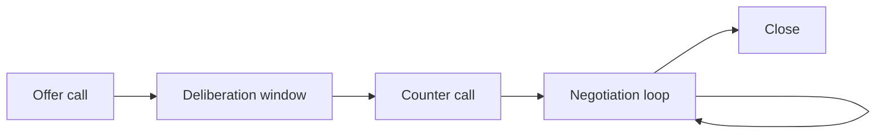
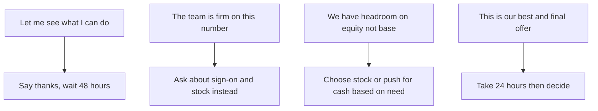

# Lecture 3 — The Negotiation Conversation, From "Hi" to Countersigned

> *Patrick McKenzie's "Salary Negotiation" essay, free on kalzumeus.com since 2012, contains a sentence the rest of the negotiation literature is largely a footnote to: "Once they make an offer, you should be ready to assume that the offer represents the absolute minimum the company is willing to pay you." The candidate who internalises this sentence — and acts on it — is the candidate who negotiates. The candidate who reads it, agrees with it intellectually, and then signs the original offer because they are afraid of seeming greedy is the candidate who leaves money on the table. The intellectual agreement is easy. The acting on it is the entire skill of this lecture.*

This lecture is the negotiation conversation itself. We will walk the standard 45-minute phone call from "hi, this is your recruiter" to "I have countersigned the revised offer," covering the recruiter's first move, the salary range push, the competing-offer frame, the four escalation phrases, the pre-signing question list, the decline-gracefully template, and the four common failure modes with their recovery patterns.

The lecture assumes you have read Lectures 1 and 2 and have a calibrated read of the comp triple. Without the calibrated read, the conversation in this lecture is improvisation; with it, the conversation is structured negotiation.

## The conversation map

A standard tech-company negotiation has approximately five phases, spread across one or two phone calls plus email follow-ups:

1. **The offer call.** The recruiter calls (or emails) with the verbal offer. Length: 15-30 minutes. The candidate's primary move here is gratitude + delay + question-list.
2. **The deliberation window.** The candidate goes silent for 2-5 business days to read the offer letter, run the levels.fyi walkthrough, and gather competing offers if applicable.
3. **The counter call.** The candidate calls the recruiter back with the counter-proposal. Length: 30-45 minutes. The candidate's primary move here is the substantive ask plus the calibrated rationale.
4. **The negotiation loop.** The recruiter goes back to the team and comes back with a revised offer (or a "we cannot move"). The candidate responds. Typically 1-3 iterations. Length per iteration: 5-15 minutes by phone or email.
5. **The close.** The final number is agreed; the revised offer letter is sent; the candidate signs.

The entire arc takes 5-14 days from the verbal offer to the signed offer. Compressing it below 3 days is the exploding-offer scenario (Challenge 1). Extending it beyond 14 days starts to test the recruiter's patience and the company's hiring-quarter deadlines.

*The five phases of a tech offer negotiation, from verbal offer to signed offer; the loop repeats one to three times.*

## Phase 1 — The offer call

The recruiter calls you. You pick up. The conversation goes:

> **Recruiter:** "Hi! I have some great news. The team has decided to extend you an offer for the Software Engineer III role. We are very excited to have you join us."
>
> **You:** "Thank you, that is wonderful news. I am really excited about the team and the role. Can you share the details of the offer with me?"
>
> **Recruiter:** "Of course. The compensation package includes a base salary of $145,000, a signing bonus of $20,000, and a stock grant of $200,000 vesting over four years. The total compensation in the first year, including everything, is approximately $230,000."

The recruiter has named the numbers. This is the moment the negotiation begins. The candidate's job in the next ninety seconds is to do four things, in this order:

1. **Express genuine gratitude.** The recruiter is the human messenger; treating them with warmth is both the right thing to do and tactically useful, because the recruiter is the person who will go to bat for you with the hiring manager and the comp committee.
2. **Acknowledge the offer without accepting it.** The phrase is "thank you, I really appreciate this offer." Not "I accept" — that closes the negotiation. Not "this is lower than I expected" — that opens the negotiation on the wrong foot.
3. **Ask for the written offer in email.** "Could you send the offer letter so I can review the details?" This is the move that converts the verbal offer into the document you read in Lecture 1. Until you have the offer letter, the negotiation is operating on numbers you cannot verify.
4. **Defer the response on numbers.** The phrase is "I am going to take some time to review the offer carefully, talk it over with my family, and come back to you with any questions and a more substantive response. When would be a good time for a follow-up call later this week or early next week?"

A polished offer call from the candidate's side, in full:

> **You:** "Thank you so much. I am really excited about this offer and I am looking forward to reviewing the details. Could you send the full offer letter to my email? I want to take a few days to go through it carefully and make sure I have a complete picture. Once I have read through it, I will come back to you with any questions and we can schedule a follow-up call. Does that work?"

The recruiter will say yes. They are not surprised. They have done this hundreds of times; they know the next 5-14 days are how this goes.

The two things the candidate should not do on the offer call:

- **State a counter-number.** If the recruiter asks "is the offer in the range you were hoping for?", the answer is "I appreciate you asking — I want to take some time to review it carefully before I give you a substantive response." Not "I was hoping for $30k more on the base." Stating a number before you have read the offer letter, run the calibration, and considered competing offers is negotiation malpractice.
- **Express disappointment.** Even if the offer is well below the calibrated 25th percentile, the offer call is not the place to push. Express gratitude; defer; come back in the counter call with the substantive case. The offer call is the wrong stage of the conversation for the substantive push.

## Phase 2 — The deliberation window

The 2-5 business days between the offer call and the counter call are the most important phase of the negotiation. The work done here determines what the counter call can achieve.

The work:

1. **Read the offer letter end to end.** Per Lecture 1. Identify the negotiable lines, the non-negotiable lines, the deadline, the contingencies.
2. **Compute the four-year total comp.** Per Lecture 1. By hand or with the comp-calculator helper in the mini-project. Compare to your calibrated target.
3. **Run the levels.fyi walkthrough.** Per Lecture 2. Identify the median, the 25th percentile, the 75th percentile for the triple. Note where this offer lands in the distribution.
4. **Cross-check against BLS.** Per Lecture 2. Verify the offer is at least at the labour-market floor for the metro.
5. **Gather competing offers.** If you have other live processes, ping those recruiters and accelerate them. The phrase to the other recruiters: "I have an offer in hand with a decision deadline next Friday. I would love to know if you are able to bring my conversation with [Company B] to a conclusion before then." Most recruiters will accelerate when there is a competing offer with a hard deadline.
6. **Draft the counter.** Write down the specific ask, in dollars, by line item. "I would like to see the base move to $155k, the sign-on move to $30k, and the stock grant move to $220k over four years" is a draftable counter; "I would like a higher offer" is not.
7. **Draft the pre-signing question list.** The questions for the recruiter that the offer letter does not answer (see below).

The deliberation window is also where the candidate decides whether to engage a lawyer. For most standard new-grad offers at large public companies, a lawyer is not necessary; the clauses are boilerplate. For startup offers with unusual equity structures, non-compete clauses in non-California states, or assignment-of-inventions clauses that look unusual, a one-hour lawyer consult (~$200-400 in most U.S. metros, free in some via state bar referral services) is high ROI.

## Phase 3 — The counter call

The counter call is the substantive negotiation. The candidate has the calibrated read, the offer letter in hand, the competing offers (if any), the pre-signing question list, and the drafted counter. The call typically goes 30-45 minutes.

### Opening the counter call

> **You:** "Thank you again for the offer. I have spent the last few days reviewing it carefully, and I am very interested in the role and the team. I want to walk through a few things with you. Before we get into the numbers, I have some questions about the role and the team — would you be able to answer those first, or would it be better to address them after the comp conversation?"

The recruiter will typically say "let's start with whichever you prefer." Start with the questions — they are easier to discuss, they soften the conversation, and they signal that you are evaluating the role holistically, not just chasing money.

### The pre-signing question list

The questions to ask the recruiter, in approximately this order, before the comp conversation:

1. **"What is the team's on-call rotation, in terms of frequency and what the on-call expectation is?"** The answer varies wildly. Get the specific cadence (e.g. "one week per quarter") and the specific expectation (e.g. "respond to alerts within 30 minutes during the rotation; you are not expected to be at a desk during the rotation").
2. **"How often does the team do performance reviews, and what is the calibration cycle?"** Annual is standard at most companies. Semi-annual at Amazon, Microsoft. Knowing the cadence tells you when your next raise opportunity arrives.
3. **"What is the equity refresh policy for someone at this level? When would I be eligible for a refresh, and what is the typical refresh band?"** Many companies grant an annual refresh of 25-50% of the initial grant at the performance review. The candidate who knows the refresh policy is the candidate who can model their year-2 and year-3 total comp accurately.
4. **"How does PTO accrual work? Is there a carryover, and is there a cap?"** Get the specifics: days per year, accrual cadence (monthly, bi-weekly), carryover cap (often 5 days or "use it or lose it"), and any policy on payout of unused PTO at termination.
5. **"What is the remote-work policy in writing? Is it manager's discretion, or is there a company-wide policy?"** The 2023-2026 era has been turbulent on this; many companies announced policies that later changed. Get the policy in writing in the offer letter or in a recruiter follow-up email.
6. **"Is there a relocation reimbursement, and if so, what is the claw-back schedule?"** Standard claw-back is 12 or 24 months prorated. If you leave before then, you owe the relocation reimbursement back.
7. **"Is the start date flexible? I am ideally targeting [date X], but I want to make sure that works for the team."** If you need a non-default start date, raise it now.

The recruiter will know some answers cold (PTO, performance review cadence, on-call broadly) and will need to look up some answers (equity refresh, specific on-call expectation on the specific team, remote-work policy in writing). Ask the recruiter to send the deferred answers in email; do not let the answers float as verbal-only.

### The comp conversation — the substantive push

After the questions, transition to comp.

> **You:** "Thank you for those answers, that is really helpful. Now I want to walk through the compensation side. I have done some careful research on what the typical comp package looks like for this level at [Company] in [Location], and I want to share where I am coming from. Based on what I am seeing from comparable offers and industry data, the offer is at the lower end of where I was expecting. I am hoping we can talk through whether there is room to move on the package. Specifically, I would like to see [specific numbers]."

The phrasing matters. Three things to notice:

- **"I have done some careful research."** Anchors the conversation on data, not vibes. The recruiter cannot push back on the levels.fyi distribution; they can push back on "I heard from a friend."
- **"At the lower end of where I was expecting."** Calibrated and not confrontational. Not "this is a lowball" (loaded, adversarial); not "this seems low" (uncalibrated, easily dismissed).
- **"Specifically."** The substantive ask is specific. "Higher comp" is not negotiable; "$10k more on base and $10k more on sign-on" is.

### What NOT to disclose

The candidate's leverage in the negotiation comes partly from information asymmetry. The recruiter knows the comp band; the candidate knows their own walk-away number. The strong candidate keeps their walk-away number private.

The four things to not disclose:

1. **Your walk-away number.** If you tell the recruiter "I cannot accept less than $200k total," you have set a floor for the negotiation that will become a ceiling. The recruiter will offer $200k.
2. **The specific dollar number of your competing offer (in most cases).** If you have a written competing offer at $230k, the recruiter will counter at $231-235k — just enough to win. You have given away the bid. The better frame: "I have a competing offer that is meaningfully higher than where this one is right now. I would like to see if we can close the gap." The "meaningfully higher" phrase is informative without being precise.
3. **Your current salary at your current job (if applicable).** Some states (California, New York, Illinois, others) have laws prohibiting employers from asking. Where the law applies, the answer is "I am not comfortable sharing my current compensation; I would rather focus the conversation on what makes sense for this role." Where the law does not apply, the same dodge usually works.
4. **Your financial situation.** "I really need this job; I have rent due next month" is the single most leverage-destroying phrase in any negotiation. The recruiter is now negotiating against your desperation, not against the market. Keep the financial situation private.

### The competing-offer frame, honest version

The candidate often has a competing offer; sometimes the competing offer is solid and written, sometimes it is verbal, sometimes it is a "process I am in but not yet at offer stage." Each requires a different frame.

**Solid written competing offer at a higher number.** "I have a written offer from [Company B] at a higher total comp. I am genuinely excited about both opportunities, and the role here is my preference if we can close the gap on comp." This is the strongest negotiating position. The recruiter will typically come back with a meaningful bump.

**Solid written competing offer at a similar or lower number.** "I have an offer from [Company B] in a similar range. I want to make sure I am making the right decision for the next four years; can we walk through the comp package to make sure I understand it fully?" The leverage here is the *option*, not the dollar gap. The recruiter knows you are not stuck; you have an alternative.

**Verbal offer not yet in writing.** "I have a verbal offer from [Company B] that will be written up next week. I am preferring this opportunity but want to make sure I have all the information before I make the call." Use cautiously; recruiters know verbal offers can fall through, so the leverage is partial.

**Process in late stages but pre-offer.** "I am in the final stages with [Company B], with a final decision expected in 7-10 days. I would prefer to come to a decision with all the information on the table." This is the weakest of the four; do not over-state it.

**No competing offer.** Do not invent one. Recruiters can sometimes verify (the tech world is small; recruiters at competing companies talk; senior recruiters can spot a bluff). An invented competing offer that is exposed destroys the candidate's credibility and sometimes the entire offer. The negotiation without a competing offer is harder but still real; the move is on the substantive case ("levels.fyi median for this triple is $X; the offer is at $Y; can we close the gap?") rather than on the option.

### Getting the recruiter's first move

In some offer calls, the recruiter has named the number first (as in the offer-call example above) and the candidate is in the responsive position. In other cases — particularly in the recruiter screen or in pre-offer conversations — the candidate is asked to name their number first.

The McKenzie principle: never name your number first if you can avoid it. The phrasing for the dodge:

> **Recruiter:** "What kind of compensation are you looking for?"
>
> **You:** "I am looking for a competitive package that reflects the level, the role, and the location. I do not have a specific number in mind right now — I think it is more productive for us to align on the role and the level first, and then have the comp conversation when we have a concrete offer to discuss. What is the comp band for this level at this company?"

The recruiter will typically respond with one of:

- A specific range. "For L3, the band is $135-150k base." You now have the band; the negotiation can proceed against it.
- A deflection. "I cannot share the band until we have an offer, but it is competitive." Accept and move on; the band will surface at the offer call.
- A push. "I really need a number to know if we are in the same ballpark." If you must give a number, give a range that brackets the high end of your calibrated read — e.g. "based on what I have seen for this level and location, I would expect total comp in the range of $200-240k." This anchors the recruiter on the high end of the band, not the low end.

The candidate who names $150k first when the band is $135-180k has just shaved $30k off the offer that was coming. The dodge is worth the awkwardness.

### The four escalation phrases the recruiter will use

In the negotiation loop (phase 4), the recruiter typically uses one of four escalation phrases to manage the candidate's expectations. The candidate's response to each:

**Phrase 1: "Let me see what I can do."**

Meaning: the recruiter is going to go back to the hiring manager or comp committee and try to get a bump. This is a positive signal; the recruiter is treating the request as legitimate.

Your response: "Thank you. Take whatever time you need. I appreciate the effort." Then wait. Do not follow up sooner than 48 hours; the recruiter is doing the work in the background.

**Phrase 2: "The team is firm on this number / we are unable to move on base."**

Meaning: the recruiter (or the team) has decided not to move on the line item you pushed on. This is often genuine for base salary (which is band-constrained) and rarely genuine for sign-on (which has more headroom).

Your response: "I understand. Could we look at the other components — the sign-on and the stock — to find some headroom there?" The reframe pivots from the line that is locked to the lines that are not.

**Phrase 3: "We have headroom on the equity but not the base."**

Meaning: the recruiter is offering a stock bump as a substitute for a base bump. Stock bumps are typically the easiest concession for the company because they do not affect the base-salary band.

Your response: this depends on your preference. A stock bump is back-loaded (75% of it arrives in years 2-4); a base bump compounds into bonus and into the next raise. If you are early-career and need cash for living expenses, push back: "I would prefer to see some of that move into sign-on, since the stock takes a year to start vesting and I need to manage the transition to the new role." If you are comfortable with the cash flow, accept the stock and move on.

**Phrase 4: "This is our best and final offer."**

Meaning: the recruiter has reached the end of their authority and the negotiation is closing. This is often genuine; sometimes it is a final test of the candidate's commitment.

Your response: "I appreciate you working through this with me. Let me take 24 hours to make sure I am making the right decision, and I will come back to you tomorrow with a final answer." Then take the 24 hours and make the decision honestly. Pushing past a "best and final" can occasionally produce one more small bump; it can also withdraw the offer if the recruiter feels jerked around. The 24-hour deliberation is the right move regardless.

*Each recruiter escalation phrase in the negotiation loop calls for a different calibrated response.*

## Phase 4 — The negotiation loop

The loop is the back-and-forth between the counter call and the close. Typically 1-3 iterations. The shape of a typical loop:

- **Counter (you):** $155k base, $30k sign-on, $220k stock.
- **Original offer:** $145k base, $20k sign-on, $200k stock.
- **Recruiter response (day 2):** "I cannot move on base, but I can offer $25k sign-on and $215k stock."
- **Your counter (day 3):** "Thank you. I really appreciate the movement. Is there any way to find $5-10k more on the sign-on or the base? My competing offer is at $230k total in year 1; this revised offer would be at $222k. The gap is real but small."
- **Recruiter response (day 5):** "I checked with the team. I can do $28k sign-on; the rest is firm. This is our final position."
- **Your response (day 5):** "Thank you. Let me confirm tomorrow."
- **Your confirmation (day 6):** "I will accept the revised offer. Could you send the updated offer letter?"

Note the patterns:

- **The candidate moves smaller on each iteration.** The first counter is the big ask; the second is the medium ask; the third is the small ask. Moving too large on the second counter signals you were never serious about the first.
- **The candidate always thanks the recruiter for the movement.** Even a $5k sign-on bump is acknowledged. The relationship is the asset; the dollars are the line item.
- **The candidate waits 24 hours before the final acceptance.** Not because they are still deciding; because the 24-hour pause communicates seriousness.

## Phase 5 — The close

The close is the moment the candidate signs the revised offer letter. Before signing:

1. Verify the revised offer letter matches the verbally agreed numbers. The recruiter occasionally sends the revised offer with a typo or with a line not updated. Cross-check every line.
2. Verify the deadline on the revised offer matches what was agreed.
3. Verify the start date matches.
4. Save a copy of the revised offer letter before signing.
5. Sign the revised offer letter using the company's signature platform (DocuSign, Adobe Sign, or similar).
6. Send a brief thank-you email to the recruiter. "Thank you for working through this with me. I am excited to join the team on [start date]." Keep the relationship warm.
7. Save the countersigned offer letter (with the company's signature) when it comes back.

After signing, decline the other offers in your loop (see below) and inform any other recruiters that you have accepted a different role. The decline-gracefully email is the last move of the negotiation conversation.

## Declining gracefully

The decline email is short, warm, and firm. The template:

> Subject: [Name] — Update on the [Company] offer
>
> Hi [Recruiter name],
>
> Thank you so much for the offer and for everything you did to make the process great. After a lot of thought, I have decided to accept a different opportunity that aligns more closely with [the specific factor — team, technology, location]. I want to be clear that this was a hard decision and that I have a lot of respect for [Company] and the team I met during the loop.
>
> I would love to stay in touch. If there is ever a fit in the future, I would be happy to talk again.
>
> Thank you again, and best wishes to you and the team.
>
> [Your name]

Three things to notice:

- **Name the company you accepted (optional but recommended).** The industry is small; the recruiter will hear anyway. Naming it is professional and avoids the impression you are hiding something.
- **Name the specific factor that drove the decision.** Not just "I went with a different company"; "I went with [Company B] because the team's focus on [X] is a closer match to my career direction." This signals the decision was thoughtful and is not a reflection on the company you are declining.
- **Leave the door open.** "I would love to stay in touch" and "if there is ever a fit in the future" are the door-open phrases. The recruiter you decline today is the recruiter who pings you on LinkedIn three years from now when their company is hiring at your senior level.

The declining-gracefully email is sent within 24 hours of signing the accepted offer. Do not let it slip; the recruiter at the company you declined is currently telling their team "I am close to closing this candidate"; the longer you wait, the more disappointment you generate.

## The four negotiation failure modes

The four failure modes that destroy negotiations, with the recovery move for each:

### Failure mode 1: Stating your number first

The candidate, asked "what are you looking for," names $150k. The recruiter writes down $150k and comes back with a $155k offer (the base + a small bump). The candidate has anchored the negotiation $30k below the company's band.

**Recovery:** if you have already stated your number and have not yet received the offer, you can re-anchor: "I want to update my earlier number. I have done more research since we spoke, and based on what I have seen for this level and location, I am now looking at a higher range — $180-200k base." Recruiters will sometimes accept the re-anchor; sometimes they will hold you to the original. The recovery is partial; the lesson is to never state the first number.

### Failure mode 2: Leveraging an unsubstantiated offer

The candidate, with no competing offer, tells the recruiter "I have a competing offer at $230k." The recruiter, who is also recruiting senior candidates and knows the band, suspects the bluff. They ask "could you share the offer letter or the company so we can match?" The candidate is now stuck.

**Recovery:** withdraw the leverage immediately. "I apologise — I overstated. I do not have a written offer at that number; I have a verbal indication from a process I am in. I want to be honest with you. Let me re-frame the conversation around the substantive case for the comp ask." The recruiter will respect the honesty. The negotiation continues at reduced leverage but with the relationship intact.

### Failure mode 3: Accepting verbally without written follow-up

The candidate, on the phone, says "yes, I accept the revised offer." The recruiter says "great, we will send the updated paperwork next week." Two days later, the recruiter follows up with "we cannot get the $25k sign-on through compliance; we are sending the updated offer at $22k." The candidate has lost $3k because the verbal-only agreement is not enforceable.

**Recovery:** if the recruiter walks back a verbal agreement, push back firmly but politely. "I want to make sure I understand — we agreed verbally on $25k sign-on on the phone yesterday. Is there a specific reason the number has changed?" Recruiters sometimes restore the agreed number; sometimes they hold the line. The prevention is the better move: do not accept verbally; ask for the revised written offer first, then accept by countersigning.

### Failure mode 4: Signing before the deadline runs out

The candidate, anxious that the offer will be withdrawn, signs at 9pm the night after the offer call. The negotiation is closed. The candidate has captured zero of the headroom.

**Recovery:** none, structurally. Once the offer is signed, the negotiation is closed. The candidate can sometimes re-open the conversation at the 6-month mark with a "I have been here for six months, I am exceeding expectations, can we revisit the comp" conversation — but the company is now negotiating from a position of strength (the candidate is committed and exit costs are high). The recovery is to read this lecture before the next offer and not repeat the failure.

## The mindset framing

The negotiation conversation is read most strongly when the candidate believes one thing the candidate does not naturally believe: the company wants you to negotiate. The hiring manager has spent six to twelve hours of interview time on you; the recruiter has invested two months in your process; the compensation team has approved the comp band for this requisition. The cost to the company of you walking away over a $10k gap is much higher than the cost to the company of closing the $10k gap.

The candidate who internalises this — who believes, on a gut level, that the recruiter on the other end of the phone wants the candidate to succeed in the negotiation — is the candidate who can hold silence, push politely, name a specific number, and walk away if the offer does not work. The candidate who believes the recruiter is an adversary, that pushing will withdraw the offer, that any ask will be seen as greed — is the candidate who signs the original offer and leaves the headroom on the table.

The mindset is not theatrical; it is calibrated. The recruiter is a professional doing a job; the job includes closing candidates at the company's preferred comp; the job also includes closing candidates at all. A candidate who does not negotiate is a candidate the recruiter notes as "easy close, did not push" — and the next time the company has a similar candidate, the comp band drifts down slightly because the previous close was easy.

Your negotiation today is a data point in the company's comp-band calibration for the next candidate. Negotiating is not just self-interest; it is contribution to the next candidate's leverage.

## Summary

The negotiation conversation is five phases — offer call, deliberation, counter call, loop, close — across 5-14 days. The candidate's job is to (a) defer at the offer call without stating a number, (b) calibrate during the deliberation window using levels.fyi and BLS, (c) come back with a specific written counter that names the substantive ask, (d) navigate the loop with calibrated escalation and graceful firmness, (e) close with the revised written offer and a declining-gracefully email to any competing recruiters.

The four failure modes are recoverable in the early stages and unrecoverable once the offer is signed. The four escalation phrases — "let me see," "the team is firm," "we have headroom on equity," "best and final" — each have a calibrated response.

The mindset is the precondition: the recruiter wants to close the deal; the company wants to hire you; the negotiation is the candidate's only chance to capture the headroom that exists between the published offer and the actual band.

Patrick McKenzie's essay says it best: "Once they make an offer, you should be ready to assume that the offer represents the absolute minimum the company is willing to pay you." This is the framing. The week's exercises rehearse the moves. The capstone is the integration.
